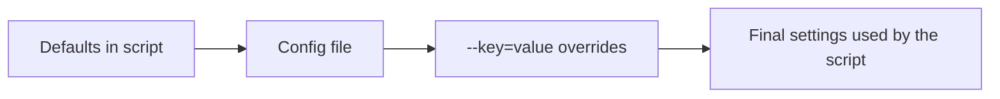
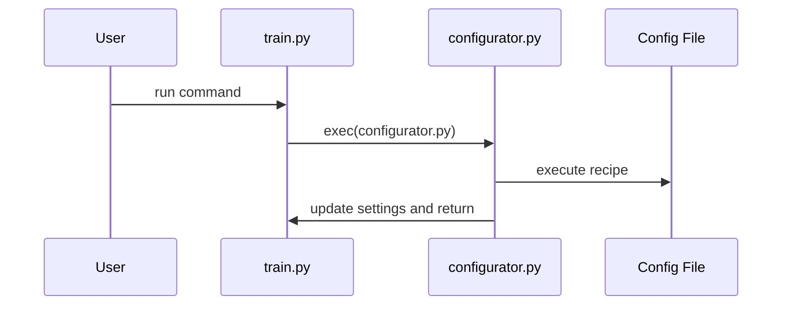

# Chapter 1: Configuration Overrides

One of the first big ideas in `nanoGPT` is this:

**Most experiments are the same program with different settings.**

You usually do **not** rewrite `train.py` or `sample.py`.  
Instead, you change a few knobs:

1. the script's **default values**
2. an optional **config file**
3. optional `--key=value` **command-line overrides**

Think of it like a coffee machine:

- the machine is `train.py`
- a preset recipe is a file in `config/`
- the last-minute knob twist is something like `--batch_size=64`

That is the whole idea of **configuration overrides**.

---

## Why this exists

Imagine you want to do this:

- train a **small Shakespeare model** on your laptop
- without editing `train.py`
- and maybe force it to run on CPU

That is a perfect use case for configuration overrides.

Without this system, you would keep opening Python files and changing things by hand:

- `dataset = 'shakespeare_char'`
- `device = 'cpu'`
- `compile = False`
- `n_layer = 6`
- `batch_size = 64`

That gets messy fast.

With configuration overrides, you can do it from the command line instead.

---

## Our concrete use case

Let's solve one simple beginner task:

> **Run a small Shakespeare training job on a laptop, using CPU, without editing the code.**

You can do that with:

```bash
python train.py config/train_shakespeare_char.py --device=cpu --compile=False
```

What happens?

- `train.py` starts with its own defaults
- `config/train_shakespeare_char.py` replaces many of them
- `--device=cpu` and `--compile=False` make final tweaks

So the same `train.py` script behaves very differently.

---

## The big picture

Here is the full flow:



A simple rule to remember:

**later settings override earlier settings**

So a common pattern is:

1. start with script defaults
2. load one config recipe
3. add a few custom command-line tweaks

---

## Step 1: Every script starts with defaults

For example, `train.py` begins with many normal Python variables.

```python
dataset = 'openwebtext'
batch_size = 12
block_size = 1024
device = 'cuda'
compile = True
exec(open('configurator.py').read())
```

This means:

- by default, training uses the `openwebtext` dataset
- it expects GPU (`cuda`)
- it uses a fairly large context length (`block_size = 1024`)
- then it runs `configurator.py`, which may change these values

So the defaults are just the script's starting point, not the final answer.

---

## Step 2: A config file acts like a preset recipe

Now look at part of `config/train_shakespeare_char.py`:

```python
out_dir = 'out-shakespeare-char'
dataset = 'shakespeare_char'
batch_size = 64
block_size = 256
n_layer = 6
n_head = 6
n_embd = 384
dropout = 0.2
```

This file says:

- use the `shakespeare_char` dataset
- save outputs to `out-shakespeare-char`
- use a much smaller model
- use shorter sequences (`block_size = 256`)

So instead of manually setting lots of knobs one by one, you load a preset recipe.

This is why the `config/` folder is useful: it contains **ready-made experiment setups**.

Examples in this repo include:

- `config/train_gpt2.py`
- `config/train_shakespeare_char.py`
- `config/finetune_shakespeare.py`
- `config/eval_gpt2.py`

---

## Step 3: Command-line overrides make final tweaks

After loading a config file, you can still override individual values.

For example:

```bash
python train.py config/train_shakespeare_char.py --device=cpu --compile=False
```

This means:

- start from `train.py`
- load the Shakespeare preset
- then force CPU
- then turn off PyTorch compile

That is often all you need for quick experiments.

---

## What you might see on screen

When you run that command, you may see messages like:

```text
Overriding config with config/train_shakespeare_char.py:
Overriding: device = cpu
Overriding: compile = False
tokens per iteration will be: 16,384
```

At a high level, this tells you:

- the config file was loaded
- your command-line changes were accepted
- training will continue using the final combined settings

---

## A very important beginner idea: “same program, different knobs”

This is the heart of `nanoGPT`.

You are not learning 20 different programs.

You are mostly learning:

- `train.py`
- `sample.py`
- `bench.py`

And then changing their knobs.

For example, `sample.py` uses the same configuration idea:

```python
num_samples = 10
max_new_tokens = 500
temperature = 0.8
top_k = 200
exec(open('configurator.py').read())
```

So you can do things like:

```bash
python sample.py --num_samples=2 --temperature=0.5 --start="ROMEO:"
```

Same script. Different behavior.

---

## Key concepts, one by one

## 1. Defaults are just the starting values

The variables written near the top of a script are the starting settings.

They are like the factory settings on a machine.

If you run:

```bash
python train.py
```

then `train.py` uses its own defaults.

---

## 2. Config files are reusable recipes

A file in `config/` usually changes many settings at once.

That makes experiments easier to repeat.

Instead of remembering 12 separate flags, you can just say:

```bash
python train.py config/train_shakespeare_char.py
```

This is cleaner and easier to share with others.

---

## 3. `--key=value` is for quick custom changes

If a config file gets you **almost** what you want, use a final override.

Examples:

- `--batch_size=32`
- `--learning_rate=1e-3`
- `--compile=False`
- `--device=cpu`

This is especially nice for quick testing.

---

## 4. Order matters

`configurator.py` reads arguments from left to right.

So this common pattern works best:

```bash
python train.py config/train_shakespeare_char.py --device=cpu
```

Why?

Because the config file is applied first, and then `--device=cpu` wins at the end.

If you reverse the order, a later config file could overwrite your earlier choice.

A good beginner rule is:

> **Put the config file first, and the `--key=value` overrides after it.**

---

## 5. Types must match

If `batch_size` is an integer, then your override must also become an integer.

Good:

```bash
python train.py --batch_size=32
```

Bad idea:

```bash
python train.py --batch_size=hello
```

Why? Because `batch_size` is supposed to be a number, not text.

This simple type check helps catch mistakes early.

---

## 6. Unknown keys are rejected

If you make a typo, `nanoGPT` tries to catch it.

For example, this is wrong:

```bash
python train.py --batchsize=32
```

Why? Because the real variable name is `batch_size`, not `batchsize`.

That is much better than silently doing the wrong thing.

---

## How `configurator.py` thinks about your command

Let's revisit our example:

```bash
python train.py config/train_shakespeare_char.py --device=cpu --compile=False
```

Here is the mental model:

1. `train.py` creates default variables
2. `configurator.py` looks at `config/train_shakespeare_char.py`
3. it executes that file, changing many variables
4. then it applies `device=cpu`
5. then it applies `compile=False`
6. `train.py` continues with those final settings

You can think of it as **stacking layers**:

- base layer: script defaults
- middle layer: config file
- top layer: command-line overrides

The top layer wins.

---

## Under the hood: step-by-step

Here is a simple picture of the process:



And now in plain English:

- you run the script
- the script creates variables like `batch_size` and `device`
- the script executes `configurator.py`
- `configurator.py` reads the command-line arguments
- if it sees a config filename, it executes that file
- if it sees `--key=value`, it updates that variable
- then control goes back to `train.py`

After that, the rest of training starts.

In the next chapter, that “rest of training” becomes the [Training Engine](02_training_engine_.md).

---

## Why `exec(...)` works here

This line appears in scripts like `train.py`, `sample.py`, and `bench.py`:

```python
exec(open('configurator.py').read())
```

This is unusual, but simple.

It means:

- open the file `configurator.py`
- read its Python code as text
- execute that code **inside the current script**

That last part is the important one.

Because it runs inside the current script, `configurator.py` can see and change variables like:

- `batch_size`
- `dataset`
- `device`
- `compile`

---

## The simplest internal idea: `globals()`

Inside `configurator.py`, the script updates variables using `globals()`.

A beginner-friendly way to think about `globals()` is:

> “all the top-level variables currently written on the script's whiteboard”

For example, in `train.py`, that whiteboard already has:

- `dataset = 'openwebtext'`
- `batch_size = 12`
- `device = 'cuda'`

Then `configurator.py` walks up to the whiteboard and changes some of them.

---

## Internal code walk-through

## 1. The script defines defaults, then runs the configurator

From `train.py`:

```python
batch_size = 12
block_size = 1024
device = 'cuda'
dtype = 'bfloat16' if torch.cuda.is_available() else 'float16'
exec(open('configurator.py').read())
```

So `configurator.py` runs **after** the defaults exist.

That is why it can override them.

---

## 2. `configurator.py` loops through command-line arguments

A simplified version from `configurator.py`:

```python
for arg in sys.argv[1:]:
    if '=' not in arg:
        config_file = arg
        with open(config_file) as f:
            print(f.read())
        exec(open(config_file).read())
```

This means:

- look at each command-line argument
- if it does **not** contain `=`, treat it as a config filename
- print the file
- execute the file

So this:

```bash
python train.py config/train_shakespeare_char.py
```

causes that config file to run like Python code.

---

## 3. `--key=value` arguments are parsed separately

Also from `configurator.py`:

```python
key, val = arg.split('=')
key = key[2:]
try:
    attempt = literal_eval(val)
except (SyntaxError, ValueError):
    attempt = val
```

What is happening?

- `--batch_size=32` becomes:
  - `key = 'batch_size'`
  - `val = '32'`
- `literal_eval` tries to turn text into a real Python value

Examples:

- `'32'` → `32`
- `'1e-3'` → `0.001`
- `'False'` → `False`

If that parsing fails, it just keeps the text as a string.

That is why `--device=cpu` still works.

---

## 4. Then it checks the name and type

Again, simplified from `configurator.py`:

```python
if key in globals():
    assert type(attempt) == type(globals()[key])
    globals()[key] = attempt
else:
    raise ValueError(f"Unknown config key: {key}")
```

This gives you two useful protections:

- the variable name must already exist
- the new value must have the right type

So `nanoGPT` avoids many silent mistakes.

---

## 5. Config files are just Python files

This is a neat detail.

A config file is not JSON.  
It is not YAML.  
It is just Python.

For example, from `config/finetune_shakespeare.py`:

```python
import time
wandb_run_name = 'ft-' + str(time.time())
```

That means config files can do small bits of logic.

This keeps the system flexible and lightweight.

> **Important:** because config files are executed as Python, only run config files you trust.

---

## A helpful analogy

Think of `nanoGPT` configuration like cooking.

- `train.py` is the base recipe
- `config/train_shakespeare_char.py` is “make it a small Shakespeare version”
- `--device=cpu` is “use the small oven”
- `--compile=False` is “skip the fancy extra step”

You are still cooking the same dish with the same kitchen.  
You are just changing the recipe settings.

---

## A few common beginner commands

### Use only the defaults

```bash
python train.py
```

High level result:

- runs training with the built-in defaults from `train.py`

---

### Use a preset recipe

```bash
python train.py config/train_shakespeare_char.py
```

High level result:

- trains a small character-level Shakespeare model
- uses the settings from that config file

The model-size knobs like `n_layer`, `n_head`, and `n_embd` will make more sense later in [Model Blueprint (GPTConfig)](04_model_blueprint__gptconfig__.md).

---

### Use a preset recipe, then tweak it

```bash
python train.py config/train_shakespeare_char.py --device=cpu --compile=False
```

High level result:

- same Shakespeare recipe
- but forced onto CPU
- with compilation disabled

This is great for local testing.

---

### Change only one sampling setting

```bash
python sample.py --temperature=0.5
```

High level result:

- still uses `sample.py`
- but generated text becomes less random

Later, when we study text generation, this connects to [Autoregressive Text Generation](07_autoregressive_text_generation_.md).

---

## Tiny cheat sheet

| Thing you want | Example |
|---|---|
| Use script defaults | `python train.py` |
| Load a config recipe | `python train.py config/train_shakespeare_char.py` |
| Override one value | `python train.py --batch_size=32` |
| Recipe + final tweak | `python train.py config/train_shakespeare_char.py --device=cpu` |

A useful habit:

> **config file first, overrides last**

---

## Common mistakes

## Mistake 1: typo in the key name

Wrong:

```bash
python train.py --batchsize=32
```

Why it fails:

- there is no variable called `batchsize`
- the real key is `batch_size`

---

## Mistake 2: wrong value type

Wrong:

```bash
python train.py --batch_size=big
```

Why it fails:

- `batch_size` should be an integer
- `"big"` is text

---

## Mistake 3: forgetting that order matters

Less ideal:

```bash
python train.py --device=cpu config/train_shakespeare_char.py
```

This may still run, but the later config file could overwrite something you set earlier.

Better:

```bash
python train.py config/train_shakespeare_char.py --device=cpu
```

---

## Why this design is nice for beginners

`nanoGPT` could have used a heavier configuration framework.

Instead, it uses a very small system that is easy to understand:

- plain Python variables
- plain Python config files
- plain `--key=value` command-line overrides

That simplicity is helpful when you are learning.

You can open `train.py`, see the defaults, and understand what is happening.

---

## What this chapter really taught you

If you remember only one sentence, let it be this:

> In `nanoGPT`, most experiments are just the same script with different knobs.

You learned that:

- scripts start with default values
- `config/` files are preset recipes
- `--key=value` gives final overrides
- later settings win
- `configurator.py` applies all of this by updating the script's global variables

That is the foundation for almost everything else in the project.

Next, we will see what happens **after** the settings are chosen, when training actually begins in the [Training Engine](02_training_engine_.md).

---

Generated by [AI Codebase Knowledge Builder](https://github.com/The-Pocket/Tutorial-Codebase-Knowledge)