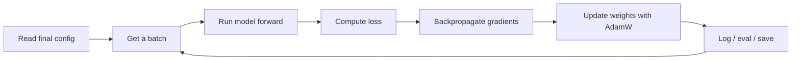
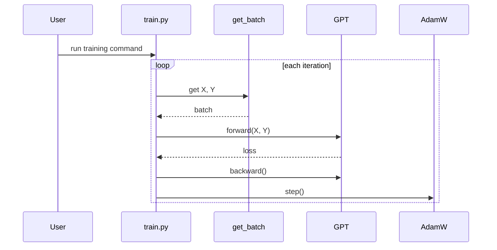
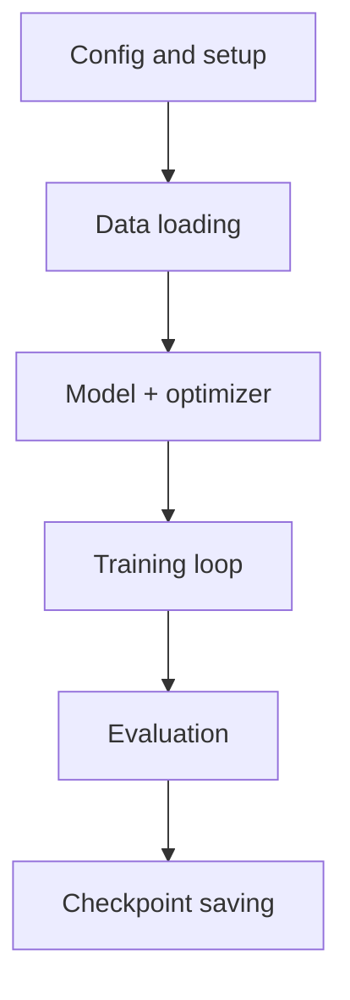

# Chapter 2: Training Engine

In [Configuration Overrides](01_configuration_overrides_.md), we learned how `nanoGPT` chooses its settings.

Now comes the next beginner question:

> **Once the settings are chosen, what does `train.py` actually do?**

This chapter answers that.

If Chapter 1 was about **setting the knobs**, Chapter 2 is about **starting the machine**.

---

## Why this exists

Training a GPT is not one single action.

It is a repeating cycle:

1. get some training data
2. ask the model to make predictions
3. measure how wrong it was
4. compute how to improve it
5. update the model's weights
6. repeat a huge number of times

That whole cycle is managed by `train.py`.

So `train.py` is the **training engine** of `nanoGPT`.

A good analogy is a flight cockpit:

- the model is the airplane
- the dataset is the sky route
- the optimizer is the control system
- `train.py` is the cockpit that keeps everything moving correctly

---

## Our concrete beginner use case

Let’s use the same simple command from the previous chapter:

```bash
python train.py config/train_shakespeare_char.py --device=cpu --compile=False
```

You already know from [Configuration Overrides](01_configuration_overrides_.md) how this command picks the settings.

Now we want to understand:

- where the data comes from
- what happens inside each training step
- why loss is printed
- when checkpoints are saved
- what features like gradient accumulation and mixed precision are doing

By the end of this chapter, this command should feel much less mysterious.

---

## The big picture

Here is the training engine at a very high level:



That loop is the heart of deep learning training.

---

## The simplest mental model

You can think of training like teaching a student with flashcards.

- **batch** = a small stack of flashcards
- **model forward pass** = the student answers
- **loss** = how wrong the answers were
- **backward pass** = figuring out what caused the mistakes
- **optimizer step** = slightly adjusting the student's brain
- **checkpoint** = saving the student's progress

And then: do that again, and again, and again.

---

## What `train.py` does before the loop starts

Before training begins, `train.py` prepares a few things:

- figures out whether this is single-device or multi-GPU training
- sets up the device (`cpu`, `cuda`, `mps`, etc.)
- opens the dataset files
- builds or loads the model
- creates the optimizer
- sets up mixed precision tools if needed

Later, [Initialization and Checkpoint Flow](06_initialization_and_checkpoint_flow_.md) will go deeper into model creation and resuming from saved checkpoints.

For now, the important beginner idea is:

> `train.py` spends some time getting ready, and then it enters a loop that repeats until training finishes.

---

## One training step in plain English

Let’s say the model sees part of the text:

- input: `HELL`
- target: `ELLO`

Why this pairing?

Because GPT training is next-token prediction:

- after `H`, predict `E`
- after `HE`, predict `L`
- after `HEL`, predict `L`
- after `HELL`, predict `O`

That shifting idea is central to GPTs.

The exact batching details come in [Token Dataset and Batching](03_token_dataset_and_batching_.md), but this is enough for now.

---

## The core loop in one tiny code sketch

Here is the basic idea, heavily simplified:

```python
X, Y = get_batch('train')
logits, loss = model(X, Y)
loss.backward()
optimizer.step()
optimizer.zero_grad()
```

What happens here?

- `X` = input tokens
- `Y` = target tokens
- `model(X, Y)` runs the model and computes loss
- `loss.backward()` computes gradients
- `optimizer.step()` updates parameters
- `optimizer.zero_grad()` clears old gradients

That is the whole learning cycle in miniature.

The real `train.py` adds several practical features around this basic pattern, but the core idea stays the same.

---

## Key concepts, one by one

## 1. A batch is a small chunk of training data

The model is not trained on the entire dataset at once.

Instead, it uses small pieces called **batches**.

In `train.py`, that looks like this:

```python
X, Y = get_batch('train')
```

This means:

- get one batch from the training split
- return inputs `X`
- return targets `Y`

High level result:

- `X` is what the model reads
- `Y` is what the model should predict

We will unpack exactly how `get_batch()` works in [Token Dataset and Batching](03_token_dataset_and_batching_.md).

---

## 2. The forward pass asks the model to predict

Next, the model tries to predict the next token.

```python
with ctx:
    logits, loss = model(X, Y)
```

This means:

- run the model on batch `X`
- compare predictions to `Y`
- return:
  - `logits` = raw prediction scores
  - `loss` = one number measuring wrongness

A very beginner-friendly way to think about **loss** is:

> **loss is the model's mistake score**

Lower is better.

---

## 3. The backward pass computes how to improve

After we know the mistake score, we ask:

> Which weights inside the model caused that mistake?

That is what backpropagation does.

```python
loss.backward()
```

This computes **gradients**.

A beginner analogy:

- the loss tells you **how bad**
- the gradients tell you **which direction to change the knobs**

Without gradients, the model would know it was wrong, but not how to get better.

---

## 4. The optimizer applies the update

Once gradients exist, the optimizer updates the model parameters.

In `nanoGPT`, the optimizer is **AdamW**.

```python
optimizer.step()
optimizer.zero_grad()
```

This means:

- `step()` changes the weights a little
- `zero_grad()` clears the old gradients

Why clear them?

Because gradients accumulate in PyTorch by default.  
If you did not clear them, the next step would accidentally mix old and new gradient information.

---

## 5. Repeat many times

A model does not become useful after one step.

It improves through many repeated corrections.

In `train.py`, that happens inside a loop:

```python
while True:
    # train one iteration
    # log sometimes
    # evaluate sometimes
    # stop at max_iters
```

This loop is the engine.

---

## What you might see on screen

When you run training, you may see lines like:

```text
tokens per iteration will be: 16,384
step 0: train loss 4.2000, val loss 4.1800
iter 10: loss 3.9500, time 52.31ms, mfu -100.00%
saving checkpoint to out-shakespeare-char
```

What do these mean?

- **tokens per iteration**: how much text is processed per optimizer update
- **train loss**: how wrong the model is on training data
- **val loss**: how wrong it is on validation data
- **time**: how long one iteration took
- **mfu**: a hardware-efficiency estimate on GPUs
- **saving checkpoint**: training progress was written to disk

For beginners, the most important numbers are usually:

- **train loss**
- **val loss**

If they go down, training is generally improving.

---

## A useful number: tokens per iteration

`train.py` prints this:

```python
tokens_per_iter = gradient_accumulation_steps * ddp_world_size * batch_size * block_size
```

This tells you how many tokens are used for one optimizer update.

For the Shakespeare character config:

- `gradient_accumulation_steps = 1`
- `ddp_world_size = 1`
- `batch_size = 64`
- `block_size = 256`

So:

```text
1 × 1 × 64 × 256 = 16,384
```

That matches the printed line.

This number is useful because it tells you the **effective training workload per step**.

---

## Under the hood: the training lifecycle

Here is a minimal step-by-step picture.



That is the basic training story.

The real code adds evaluation, logging, saving, mixed precision, and multi-GPU coordination.

---

## The real training loop skeleton

Here is a simplified version of the actual loop in `train.py`:

```python
while True:
    lr = get_lr(iter_num)
    if iter_num % eval_interval == 0:
        losses = estimate_loss()
    # forward + backward + update
    iter_num += 1
    if iter_num > max_iters:
        break
```

This shows the main rhythm:

1. decide the learning rate
2. sometimes evaluate
3. train one iteration
4. count the step
5. stop when done

---

## Why `model(X, Y)` returns the loss directly

A nice beginner-friendly design choice in `nanoGPT` is that the model computes its own training loss when targets are provided.

From `model.py`, simplified:

```python
if targets is not None:
    logits = self.lm_head(x)
    loss = F.cross_entropy(logits.view(-1, logits.size(-1)), targets.view(-1))
```

So `train.py` does not need to manually compute cross-entropy elsewhere.

That is why the training loop can simply do:

```python
logits, loss = model(X, Y)
```

Later, the model itself is explained in [GPT Language Model](05_gpt_language_model_.md).

---

## Evaluation: checking progress without training

Training should sometimes pause and ask:

> How well is the model doing right now?

That is what evaluation does.

In `train.py`, evaluation happens periodically.

```python
if iter_num % eval_interval == 0 and master_process:
    losses = estimate_loss()
    print(f"step {iter_num}: train loss {losses['train']:.4f}, val loss {losses['val']:.4f}")
```

This means:

- every `eval_interval` steps
- compute average losses on train and validation batches
- print them

Why both train and val?

- **train loss** shows how well the model fits what it has seen
- **val loss** shows how well it generalizes to held-out data

A good beginner rule:

> **validation loss is usually the more important one to watch**

---

## `estimate_loss()` uses evaluation mode

The evaluation helper is written to avoid training side effects.

Simplified:

```python
@torch.no_grad()
def estimate_loss():
    model.eval()
    # run a few batches and average the loss
    model.train()
```

Two beginner-important ideas here:

- `@torch.no_grad()` means do not track gradients
- `model.eval()` switches the model into evaluation mode

That makes evaluation cheaper and more correct.

---

## Checkpoints: saving progress

Training can take a long time, so `train.py` saves checkpoints.

A checkpoint is like a **save game**.

Simplified:

```python
checkpoint = {
    'model': raw_model.state_dict(),
    'optimizer': optimizer.state_dict(),
    'iter_num': iter_num,
}
torch.save(checkpoint, os.path.join(out_dir, 'ckpt.pt'))
```

This saves enough information to continue later.

High level result:

- model weights are saved
- optimizer state is saved
- current iteration is saved

That is why training can resume instead of starting over from zero.

We will study this flow more carefully in [Initialization and Checkpoint Flow](06_initialization_and_checkpoint_flow_.md).

---

## AdamW: the parameter update rule

`nanoGPT` uses **AdamW**, a very common optimizer for transformer training.

The optimizer is created in `model.py`:

```python
optimizer = torch.optim.AdamW(
    optim_groups, lr=learning_rate, betas=betas, **extra_args
)
```

You do not need to understand every AdamW detail right away.

For now, just remember:

> AdamW is the part that turns gradients into actual weight updates.

Also important: some parameters get **weight decay**, and some do not.  
That grouping is handled for you inside `configure_optimizers()`.

---

## Practical training feature 1: Gradient accumulation

Sometimes one batch is too large to fit in memory.

So instead of doing one huge batch, `train.py` can do several smaller **micro-steps** and add their gradients together.

This is called **gradient accumulation**.

Simplified:

```python
for micro_step in range(gradient_accumulation_steps):
    with ctx:
        logits, loss = model(X, Y)
        loss = loss / gradient_accumulation_steps
    scaler.scale(loss).backward()
```

What is happening?

- do several smaller forward/backward passes
- divide loss so the total gradient stays the right size
- only update weights after all micro-steps are done

Analogy:

- instead of carrying one giant box
- you carry four smaller boxes
- then count them as one full delivery

For the small Shakespeare character config, `gradient_accumulation_steps = 1`, so this feature is effectively off.  
But for larger runs, it matters a lot.

---

## Practical training feature 2: Mixed precision

Modern GPUs can often train faster using lower-precision math like `float16` or `bfloat16`.

`train.py` supports this automatically.

```python
ptdtype = {'float32': torch.float32, 'bfloat16': torch.bfloat16, 'float16': torch.float16}[dtype]
ctx = nullcontext() if device_type == 'cpu' else torch.amp.autocast(device_type=device_type, dtype=ptdtype)
scaler = torch.cuda.amp.GradScaler(enabled=(dtype == 'float16'))
```

Beginner version of what this means:

- **autocast** lets many operations run in a faster lower precision
- **GradScaler** helps keep `float16` training numerically safe

Analogy:

- full precision is like writing with very exact measurements
- mixed precision is like using lighter, faster tools where possible
- GradScaler is the safety equipment that prevents some mistakes

If you are on CPU, this machinery is usually much less important.

---

## Practical training feature 3: Gradient clipping

Sometimes gradients become too large and make training unstable.

`train.py` can clip them:

```python
if grad_clip != 0.0:
    scaler.unscale_(optimizer)
    torch.nn.utils.clip_grad_norm_(model.parameters(), grad_clip)
```

This is like a safety rail.

If gradients try to explode, clipping limits their size before the optimizer step.

Good beginner mental model:

> gradient clipping is a “don’t turn the knobs too violently” rule

---

## Practical training feature 4: Learning-rate warmup and cosine decay

The learning rate controls how big each update is.

In `train.py`, it can change over time.

Simplified:

```python
if it < warmup_iters:
    return learning_rate * (it + 1) / (warmup_iters + 1)
if it > lr_decay_iters:
    return min_lr
decay_ratio = (it - warmup_iters) / (lr_decay_iters - warmup_iters)
return min_lr + 0.5 * (1 + math.cos(math.pi * decay_ratio)) * (learning_rate - min_lr)
```

This schedule has three phases:

1. **warmup**: start gently
2. **main phase**: gradually decay
3. **floor**: stop decaying below `min_lr`

Analogy:

- do not slam the gas pedal at the start
- accelerate smoothly
- later slow down for a cleaner finish

This is one of those practical tricks that helps transformer training behave well.

---

## Practical training feature 5: DDP for multi-GPU training

`train.py` can also run on many GPUs using **Distributed Data Parallel (DDP)**.

Detection is simple:

```python
ddp = int(os.environ.get('RANK', -1)) != -1
if ddp:
    init_process_group(backend=backend)
    model = DDP(model, device_ids=[ddp_local_rank])
```

This means:

- if launched with `torchrun`, distributed training is enabled
- each process gets its own GPU
- gradients are synchronized across GPUs

Analogy:

- one worker can study one pile of flashcards
- four workers can each study a different pile
- then they combine what they learned before updating the shared model

A typical multi-GPU launch looks like:

```bash
torchrun --standalone --nproc_per_node=4 train.py config/train_gpt2.py
```

High level result:

- four GPU processes train together
- training is much faster than a single GPU run

---

## A neat DDP detail: sync only when needed

When using both DDP and gradient accumulation, `train.py` avoids unnecessary gradient synchronization on early micro-steps.

```python
if ddp:
    model.require_backward_grad_sync = (
        micro_step == gradient_accumulation_steps - 1
    )
```

This is an efficiency trick.

Beginner meaning:

- while accumulating gradients, do not sync every tiny step
- sync only on the last micro-step before the optimizer update

This reduces extra communication between GPUs.

You do not need to memorize this, but it is nice to see how practical the training loop is.

---

## Logging: what gets printed and why

Every `log_interval` iterations, `train.py` prints a short training report.

Simplified:

```python
if iter_num % log_interval == 0 and master_process:
    lossf = loss.item() * gradient_accumulation_steps
    print(f"iter {iter_num}: loss {lossf:.4f}, time {dt*1000:.2f}ms")
```

This gives you a quick heartbeat of training.

Useful beginner interpretation:

- if loss is trending down, learning is happening
- if time is extremely slow, maybe the device settings are not what you expected
- if nothing prints for a long time, your intervals may be large

---

## Optional extras around the engine

There are a few more practical parts around the training loop.

For example, optional compilation:

```python
if compile:
    model = torch.compile(model)
```

This can speed up training on supported systems.

But as a beginner, it is fine to think of it as:

> “an optional speed boost, not the core learning idea”

If you want more performance-focused discussion later, see [Performance and Benchmarking](08_performance_and_benchmarking_.md).

---

## Solving our use case step by step

Let’s return to our beginner command:

```bash
python train.py config/train_shakespeare_char.py --device=cpu --compile=False
```

Here is what happens at a high level:

1. `train.py` starts with default settings
2. the Shakespeare config overrides many of them
3. CPU is forced
4. compilation is turned off
5. the model and optimizer are created
6. a batch of character tokens is loaded
7. the model predicts the next characters
8. loss is computed
9. gradients are backpropagated
10. AdamW updates the weights
11. every so often, training and validation loss are measured
12. checkpoints may be saved
13. this repeats until `max_iters`

So even though the command is short, a lot is happening inside the engine.

---

## A beginner-friendly map of `train.py`

Here is a nice way to mentally divide the file:



This is one reason `nanoGPT` is such a useful learning project:

> the full training lifecycle is readable in one file

---

## Common beginner confusions

## “Is loss the same as accuracy?”

No.

For language models, training usually uses **cross-entropy loss**, not accuracy.  
Loss is a smoother, more useful signal for optimization.

---

## “Why does the model need so many iterations?”

Because each update is tiny.

Training is not one big rewrite of the model.  
It is millions of small nudges.

---

## “Why evaluate on validation data?”

Because we do not just want the model to memorize training batches.  
We want to know how well it works on unseen data too.

---

## “Why save checkpoints if training is still going?”

Because:

- training can crash
- you may want to resume later
- the best model may happen before the very end

---

## “Why is the code using `with ctx:`?”

That context enables mixed precision on supported devices.  
It is part of making training faster and more memory-efficient.

---

## Tiny cheat sheet

| Idea | What it means |
|---|---|
| `get_batch()` | fetch training examples |
| `model(X, Y)` | predict and compute loss |
| `loss.backward()` | compute gradients |
| `optimizer.step()` | update weights |
| `estimate_loss()` | check train/val performance |
| checkpoint | save progress to disk |
| gradient accumulation | simulate bigger batches |
| DDP | use multiple GPUs together |

---

## What this chapter really taught you

If you remember only one sentence, let it be this:

> **`train.py` is the loop that repeatedly predicts, measures error, backpropagates, updates the model, evaluates progress, and saves work.**

You learned that the training engine:

- builds batches
- runs the model forward
- gets a loss
- backpropagates gradients
- updates parameters with AdamW
- evaluates on train/val
- logs metrics
- saves checkpoints
- supports real-world training features like mixed precision, gradient accumulation, clipping, learning-rate schedules, and DDP

That is the operational heart of `nanoGPT`.

In the next chapter, we will zoom into one important piece of this loop: where `X` and `Y` come from in [Token Dataset and Batching](03_token_dataset_and_batching_.md).

---

Generated by [AI Codebase Knowledge Builder](https://github.com/The-Pocket/Tutorial-Codebase-Knowledge)