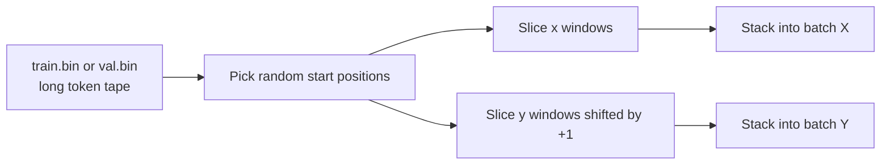
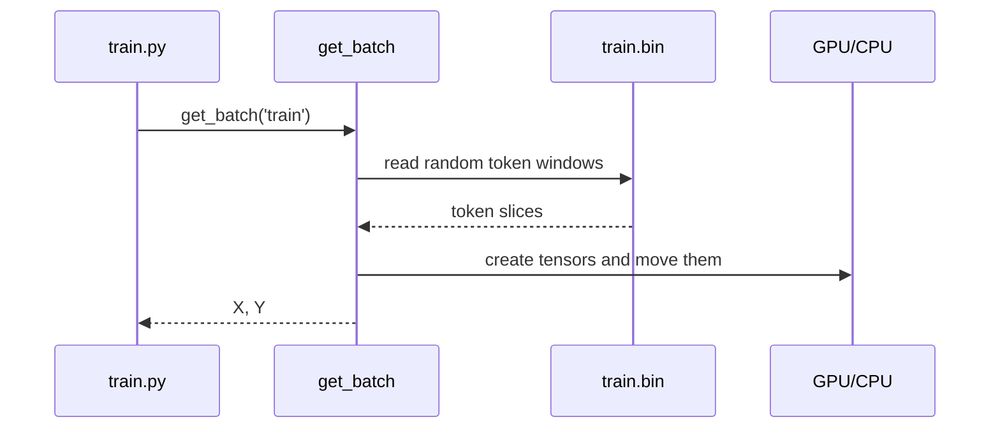

# Chapter 3: Token Dataset and Batching

In [Training Engine](02_training_engine_.md), we kept seeing this line:

```python
X, Y = get_batch('train')
```

This chapter zooms in on that one line.

If Chapter 2 was about the **engine**, this chapter is about the **fuel line**:  
**Where do `X` and `Y` actually come from?**

---

## Why this exists

A GPT trains on a *lot* of text.

But `nanoGPT` does **not** wrap that text in a big fancy dataset class.  
Instead, it keeps things very simple:

- tokenize the text into integers
- save those integers into `train.bin` and `val.bin`
- treat each file like one long tape of token IDs
- randomly cut out windows from that tape for training

That is the whole data path.

This design solves two beginner-important problems:

1. **The dataset can be huge**, so we don't want to load all of it into RAM.
2. **Training needs lots of small examples**, so we grab random windows on demand.

---

## Our concrete beginner use case

Let’s use a simple question:

> **When `train.py` calls `get_batch('train')`, what exactly are `X` and `Y`?**

By the end of this chapter, you will understand:

- what is inside `train.bin` and `val.bin`
- why the dataset is a long flat stream of token IDs
- how `get_batch()` picks random slices
- why `Y` is just `X` shifted by one token
- how batches get moved to CPU or GPU

If you understand that, you understand the entire `nanoGPT` data-loading story.

---

## The big picture

Here is the full idea:



That is it.

No complex dataset tree.  
No one-example-per-row table.  
Just a long tape of token IDs and random windows.

---

## First: what is in `train.bin`?

Before training starts, a dataset preparation script tokenizes raw text and saves the result.

So instead of storing text like:

- `"To be, or not to be"`

it stores token IDs like:

- `[51, 324, 11, 393, 407, 284, 324]`

The exact numbers depend on the tokenizer:

- in `shakespeare_char`, a token is a **character**
- in `openwebtext`, a token is usually a **subword piece**

But `get_batch()` does not care.  
To it, tokens are just integers.

### Important beginner idea

`train.bin` is **not** a spreadsheet of sentences.

It is just one long 1D stream of token IDs.

You can imagine it like this:

```text
[18, 7, 42, 5, 9, 11, 3, 27, 8, 8, 19, ...]
```

That is why people often describe it as a **tape**.

---

## `train.bin` and `val.bin`

`nanoGPT` usually uses two files:

- `train.bin` for learning
- `val.bin` for checking progress

This matches what we saw in [Training Engine](02_training_engine_.md):

- training loss uses training batches
- validation loss uses validation batches

So the split is very simple:

- `get_batch('train')` reads from `train.bin`
- `get_batch('val')` reads from `val.bin`

---

## The core language modeling trick: `Y` is `X` shifted by one

This is the heart of GPT training.

Suppose a tiny text window is:

```text
H E L L O
```

If we want the model to learn next-token prediction, we can set:

- `X = H E L L`
- `Y = E L L O`

So:

- after `H`, predict `E`
- after `HE`, predict `L`
- after `HEL`, predict `L`
- after `HELL`, predict `O`

That is why `Y` is just `X` shifted one step to the right.

### Tiny toy example

```python
tape = [20, 21, 22, 23, 24, 25]
start = 1
x = tape[start:start+4]
y = tape[start+1:start+5]
```

This gives:

- `x = [21, 22, 23, 24]`
- `y = [22, 23, 24, 25]`

So `y` is the "next token" version of `x`.

---

## One window becomes one training example

A single random window gives one pair:

- input sequence `x`
- target sequence `y`

In `nanoGPT`, the length of that window is called `block_size`.

So if:

- `block_size = 4`

then each example contains 4 input positions and 4 target positions.

### Beginner-friendly shape idea

| Tensor | Meaning | Shape |
|---|---|---|
| `x` | input token IDs | `(block_size,)` |
| `y` | next-token targets | `(block_size,)` |

---

## A batch means many windows at once

Training usually uses more than one example at a time.

If `batch_size = 2`, then we pick **two random windows** and stack them together.

```python
x = [[20, 21, 22],
     [22, 23, 24]]

y = [[21, 22, 23],
     [23, 24, 25]]
```

Now the shapes are:

| Tensor | Shape |
|---|---|
| `X` | `(batch_size, block_size)` |
| `Y` | `(batch_size, block_size)` |

So if:

- `batch_size = 2`
- `block_size = 3`

then `X` and `Y` are both shape `(2, 3)`.

---

## What `train.py` does with the batch

Back in [Training Engine](02_training_engine_.md), we saw this:

```python
X, Y = get_batch('train')
logits, loss = model(X, Y)
```

This means:

1. fetch a batch of token windows
2. ask the model to predict the next token at each position
3. compare predictions to `Y`

Later, in [GPT Language Model](05_gpt_language_model_.md), we will see exactly how `model(X, Y)` uses those tensors.

---

## Key concepts, one by one

## 1. The dataset is just a long flat token stream

This is the first big beginner idea.

Instead of:

- sentence objects
- paragraph objects
- custom dataset classes with lots of metadata

`nanoGPT` mostly uses:

- one flat binary file of token IDs

Analogy:

> Imagine a giant roll of movie film.  
> Training just grabs random clips from the roll.

---

## 2. `block_size` is the window length

`block_size` says:

> **How many tokens long should each training window be?**

If `block_size = 256`, then every sampled `x` and `y` sequence has length 256.

This number also becomes part of the model setup later in [Model Blueprint (GPTConfig)](04_model_blueprint__gptconfig__.md), because the model must know how much context it can handle.

---

## 3. `batch_size` is how many windows we grab

If:

- `batch_size = 64`

then each call to `get_batch()` returns 64 windows at once.

So one batch is:

- 64 input sequences in `X`
- 64 shifted target sequences in `Y`

---

## 4. The windows are chosen randomly

This is very important.

`nanoGPT` does not walk through the file line by line in order.  
Instead, it picks random starting points.

That means every batch is a different little sample of the giant token tape.

Analogy:

> You are not reading the whole book front to back.  
> You keep opening the book at random places and reading short snippets.

That randomness helps training mix the data.

---

## 5. `Y` is always `X` shifted by one token

This is the core language modeling setup.

A GPT is trained to answer:

> “What token comes next?”

So if `X` contains tokens from positions:

- `i` to `i + block_size - 1`

then `Y` contains tokens from:

- `i + 1` to `i + block_size`

Same window, just shifted right by one.

---

## 6. NumPy memmap keeps the full dataset off RAM

A very practical detail in `nanoGPT` is this:

- the dataset file can stay on disk
- NumPy gives you a `memmap` object that behaves a lot like an array
- small slices are read when needed

This is helpful because large datasets may not fit comfortably in memory.

A beginner-friendly analogy:

> A memmap is like looking at a huge book through a window.  
> You do not copy the whole book onto your desk.  
> You only read the page you need.

---

## 7. Batches are turned into PyTorch tensors

The memmap gives NumPy arrays.  
But the model needs PyTorch tensors.

So `get_batch()` converts each slice into tensors and stacks them into a batch.

High level:

- slice token IDs from NumPy
- convert to PyTorch
- stack into shape `(batch_size, block_size)`

---

## 8. On GPU, memory can be pinned before transfer

If training uses CUDA, `nanoGPT` does a small performance trick:

- pin CPU memory
- move tensors to GPU with `non_blocking=True`

You do **not** need to master this right now.

Beginner meaning:

> It is a speed optimization for moving batch data to the GPU.

If you are on CPU, this part is much less important.

---

## Solving our use case with a tiny example

Let’s answer the question:

> What are `X` and `Y`?

Imagine the token tape is:

```text
[5, 9, 2, 7, 4, 8, 1]
```

Let:

- `block_size = 4`
- `batch_size = 2`

Suppose random starts are:

- `0`
- `2`

Then the two examples are:

### Example 1
- `x = [5, 9, 2, 7]`
- `y = [9, 2, 7, 4]`

### Example 2
- `x = [2, 7, 4, 8]`
- `y = [7, 4, 8, 1]`

Stacked together:

```text
X = [[5, 9, 2, 7],
     [2, 7, 4, 8]]

Y = [[9, 2, 7, 4],
     [7, 4, 8, 1]]
```

That is exactly the kind of thing `get_batch()` returns.

---

## Under the hood: what happens step by step

Here is the non-code story for `get_batch('train')`:

1. decide whether to read `train.bin` or `val.bin`
2. open that file as a NumPy memmap
3. choose random start positions
4. slice `block_size` tokens for each input window
5. slice the same windows shifted by 1 for targets
6. stack them into batch tensors
7. move them to the training device
8. return `X` and `Y`

---

## Sequence diagram



This is the whole journey of a batch.

---

## Internal code walk-through from `train.py`

Now let’s look at the real ideas in smaller pieces.

## 1. Pick the dataset folder

From `train.py`, simplified:

```python
data_dir = os.path.join('data', dataset)
```

This builds a path like:

- `data/openwebtext`
- `data/shakespeare_char`

So the current `dataset` setting decides which folder to read from.  
That setting comes from the configuration system we learned in [Configuration Overrides](01_configuration_overrides_.md).

---

## 2. Open `train.bin` or `val.bin`

```python
if split == 'train':
    data = np.memmap(os.path.join(data_dir, 'train.bin'),
                     dtype=np.uint16, mode='r')
else:
    data = np.memmap(os.path.join(data_dir, 'val.bin'),
                     dtype=np.uint16, mode='r')
```

What this means:

- if we want training data, open `train.bin`
- otherwise open `val.bin`
- treat the file as `uint16` token IDs
- open it read-only (`mode='r'`)

### Why `uint16`?

Because token IDs are stored compactly on disk.  
This saves space.

Later, the code converts them to a PyTorch-friendly integer type.

### A small practical detail

In `train.py`, the memmap is recreated every batch.  
That looks a bit strange, but the comment explains it is done to avoid a memory leak.

So this is one of those “simple, practical engineering” choices.

---

## 3. Pick random start positions

```python
ix = torch.randint(len(data) - block_size, (batch_size,))
```

This line does a lot.

It says:

- choose `batch_size` random integers
- each integer is a valid starting point into the token tape

If:

- `batch_size = 4`

then `ix` might look like:

```text
[120, 5001, 42, 900]
```

Each number says:  
“start one training window here.”

### Why `len(data) - block_size`?

Because a full window must fit inside the file.

And since `y` needs one extra shifted token, the code carefully avoids starting too close to the end.

---

## 4. Build the input batch `x`

```python
x = torch.stack([
    torch.from_numpy((data[i:i+block_size]).astype(np.int64))
    for i in ix
])
```

This means:

- for each random start `i`
- take `block_size` tokens
- convert them to `int64`
- turn them into a PyTorch tensor
- stack all examples together

So if there are 64 starts, you get 64 rows in `x`.

### Why `stack`?

Because we want one 2D tensor instead of many separate 1D tensors.

Without stacking, we would have a Python list.  
With stacking, we get one clean batch tensor.

---

## 5. Build the target batch `y`

```python
y = torch.stack([
    torch.from_numpy((data[i+1:i+1+block_size]).astype(np.int64))
    for i in ix
])
```

This is the same as `x`, except every slice starts one token later.

That is the whole next-token trick.

If `x` starts at position `i`, then `y` starts at position `i+1`.

So:

- `x` = current tokens
- `y` = next tokens

---

## 6. Move the batch to the device

```python
if device_type == 'cuda':
    x = x.pin_memory().to(device, non_blocking=True)
    y = y.pin_memory().to(device, non_blocking=True)
else:
    x, y = x.to(device), y.to(device)
```

This means:

- if using CUDA, do a faster-style transfer
- otherwise just move tensors normally

### Beginner translation

- `pin_memory()` helps CPU-to-GPU transfer
- `non_blocking=True` lets that transfer happen more efficiently
- on CPU, none of this is necessary

You can think of it like this:

> pinned memory is a better loading dock for sending data to the GPU

---

## 7. Return the batch

At the end of `get_batch()`:

```python
return x, y
```

So when `train.py` writes:

```python
X, Y = get_batch('train')
```

`X` and `Y` are now ready for the model.

---

## A simpler cousin in `bench.py`

The benchmarking script uses the same basic idea.

```python
train_data = np.memmap(os.path.join(data_dir, 'train.bin'),
                       dtype=np.uint16, mode='r')
def get_batch(split):
    data = train_data
```

This version is simpler because:

- it is only benchmarking
- it ignores the validation split
- it keeps one memmap around

So the core data idea stays the same, even in the benchmark script.

---

## How to inspect a real batch yourself

A very beginner-friendly trick is to print a batch.

```python
X, Y = get_batch('train')
print(X.shape, Y.shape)
print(X[0, :8])
print(Y[0, :8])
```

What you will usually see:

- both shapes are `(batch_size, block_size)`
- `Y[0]` looks like `X[0]` shifted by one token

For example, if `X[0, :8]` is something like:

```text
tensor([18, 7, 42, 5, 9, 11, 3, 27])
```

then `Y[0, :8]` will often look like:

```text
tensor([7, 42, 5, 9, 11, 3, 27, 8])
```

The values are token IDs, so they may not be human-readable yet.  
But the shift pattern is the key thing to notice.

---

## A helpful analogy: measuring tape on a long ribbon

Imagine a very long ribbon with numbers printed on it.

- the ribbon = `train.bin`
- one ruler of length `block_size` = one training example
- many rulers placed at random = one batch
- the target ruler is the same thing moved one notch right

That is exactly what `nanoGPT` is doing.

---

## Why this design is so simple and powerful

`nanoGPT` could have used:

- dataset classes
- samplers
- custom collators
- complex file formats

But instead it mostly uses:

- a flat binary file
- a few random starting indices
- two slices per example

This makes the data path easy to understand.

If someone asks:

> “Where does the training batch come from?”

you can now answer:

> “From random windows cut out of `train.bin`, with targets shifted by one.”

---

## Common beginner questions

## “Why not store sentences separately?”

Because language modeling can be trained on one long token stream.

For `nanoGPT`, this keeps the code small and fast.

---

## “Why are `X` and `Y` the same shape?”

Because for every position in the input, the model predicts one next token.

So there is one target token per input position.

---

## “Why are the windows random?”

Random sampling mixes the data and gives varied batches during training.

If every batch came from the same nearby region, training would be less shuffled.

---

## “Why use memmap instead of loading everything into RAM?”

Because the dataset might be very large.

Memmap lets the file stay on disk while still allowing array-like slicing.

---

## “Why convert from `uint16` to `int64`?”

The file stores tokens compactly.  
PyTorch training code usually wants integer tensors in a bigger type such as `int64` (also called `long`).

So:

- disk format is compact
- training tensor format is convenient

---

## “Does this depend on the tokenizer?”

No.

This batching code does not care whether tokens are:

- characters
- subwords
- words
- something else

As long as the data is a flat stream of token IDs, the batching logic stays the same.

---

## Tiny cheat sheet

| Idea | Meaning |
|---|---|
| `train.bin` | long token stream for training |
| `val.bin` | long token stream for validation |
| `block_size` | length of each sampled window |
| `batch_size` | number of windows per batch |
| `X` | input token windows |
| `Y` | same windows shifted right by one |
| `np.memmap` | read slices without loading full dataset into RAM |
| `pin_memory()` | faster CPU-to-GPU transfer helper |

---

## What this chapter really taught you

If you remember only one sentence, let it be this:

> **A `nanoGPT` batch is just a set of random windows from `train.bin`, with targets equal to the same windows shifted by one token.**

You learned that:

- the dataset is stored as flat binary token files
- `train.bin` and `val.bin` are the two main splits
- `get_batch()` picks random start positions
- `x` is a slice of length `block_size`
- `y` is the same slice shifted by one
- many windows are stacked into a batch
- memmaps keep the whole dataset off RAM
- pinned memory helps move batches to GPU faster

That is the full data path.

Next, we will move from the data to the model’s configuration in [Model Blueprint (GPTConfig)](04_model_blueprint__gptconfig__.md).

---

Generated by [AI Codebase Knowledge Builder](https://github.com/The-Pocket/Tutorial-Codebase-Knowledge)