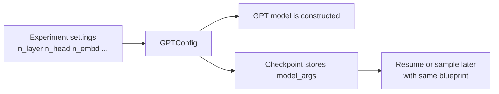
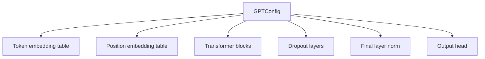
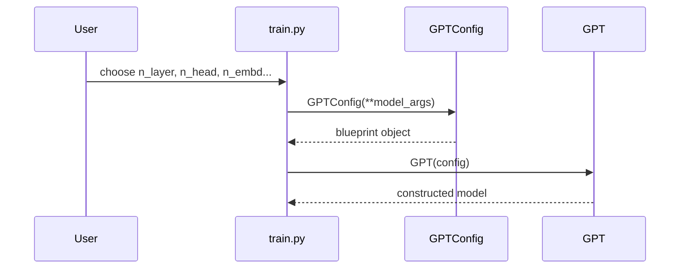

# Chapter 4: Model Blueprint (GPTConfig)

In [Token Dataset and Batching](03_token_dataset_and_batching_.md), we learned where `X` and `Y` come from:

- `X` is a batch of token windows
- `Y` is the same batch shifted by one token

Now we can ask the next beginner question:

> **What kind of model are those token batches being sent into?**

Before we study the full [GPT Language Model](05_gpt_language_model_.md), we need to understand the small object that *describes* the model first:

**`GPTConfig`**

---

## Why this exists

Imagine you want to train a **small Shakespeare model**.

You might choose:

- `block_size = 256`
- `vocab_size = 65`
- `n_layer = 6`
- `n_head = 6`
- `n_embd = 384`
- `dropout = 0.2`
- `bias = False`

Those are important choices.

But where should they live?

If every part of the code had to receive these values separately, things would get messy fast:

- model constructor needs them
- checkpoint saving needs them
- resume logic needs them
- sampling needs them
- pretrained loading needs them

So `nanoGPT` puts these model-shape choices into **one compact object**:

**`GPTConfig`**

A very beginner-friendly analogy:

> `GPTConfig` is the **blueprint**.  
> `GPT` is the **building**.

The blueprint says:

- how big the building should be
- how many floors it has
- how wide the rooms are

The building code then uses that blueprint to actually construct the house.

---

## Our concrete beginner use case

Let’s solve this question:

> **If I choose a small model in a config file, how do those numbers actually become a real GPT model?**

By the end of this chapter, you will understand:

- what `GPTConfig` stores
- what each field means
- why it is separate from training settings
- how `train.py` turns settings into a `GPTConfig`
- how `model.py` uses that config to build the model
- why checkpoints and sampling also rely on the same blueprint

---

## The big picture



The key idea is:

> **One blueprint object keeps the whole model consistent.**

---

## Meet `GPTConfig`

In `model.py`, `GPTConfig` is defined like this:

```python
@dataclass
class GPTConfig:
    block_size: int = 1024
    vocab_size: int = 50304
    n_layer: int = 12
    n_head: int = 12
    n_embd: int = 768
    dropout: float = 0.0
    bias: bool = True
```

This is a Python **dataclass**.

A beginner-friendly way to think about a dataclass is:

> a neat little container for named settings

So `GPTConfig` does **not** do neural network math.  
It mostly just stores values like:

- `config.n_layer`
- `config.n_head`
- `config.block_size`

Later, the real model reads those values and builds itself.

---

## What each field means

Here is the beginner version:

| Field | Meaning | Simple mental model |
|---|---|---|
| `block_size` | maximum sequence length | how much text the model can look at once |
| `vocab_size` | number of possible token IDs | size of the token dictionary |
| `n_layer` | number of transformer blocks | number of processing floors |
| `n_head` | number of attention heads | number of parallel “attention views” |
| `n_embd` | embedding width | how wide the model’s internal vectors are |
| `dropout` | regularization amount | small random noise during training |
| `bias` | whether some layers use bias terms | a small architecture choice |

---

## A very important boundary: model settings vs training settings

One of the nicest things about `GPTConfig` is that it draws a clean line.

### Inside `GPTConfig`
These describe **what model to build**:

- `block_size`
- `vocab_size`
- `n_layer`
- `n_head`
- `n_embd`
- `dropout`
- `bias`

### Outside `GPTConfig`
These describe **how to train or run it**:

- `batch_size`
- `learning_rate`
- `max_iters`
- `device`
- `eval_interval`
- `compile`

That is a really useful beginner idea.

> `GPTConfig` is about the **model blueprint**, not the whole experiment.

So if you change `learning_rate`, you are not changing the model architecture.  
If you change `n_layer`, you **are** changing the model architecture.

---

## Solving our use case

Let’s say your experiment chooses a smaller Shakespeare model.

A config recipe might contain settings like:

```python
block_size = 256
n_layer = 6
n_head = 6
n_embd = 384
dropout = 0.2
bias = False
```

These are still just plain Python variables at this point.

Later, `train.py` gathers the model-related ones into `model_args`:

```python
model_args = dict(
    n_layer=n_layer, n_head=n_head, n_embd=n_embd,
    block_size=block_size, bias=bias,
    vocab_size=meta_vocab_size, dropout=dropout,
)
```

This means:

- take the chosen values
- put them into one dictionary
- prepare them for model construction

Then `train.py` turns them into a `GPTConfig`:

```python
gptconf = GPTConfig(**model_args)
model = GPT(gptconf)
```

Beginner translation:

- `GPTConfig(**model_args)` = “make the blueprint”
- `GPT(gptconf)` = “build the actual model from that blueprint”

If this is a Shakespeare character dataset, `meta_vocab_size` may be something like `65`.  
So the finished model will be built for:

- 65 possible tokens
- sequence length up to 256
- 6 transformer blocks
- 6 heads per block
- embedding size 384

That is exactly how a few settings become a real neural network.

---

## Why not pass seven separate arguments everywhere?

You *could* imagine code like this:

```python
model = GPT(
    block_size=256,
    vocab_size=65,
    n_layer=6,
    # ...
)
```

But then other parts of the code would also need all those values separately:

- checkpoint saving
- checkpoint loading
- pretrained initialization
- model surgery like cropping block size

That would be repetitive and error-prone.

`GPTConfig` solves that by saying:

> “Here is the whole model blueprint in one object.”

This makes the code cleaner and easier to reason about.

---

## Key concepts, one by one

## 1. `block_size` = maximum context length

You already saw `block_size` in [Token Dataset and Batching](03_token_dataset_and_batching_.md).

There, it meant:

- how long each sampled window is

Here, it also means:

- how long a sequence the model is prepared to handle

Inside `model.py`, the forward pass checks this:

```python
b, t = idx.size()
assert t <= self.config.block_size
```

This means:

- `t` = current sequence length
- it must not exceed the model’s `block_size`

So if your model was built with `block_size = 256`, it cannot accept a length-300 input without special handling.

### Beginner mental model

`block_size` is like the size of the model’s desk.

If the desk fits 256 tokens, you cannot place 400 tokens on it all at once.

---

## 2. `vocab_size` = how many token IDs exist

The model needs to know how many possible tokens there are.

For a character-level dataset, the vocabulary may be small.  
For a GPT-2 tokenizer, it is much larger.

`vocab_size` matters in two big places.

First, token embeddings:

```python
wte = nn.Embedding(config.vocab_size, config.n_embd)
```

This means:

- there is one embedding row per token ID
- each row has width `n_embd`

Second, output prediction:

```python
self.lm_head = nn.Linear(config.n_embd, config.vocab_size, bias=False)
```

This means:

- after processing, the model produces scores
- one score for each possible token

So `vocab_size` affects both:

- how tokens go **in**
- how predictions come **out**

### Beginner analogy

If `vocab_size` is the size of the dictionary, then:

- the embedding table is how the model **looks up words**
- the output layer is how the model **chooses the next word**

---

## 3. `n_layer` = how many transformer blocks

The model contains a stack of repeated processing units called blocks.

In `model.py`, they are created like this:

```python
h = nn.ModuleList([Block(config) for _ in range(config.n_layer)])
```

This means:

- build `config.n_layer` many blocks
- store them in a list-like module container

So if:

- `n_layer = 6`

then the model gets 6 transformer blocks.

If:

- `n_layer = 12`

then it gets 12 blocks.

### Beginner analogy

Think of text flowing through a series of workshops.

Each workshop refines the representation a bit more.

- more layers = more workshops
- fewer layers = a smaller model

We will look inside a block later in [Transformer Block](09_transformer_block_.md).

---

## 4. `n_head` = how many attention heads per block

Inside each block is self-attention.

Attention is split into several parallel heads.

One important rule appears in `model.py`:

```python
assert config.n_embd % config.n_head == 0
```

This means:

- the embedding size must split evenly across heads

For example:

- `n_embd = 384`, `n_head = 6` works
- each head gets `384 / 6 = 64` dimensions

But:

- `n_embd = 385`, `n_head = 6` would not work evenly

### Beginner analogy

Imagine 6 students sharing 384 colored pencils equally.

That works because each gets 64 pencils.

If the number did not divide evenly, the sharing would be awkward.

We will go deeper into attention later in [Causal Self-Attention](10_causal_self_attention_.md).

---

## 5. `n_embd` = width of the model’s internal representation

This is one of the most important size settings.

`n_embd` controls the width of vectors flowing through the model.

You can see it in many places:

- token embeddings are size `n_embd`
- position embeddings are size `n_embd`
- attention projections use `n_embd`
- the final layer norm uses `n_embd`

For example:

```python
wpe = nn.Embedding(config.block_size, config.n_embd)
ln_f = LayerNorm(config.n_embd, bias=config.bias)
```

### Beginner intuition

If `n_layer` is how **deep** the model is,  
then `n_embd` is how **wide** it is.

A wider model can carry richer internal information, but it also costs more memory and computation.

---

## 6. `dropout` = small random regularization during training

Dropout is a training trick that randomly drops some activations.

In `model.py`, it shows up in several places:

```python
self.attn_dropout = nn.Dropout(config.dropout)
self.resid_dropout = nn.Dropout(config.dropout)
```

This means the dropout rate is controlled by the config.

If:

- `dropout = 0.0`, dropout is effectively off
- `dropout = 0.2`, dropout randomly drops 20% in those spots during training

### Beginner analogy

Dropout is like forcing a team to practice even when a few members occasionally sit out.

That can make the whole team less dependent on any one path.

---

## 7. `bias` = small architecture choice for certain layers

`bias` controls whether some linear layers and layer norms include bias parameters.

For example:

```python
self.c_attn = nn.Linear(config.n_embd, 3 * config.n_embd, bias=config.bias)
```

And in custom layer norm:

```python
self.bias = nn.Parameter(torch.zeros(ndim)) if bias else None
```

So if:

- `bias = True`, those layers use bias terms
- `bias = False`, they do not

You do not need to worry deeply about this yet.

Beginner version:

> `bias` is a small model-design switch.

The repo comment even says:

- `True`: like GPT-2
- `False`: a bit better and faster

---

## A tiny “blueprint first” example

Here is the smallest way to create a custom model manually:

```python
from model import GPTConfig, GPT

cfg = GPTConfig(
    block_size=256, vocab_size=65,
    n_layer=6, n_head=6, n_embd=384,
    dropout=0.2, bias=False
)
model = GPT(cfg)
```

What happens at a high level:

- `cfg` stores the chosen blueprint
- `model` becomes a real GPT built from that blueprint
- the constructor prints the parameter count

You do **not** have to build models this way during normal training, but it is a great mental model.

---

## A helpful picture of the blueprint



One small object influences many different parts of the model.

That is why it is called a blueprint.

---

## Under the hood: what happens step by step

Let’s walk through the beginner story for our Shakespeare example.

1. You choose settings like `n_layer=6`, `n_head=6`, `n_embd=384`
2. `train.py` gathers the model-related settings
3. `GPTConfig` is created from them
4. `GPT.__init__` reads `config`
5. the model builds:
   - token embeddings
   - position embeddings
   - a list of blocks
   - final layer norm
   - output head
6. later, checkpoints save the same `model_args`
7. when resuming or sampling, the code rebuilds the same `GPTConfig`
8. then it loads the saved weights into that same model shape

That last part is very important:

> the saved weights only make sense if the model shape matches

`GPTConfig` helps guarantee that.

---

## Sequence diagram



This is the creation story in miniature.

---

## Internal code walk-through

Now let’s look at how the real files use `GPTConfig`.

---

## 1. `model.py` defines the blueprint

The definition itself is very small:

```python
@dataclass
class GPTConfig:
    block_size: int = 1024
    vocab_size: int = 50304
    n_layer: int = 12
    n_head: int = 12
    n_embd: int = 768
    dropout: float = 0.0
    bias: bool = True
```

This tells us something important:

> `GPTConfig` is intentionally simple.

It is not a giant framework.  
It is just a clean bundle of model settings.

---

## 2. `train.py` creates `GPTConfig` before building the model

From `train.py`, simplified:

```python
model_args = dict(
    n_layer=n_layer, n_head=n_head, n_embd=n_embd,
    block_size=block_size, bias=bias,
    vocab_size=meta_vocab_size, dropout=dropout,
)
gptconf = GPTConfig(**model_args)
```

This means:

- take experiment variables
- keep only the model-relevant ones
- create a blueprint object

Notice what is **not** included here:

- `batch_size`
- `learning_rate`
- `device`

That is the clean boundary we talked about earlier.

---

## 3. `GPT.__init__` reads the config to build the pieces

Inside `model.py`, the GPT constructor stores the config:

```python
self.config = config
```

Then it uses the config everywhere.

For example, embeddings:

```python
wte = nn.Embedding(config.vocab_size, config.n_embd)
wpe = nn.Embedding(config.block_size, config.n_embd)
```

This means:

- token embeddings depend on `vocab_size` and `n_embd`
- position embeddings depend on `block_size` and `n_embd`

So if you change the config, these layer shapes change too.

---

## 4. Blocks are created from the same config

The model also uses the config to make repeated blocks:

```python
h = nn.ModuleList([Block(config) for _ in range(config.n_layer)])
```

Then each `Block` passes that same config into its own sub-parts.

That means the same blueprint reaches all the way down into:

- layer norms
- attention
- MLP layers
- dropout

So `GPTConfig` is not just used once.  
It is reused throughout the entire model tree.

---

## 5. Attention also depends on the config

Inside `CausalSelfAttention`, the config is used immediately:

```python
assert config.n_embd % config.n_head == 0
self.n_head = config.n_head
self.n_embd = config.n_embd
self.dropout = config.dropout
```

So attention needs to know:

- how many heads
- how wide the embeddings are
- how much dropout to use

This is a nice example of why a single config object is convenient.

Without it, you would have to pass many separate values into every submodule.

---

## 6. `block_size` affects more than one thing

In attention, `block_size` also matters for the causal mask in the non-flash path:

```python
self.register_buffer(
    "bias",
    torch.tril(torch.ones(config.block_size, config.block_size))
)
```

You do not need to master this yet.

Beginner meaning:

- the model may need a square mask based on the maximum sequence length
- so `block_size` changes real internal tensor shapes

That is why `block_size` belongs in the blueprint.

---

## 7. Checkpoints save the model blueprint too

In `train.py`, checkpoints include `model_args`:

```python
checkpoint = {
    'model': raw_model.state_dict(),
    'optimizer': optimizer.state_dict(),
    'model_args': model_args,
}
```

This is very important.

Why save `model_args`?

Because later, when you want to resume or sample, the code must rebuild the **same kind of model** before loading the saved weights.

Think of it like this:

- weights are the furniture
- `model_args` describe the house

You need the same house layout before putting the furniture back in.

We will study this flow more in [Initialization and Checkpoint Flow](06_initialization_and_checkpoint_flow_.md).

---

## 8. `sample.py` rebuilds the model from the saved blueprint

When sampling from a checkpoint, `sample.py` does this:

```python
gptconf = GPTConfig(**checkpoint['model_args'])
model = GPT(gptconf)
```

This means:

1. read saved model settings
2. rebuild the same architecture
3. load the saved weights

So `GPTConfig` is not just for training startup.  
It is also part of the restore path.

That is one of its biggest jobs.

---

## 9. Pretrained GPT-2 variants also use `GPTConfig`

Even pretrained loading still goes through the same blueprint idea.

In `model.py`, `from_pretrained()` builds a config like this:

```python
config_args['vocab_size'] = 50257
config_args['block_size'] = 1024
config_args['bias'] = True
config = GPTConfig(**config_args)
```

This means:

- even when loading GPT-2 weights
- the code still first describes the architecture with `GPTConfig`

So whether the model comes from:

- scratch
- resume
- pretrained GPT-2

the project still uses the same blueprint object.

That consistency is a really nice design choice.

---

## 10. The model can even shrink its `block_size`

There is also a helper called `crop_block_size()`:

```python
assert block_size <= self.config.block_size
self.config.block_size = block_size
self.transformer.wpe.weight = nn.Parameter(
    self.transformer.wpe.weight[:block_size]
)
```

Beginner version:

- if a loaded model supports a larger context
- you can surgically reduce it to a smaller one

This is another example of the config being treated as the model’s official blueprint.

---

## A useful mental model: one suitcase of model facts

Imagine the model constructor is going on a trip.

Instead of carrying 7 loose papers:

- one says `n_layer`
- one says `n_head`
- one says `n_embd`
- one says `dropout`
- ...

it carries **one suitcase**: `GPTConfig`

That suitcase contains everything needed to answer:

> “What kind of GPT am I?”

---

## Common beginner confusions

## “Is `GPTConfig` the model?”

No.

`GPTConfig` is just the **description** of the model.

- `GPTConfig` = blueprint
- `GPT` = actual neural network

---

## “Why is `batch_size` not in `GPTConfig`?”

Because `batch_size` is about **training**, not about the model’s architecture.

You can train the same model with different batch sizes.

---

## “Why is `block_size` in both data loading and model config?”

Because it matters to both:

- batching uses it to cut input windows
- the model uses it to define maximum context and position embeddings

So it is both a data-shape choice and a model-shape choice.

---

## “Why does `vocab_size` have to be known?”

Because the model needs fixed-size layers for:

- token embeddings
- output logits

It has to know how many possible token IDs exist.

---

## “Can I change `n_head` to anything I want?”

Not quite.

It must work with `n_embd` so that:

```python
n_embd % n_head == 0
```

Each head needs an equal share of the embedding dimensions.

---

## “Why have defaults in `GPTConfig` if `train.py` overrides them?”

The defaults make the class usable on its own and provide sensible starting values.

But in real experiments, `train.py` often replaces them with your chosen settings.

---

## Tiny cheat sheet

| If you change... | You are changing... |
|---|---|
| `n_layer` | model depth |
| `n_head` | number of attention heads |
| `n_embd` | model width |
| `vocab_size` | token dictionary size |
| `block_size` | max context length |
| `dropout` | regularization behavior |
| `bias` | a small layer design choice |

And:

| This is... | Usually belongs where? |
|---|---|
| `learning_rate` | training config |
| `batch_size` | training config |
| `device` | runtime config |
| `n_layer` | `GPTConfig` |
| `n_head` | `GPTConfig` |

---

## What this chapter really taught you

If you remember only one sentence, let it be this:

> **`GPTConfig` is the compact blueprint that defines what kind of GPT model to build.**

You learned that:

- `GPTConfig` stores the model’s architectural settings
- it is separate from general training settings
- `train.py` turns chosen values into a `GPTConfig`
- `GPT` reads that config to build embeddings, blocks, attention, and output layers
- checkpoints save the same blueprint so the model can be rebuilt later
- pretrained loading also uses the same idea

Now that the blueprint makes sense, we are ready to study the actual building.

In the next chapter, we will look at the full [GPT Language Model](05_gpt_language_model_.md).

---

Generated by [AI Codebase Knowledge Builder](https://github.com/The-Pocket/Tutorial-Codebase-Knowledge)