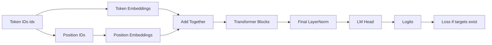
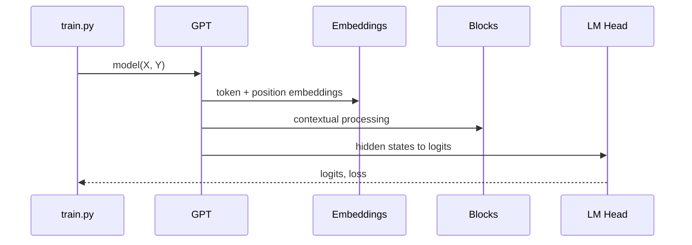

# Chapter 5: GPT Language Model

In the previous chapter, [Model Blueprint (GPTConfig)](04_model_blueprint__gptconfig__.md), we learned how `nanoGPT` describes a model before building it.

Now we finally meet the real star of the repo:

**`GPT`**

If `GPTConfig` is the blueprint, then `GPT` is the actual building.

---

## Why this exists

So far, we have seen:

- how settings get chosen in [Configuration Overrides](01_configuration_overrides_.md)
- how training loops work in [Training Engine](02_training_engine_.md)
- how batches `X` and `Y` are created in [Token Dataset and Batching](03_token_dataset_and_batching_.md)
- how model shape is described in [Model Blueprint (GPTConfig)](04_model_blueprint__gptconfig__.md)

But one big beginner question is still waiting:

> **What is the actual neural network that turns token IDs into predictions?**

That is exactly what the `GPT` class does.

It takes in token IDs like:

```text
[18, 7, 42, 5]
```

and produces scores for the next token at each position.

A good analogy is a **translation pipeline**:

1. raw token IDs go in
2. they are turned into vectors
3. position information is added
4. several Transformer layers build richer context
5. a final output layer scores every possible next token

That whole pipeline lives inside `GPT`.

---

## Our concrete beginner use case

Let’s solve this very common line from `train.py`:

```python
logits, loss = model(X, Y)
```

What does it really mean?

By the end of this chapter, you will understand:

- what the `GPT` class contains
- what happens inside `model(X, Y)`
- what `logits` are
- why `loss` is optional
- how the same class also supports:
  - training
  - evaluation
  - generation
  - checkpoint restore
  - pretrained GPT-2 loading

If you understand `GPT`, you understand the center of `nanoGPT`.

---

## The big picture

Here is the top-level flow inside the model:



You can read this as:

- first, turn tokens into vectors
- also encode where each token sits in the sequence
- mix those together
- refine them through many blocks
- convert the final hidden states into vocabulary scores

---

## Meet the `GPT` class

In `model.py`, the model is defined like this:

```python
class GPT(nn.Module):
    def __init__(self, config):
        super().__init__()
        self.config = config
        # build embeddings, blocks, layer norm, output head
```

This means:

- `GPT` is a PyTorch neural network module
- it is built from a `GPTConfig`
- once constructed, it can be called like a normal model

So when `train.py` does this:

```python
gptconf = GPTConfig(**model_args)
model = GPT(gptconf)
```

it is saying:

- make the blueprint
- build the full GPT network from that blueprint

---

## The simplest mental model

Think of `GPT` as a text-reading factory.

- **input**: token IDs
- **middle**: layers that build contextual meaning
- **output**: scores for the next token

Or even simpler:

> `GPT` is the machine that answers:  
> **"Given the text so far, what token should come next?"**

That is the core job of a language model.

---

## A tiny example of using it

Here is a small example:

```python
from model import GPT, GPTConfig
import torch

cfg = GPTConfig(block_size=8, vocab_size=65, n_layer=2, n_head=2, n_embd=32)
model = GPT(cfg)
idx = torch.tensor([[1, 2, 3, 4]])
targets = torch.tensor([[2, 3, 4, 5]])
logits, loss = model(idx, targets)
```

What happens here?

- `idx` is one input sequence
- `targets` is the shifted next-token version
- `logits` contains prediction scores
- `loss` is one number measuring error

At a high level:

- `logits.shape` would be `(1, 4, 65)`
- `loss` would be a single scalar value

That means:

- batch size = 1
- sequence length = 4
- vocabulary size = 65

---

## Where `GPT` appears in the repo

The reason this class matters so much is that it appears everywhere.

### In training

```python
model = GPT(gptconf)
logits, loss = model(X, Y)
```

This is the core training path from [Training Engine](02_training_engine_.md).

---

### In sampling

```python
model = GPT(gptconf)
y = model.generate(x, max_new_tokens=100)
```

This is the text-generation path used by `sample.py`.

We will study generation in more detail in [Autoregressive Text Generation](07_autoregressive_text_generation_.md).

---

### In pretrained loading

```python
model = GPT.from_pretrained('gpt2')
```

This creates a `GPT` and fills it with GPT-2 weights.

We will connect this more to model startup in [Initialization and Checkpoint Flow](06_initialization_and_checkpoint_flow_.md).

---

## The main pieces inside `GPT`

The constructor builds several important parts:

```python
self.transformer = nn.ModuleDict(dict(
    wte = nn.Embedding(config.vocab_size, config.n_embd),
    wpe = nn.Embedding(config.block_size, config.n_embd),
    drop = nn.Dropout(config.dropout),
    h = nn.ModuleList([Block(config) for _ in range(config.n_layer)]),
    ln_f = LayerNorm(config.n_embd, bias=config.bias),
))
```

This is dense at first, so let’s translate it.

| Part | Meaning | Beginner picture |
|---|---|---|
| `wte` | token embeddings | turn token IDs into vectors |
| `wpe` | position embeddings | tell the model where each token is |
| `drop` | dropout | regularization during training |
| `h` | list of Transformer blocks | repeated processing layers |
| `ln_f` | final layer norm | final cleanup before output |

Then there is one more output layer:

```python
self.lm_head = nn.Linear(config.n_embd, config.vocab_size, bias=False)
```

This layer maps hidden vectors back to vocabulary scores.

So the full story is:

- tokens enter as integers
- they become vectors
- those vectors are refined
- the model produces one score per possible token

---

## Key concepts, one by one

## 1. Input is a batch of token IDs

From [Token Dataset and Batching](03_token_dataset_and_batching_.md), we know `X` looks like this:

- shape `(batch_size, block_size)`
- values are integer token IDs

For example:

```python
idx = torch.tensor([
    [10, 20, 30, 40],
    [ 7,  8,  9, 10],
])
```

This means:

- there are 2 sequences
- each sequence has length 4

At this point, the model sees only integers.

Those integers are not yet rich meanings.

---

## 2. Token embeddings turn IDs into vectors

The first big step is:

```python
tok_emb = self.transformer.wte(idx)
```

This uses an embedding table.

Beginner meaning:

- each token ID looks up a learned vector
- token `10` gets one vector
- token `20` gets another vector
- and so on

If `n_embd = 32`, then each token becomes a length-32 vector.

### Analogy

Imagine a giant dictionary drawer.

- token ID `10` points to one drawer
- token ID `20` points to another drawer

Inside each drawer is a learned vector describing that token.

So token embeddings are like the model’s **meaning lookup table**.

---

## 3. Position embeddings tell the model where each token is

A language model must know not only **what** the tokens are, but also **where** they are.

The model creates position IDs like this:

```python
pos = torch.arange(0, t, dtype=torch.long, device=device)
pos_emb = self.transformer.wpe(pos)
```

If the sequence length `t` is 4, then `pos` is basically:

```text
[0, 1, 2, 3]
```

Then the model looks up embeddings for those positions.

### Why this matters

These two sequences contain the same tokens but in a different order:

- `the cat sat`
- `sat cat the`

Without position information, the model would struggle to tell them apart.

### Analogy

Token embeddings tell you **which word card** you have.  
Position embeddings add a sticky note saying:

- first
- second
- third
- fourth

So the model knows both identity and location.

---

## 4. Token and position embeddings are added together

After that, the model combines them:

```python
x = self.transformer.drop(tok_emb + pos_emb)
```

This means:

- take the token meaning vector
- add the position vector
- apply dropout

Beginner translation:

> “This token means X, and it appears in position Y.”

That combined representation becomes the input to the Transformer stack.

### Shape intuition

| Tensor | Shape |
|---|---|
| `idx` | `(b, t)` |
| `tok_emb` | `(b, t, n_embd)` |
| `pos_emb` | `(t, n_embd)` |
| `x` | `(b, t, n_embd)` |

The position embeddings are shared across the whole batch.

---

## 5. Transformer blocks build context layer by layer

Then the model sends `x` through many blocks:

```python
for block in self.transformer.h:
    x = block(x)
```

If `n_layer = 6`, this loop runs 6 times.

Each block helps the model build richer contextual understanding.

For example, in the phrase:

- `bank of the river`
- `bank account`

the meaning of `bank` depends on surrounding tokens.

That is exactly the kind of contextual processing these blocks help create.

### Analogy

Think of each block as a workshop station in a factory.

- first station: rough understanding
- second station: better context
- third station: even better context
- ...

By the time the text leaves the final station, its internal representation is much richer.

We will open up one block in [Transformer Block](09_transformer_block_.md), and then zoom further into attention in [Causal Self-Attention](10_causal_self_attention_.md).

---

## 6. A final layer norm cleans up the result

After all blocks, the model applies:

```python
x = self.transformer.ln_f(x)
```

This is the final layer normalization.

Beginner version:

- it helps stabilize the hidden values
- it prepares them for the final output layer

You can think of it like a final polish before the answer is scored.

---

## 7. The language-model head turns hidden states into logits

Now comes the output step:

```python
logits = self.lm_head(x)
```

This maps from hidden width `n_embd` back to `vocab_size`.

So if:

- `n_embd = 384`
- `vocab_size = 65`

then each position’s hidden vector becomes 65 scores.

These scores are called **logits**.

### What are logits?

Logits are raw, unnormalized scores.

They are **not probabilities yet**.

For example, a position might produce something like:

```text
[2.4, -0.1, 0.8, 5.2, 1.0]
```

This means:

- token 4 currently has the highest score
- the model thinks token 4 is most likely next

Later, softmax can turn logits into probabilities.

### Analogy

Logits are like every token entering a competition.  
Each token gets a score.  
The highest score is the current favorite.

---

## 8. If targets are provided, the model also computes loss

This is the training path:

```python
if targets is not None:
    logits = self.lm_head(x)
    loss = F.cross_entropy(
        logits.view(-1, logits.size(-1)),
        targets.view(-1),
        ignore_index=-1
    )
```

Beginner meaning:

- compute scores for every token at every position
- compare those scores to the correct next-token targets
- return a mistake score called **loss**

This is why `train.py` can simply do:

```python
logits, loss = model(X, Y)
```

The model does both jobs:

- prediction
- loss computation

### Why flatten with `.view(...)`?

Because cross-entropy expects a big list of predictions and a matching big list of targets.

So the model reshapes:

- `(b, t, vocab_size)` into `(b*t, vocab_size)`
- `(b, t)` into `(b*t)`

Same data, just flattened.

---

## 9. If targets are missing, the model only returns prediction logits

This is the inference path:

```python
else:
    logits = self.lm_head(x[:, [-1], :])
    loss = None
```

This is a neat optimization.

If we are generating text, we usually only need the prediction for the **last position**.

So instead of scoring every position, the model only scores the final one.

Beginner meaning:

- training: score every position, compute loss
- generation: only score the newest position

This saves work during sampling.

---

## 10. The input and output token weights are tied together

This line is a neat design trick:

```python
self.transformer.wte.weight = self.lm_head.weight
```

This is called **weight tying**.

It means the model shares the same weight matrix for:

- input token embeddings
- output token prediction layer

### Beginner analogy

It is like using the same dictionary for:

- reading words
- speaking words

This reduces parameters and often helps performance too.

---

## A full beginner-friendly flow

When you call:

```python
logits, loss = model(X, Y)
```

here is what happens:

1. `X` contains token IDs
2. token embeddings turn IDs into vectors
3. position embeddings add location information
4. dropout is applied
5. the vectors pass through all Transformer blocks
6. final layer norm is applied
7. `lm_head` turns hidden states into logits
8. if `Y` exists, cross-entropy loss is computed
9. return `(logits, loss)`

That is the heart of GPT training in `nanoGPT`.

---

## Solving our use case step by step

Let’s return to the use case:

> What does `logits, loss = model(X, Y)` do?

Imagine:

- `X` has shape `(64, 256)`
- `Y` has shape `(64, 256)`
- `vocab_size = 65`

Then this line means:

1. process 64 sequences of length 256
2. build contextual hidden states for every token position
3. produce logits of shape `(64, 256, 65)`
4. compare them against `Y`
5. return one scalar loss

So:

- `logits` = raw scores for every token at every position
- `loss` = one summary number of how wrong the model was

That is exactly what the training loop needs.

---

## A simple shape map

This is one of the most helpful beginner views:

```mermaid
flowchart TD
    A[idx: (b,t)] --> B[tok_emb: (b,t,n_embd)]
    A --> C[pos: (t)]
    C --> D[pos_emb: (t,n_embd)]
    B --> E[x: (b,t,n_embd)]
    D --> E
    E --> F[after blocks: (b,t,n_embd)]
    F --> G[logits: (b,t,vocab_size)]
```

This picture is worth remembering.

---

## Under the hood: what happens when `GPT` is called?

Here is the non-code version for `model(X, Y)`:

- the model checks the sequence length
- it builds token embeddings
- it builds position embeddings
- it adds them together
- it runs the stack of Transformer blocks
- it applies a final normalization
- it maps hidden states back to vocabulary logits
- if targets exist, it computes cross-entropy loss

That is the whole forward pass at a high level.

---

## Sequence diagram



This is the core call path.

---

## Internal code walk-through

Now let’s look at the real implementation in small pieces.

---

## 1. The constructor builds the main submodules

From `model.py`:

```python
self.transformer = nn.ModuleDict(dict(
    wte = nn.Embedding(config.vocab_size, config.n_embd),
    wpe = nn.Embedding(config.block_size, config.n_embd),
    drop = nn.Dropout(config.dropout),
    h = nn.ModuleList([Block(config) for _ in range(config.n_layer)]),
    ln_f = LayerNorm(config.n_embd, bias=config.bias),
))
```

This creates the model body.

What each line means:

- `wte`: token lookup table
- `wpe`: position lookup table
- `drop`: dropout layer
- `h`: stack of repeated blocks
- `ln_f`: final normalization

So the constructor is literally assembling the model’s pieces from the blueprint.

---

## 2. The output head maps hidden vectors back to the vocabulary

Also in `model.py`:

```python
self.lm_head = nn.Linear(config.n_embd, config.vocab_size, bias=False)
self.transformer.wte.weight = self.lm_head.weight
```

This does two things:

- creates the final output layer
- ties its weights to the token embedding table

That weight sharing is why the model can be a little smaller and more elegant.

---

## 3. The forward pass first checks sequence length

At the start of `forward()`:

```python
b, t = idx.size()
assert t <= self.config.block_size
pos = torch.arange(0, t, dtype=torch.long, device=idx.device)
```

This means:

- `idx` has shape `(batch, time)`
- sequence length must fit inside the model’s `block_size`
- create position IDs `0, 1, 2, ..., t-1`

This connects directly to [Model Blueprint (GPTConfig)](04_model_blueprint__gptconfig__.md), where `block_size` was part of the model blueprint.

---

## 4. It builds token and position embeddings

Next:

```python
tok_emb = self.transformer.wte(idx)
pos_emb = self.transformer.wpe(pos)
x = self.transformer.drop(tok_emb + pos_emb)
```

This is one of the most important steps in the whole repo.

It says:

- look up meaning vectors for the tokens
- look up location vectors for the positions
- add them together
- apply dropout

That gives the starting hidden representation `x`.

---

## 5. It runs through all Transformer blocks

Then:

```python
for block in self.transformer.h:
    x = block(x)
x = self.transformer.ln_f(x)
```

This means:

- refine `x` through each block
- then apply final normalization

Each block is a deeper processing stage.

Later, [Transformer Block](09_transformer_block_.md) will unpack what one block does internally.

---

## 6. Training path: full logits and loss

When targets are given:

```python
logits = self.lm_head(x)
loss = F.cross_entropy(
    logits.view(-1, logits.size(-1)),
    targets.view(-1),
    ignore_index=-1
)
```

This means:

- produce logits for every position
- compare them to the correct next tokens
- compute cross-entropy

### About `ignore_index=-1`

This lets the code ignore positions whose target is `-1`.

You do not need this detail right away, but it is a common masking trick.

---

## 7. Inference path: only the last position

When targets are not given:

```python
logits = self.lm_head(x[:, [-1], :])
loss = None
```

That `[:, [-1], :]` means:

- keep only the last time step
- preserve the time dimension

This is helpful for generation, because next-token prediction only needs the newest position.

---

## 8. The class also supports generation

A simplified chunk from `generate()` looks like this:

```python
logits, _ = self(idx_cond)
logits = logits[:, -1, :] / temperature
probs = F.softmax(logits, dim=-1)
idx_next = torch.multinomial(probs, num_samples=1)
idx = torch.cat((idx, idx_next), dim=1)
```

This means:

- run the model on the current context
- keep the last-step logits
- turn them into probabilities
- sample one next token
- append it to the sequence

Then it repeats.

We will study this much more carefully in [Autoregressive Text Generation](07_autoregressive_text_generation_.md).

---

## 9. The class also supports pretrained GPT-2 loading

The class has a special constructor:

```python
model = GPT.from_pretrained('gpt2')
```

This tells the class to:

- build a GPT with GPT-2’s shape
- import weights from Hugging Face/OpenAI-format checkpoints

So `GPT` is not only for scratch training.

It is also the gateway for pretrained import.

---

## 10. The class also creates the optimizer

Another useful method is:

```python
optimizer = model.configure_optimizers(
    weight_decay, learning_rate, (beta1, beta2), device_type
)
```

This is why the `GPT` class feels like the central object in the repo.

It does not just hold the neural network math.

It also helps with practical things around that network.

---

## Why this class is so central

A beginner-friendly way to think about `GPT` is:

> it is the main “thing” the rest of the project interacts with

- `train.py` constructs it
- batches are fed into it
- losses come out of it
- checkpoints save its weights
- `sample.py` loads it
- generation happens through it
- pretrained import starts from it

That is why understanding `GPT` unlocks so much of `nanoGPT`.

---

## A helpful analogy: a smart reading machine

Imagine a machine on a desk.

You insert a row of token IDs.

Inside the machine:

- a dictionary converts IDs into word-like vectors
- a position ruler marks each slot
- a stack of expert readers studies the whole sequence
- a final judge scores every possible next token

Then the machine outputs:

- a giant score table (`logits`)
- and, if you also supplied the answer key (`targets`), a mistake score (`loss`)

That machine is the `GPT` class.

---

## Common beginner questions

## “Is `GPT` the same thing as one Transformer block?”

No.

`GPT` is the **whole model**.

It contains:

- embeddings
- many blocks
- final layer norm
- output head

A block is just one repeated internal layer.  
We will study that later in [Transformer Block](09_transformer_block_.md).

---

## “What is the difference between logits and probabilities?”

- **logits** are raw scores
- **probabilities** are normalized scores that sum to 1

Softmax converts logits into probabilities.

During training, cross-entropy works directly with logits.

---

## “Why does `forward()` accept optional `targets`?”

Because the same class supports both:

- **training**: need logits and loss
- **generation/evaluation**: may only need logits

This keeps the interface simple.

---

## “Why does generation only use the last position?”

Because when predicting the next token, only the newest position matters for the immediate next choice.

The earlier positions were only needed to build context.

---

## “Why are there both token embeddings and position embeddings?”

Because the model needs to know both:

- which token it is
- where it appears in the sequence

Without positions, order would be hard to understand.

---

## “Why is the output size `vocab_size`?”

Because the model must score **every possible next token**.

So if there are 65 tokens in the vocabulary, each position gets 65 logits.

---

## Tiny cheat sheet

| Thing | Meaning |
|---|---|
| `GPT(config)` | build the full language model |
| `model(X, Y)` | return logits and loss |
| `model(X)` | return logits, no loss |
| `wte` | token embedding table |
| `wpe` | position embedding table |
| `h` | stack of Transformer blocks |
| `ln_f` | final layer norm |
| `lm_head` | hidden states to vocabulary logits |
| `logits` | raw next-token scores |
| `loss` | training mistake score |

---

## One final minimal summary of the forward pass

If you want the shortest possible version, it is this:

```python
tok_emb = wte(idx)
pos_emb = wpe(pos)
x = tok_emb + pos_emb
x = blocks(x)
x = ln_f(x)
logits = lm_head(x)
```

And if targets exist:

```python
loss = cross_entropy(logits, targets)
```

That is the entire GPT idea in miniature.

---

## What this chapter really taught you

If you remember only one sentence, let it be this:

> **`GPT` is the top-level model that turns token IDs into contextual hidden states and finally into next-token logits.**

You learned that:

- `GPT` is the main neural network in `nanoGPT`
- it is built from a [Model Blueprint (GPTConfig)](04_model_blueprint__gptconfig__.md)
- it combines token embeddings, position embeddings, a stack of blocks, a final layer norm, and an output head
- `model(X, Y)` returns both prediction scores and training loss
- `model(X)` supports inference
- the same class also supports generation, optimizer setup, checkpoint restore, and pretrained GPT-2 import

In the next chapter, we will look at how this model is created, resumed, and restored in [Initialization and Checkpoint Flow](06_initialization_and_checkpoint_flow_.md).

---

Generated by [AI Codebase Knowledge Builder](https://github.com/The-Pocket/Tutorial-Codebase-Knowledge)