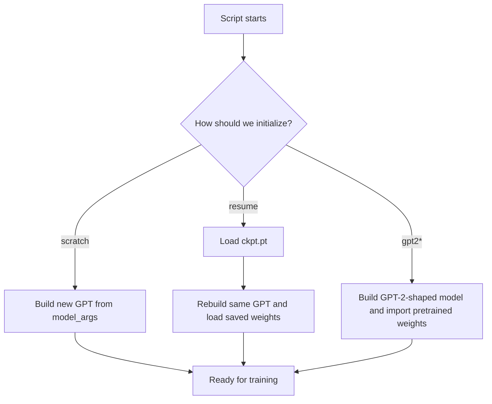
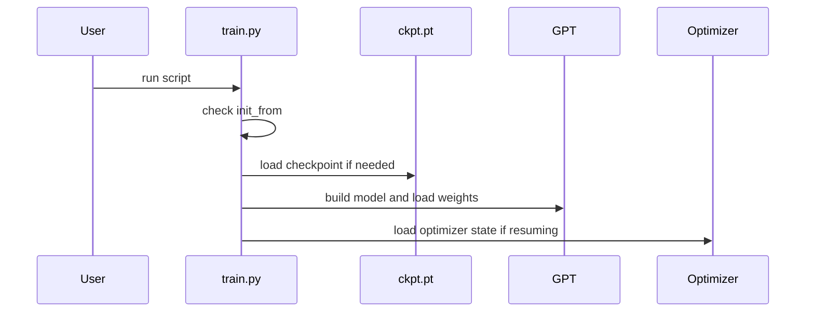
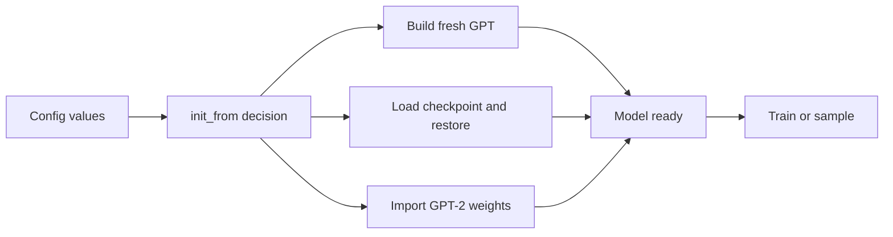

# Chapter 6: Initialization and Checkpoint Flow

In the previous chapter, [GPT Language Model](05_gpt_language_model_.md), we learned **what the model is**.

Now we ask the next very practical beginner question:

> **When `nanoGPT` starts, where does that model come from?**

Does it:

- build a brand-new model,
- continue from a saved checkpoint,
- or import pretrained GPT-2 weights?

This chapter explains that startup path.

---

## Why this exists

When you run `train.py` or `sample.py`, the code needs a model **right now**.

But there are different ways to get one:

1. **from scratch**  
   Build a new model with fresh random weights.

2. **from resume**  
   Load a checkpoint you saved earlier and continue.

3. **from pretrained GPT-2**  
   Start from already-trained OpenAI GPT-2 weights.

A very beginner-friendly analogy:

- **scratch** = build a car from parts
- **resume** = continue working on the car in your garage
- **pretrained** = start from a factory-made car

If you understand these three start modes, `nanoGPT` stops feeling magical.

---

## Our concrete beginner use case

Let’s use one simple story:

> **You trained a Shakespeare model yesterday. Today you want to continue training it, and later sample text from exactly that saved model. You also want to understand how this differs from starting from scratch or from GPT-2.**

By the end of this chapter, you will understand:

- what `init_from` does
- what is inside `ckpt.pt`
- why the model is rebuilt before weights are loaded
- how training resume differs from sampling restore
- how GPT-2 weights are imported carefully

---

## The big picture



The key idea is:

> `nanoGPT` always wants a real `GPT` model in memory.  
> The only question is **how we get it**.

---

## The main switch: `init_from`

In `train.py`, the main choice is controlled by `init_from`.

You will usually see one of these:

- `init_from = 'scratch'`
- `init_from = 'resume'`
- `init_from = 'gpt2'`
- `init_from = 'gpt2-medium'`
- `init_from = 'gpt2-large'`
- `init_from = 'gpt2-xl'`

This value comes from the configuration system you learned in [Configuration Overrides](01_configuration_overrides_.md).

So a very simple mental model is:

> **`init_from` answers: “Where should this model come from?”**

---

## The three start modes

## 1. Start from scratch

This means:

- create a brand-new `GPTConfig`
- build a new `GPT`
- initialize its weights randomly

Tiny example:

```bash
python train.py config/train_shakespeare_char.py
```

High-level result:

- `train.py` reads the config
- sees `init_from='scratch'` by default
- creates a fresh model
- begins training from zero

You will usually see output like:

```text
Initializing a new model from scratch
```

This is the cleanest and simplest startup mode.

---

## 2. Resume from a checkpoint

This means:

- load a saved file like `out-shakespeare-char/ckpt.pt`
- rebuild the model with the same architecture
- load the saved weights
- also load optimizer state and training counters

Tiny example:

```bash
python train.py config/train_shakespeare_char.py --init_from=resume
```

High-level result:

- training continues instead of starting over
- optimizer momentum/history is restored
- `iter_num` continues from the saved point

You will usually see output like:

```text
Resuming training from out-shakespeare-char
```

This is like loading a saved game.

---

## 3. Start from pretrained GPT-2

This means:

- build a model shaped like GPT-2
- import pretrained GPT-2 weights
- optionally fine-tune on your dataset

Tiny example:

```bash
python train.py --init_from=gpt2
```

Or a config can do it for you, like `config/finetune_shakespeare.py`.

High-level result:

- you do **not** start from random weights
- the model already knows a lot about language
- your training becomes fine-tuning instead of pretraining from zero

You will usually see output like:

```text
Initializing from OpenAI GPT-2 weights: gpt2
```

This is a very powerful mode because it can save huge amounts of training time.

---

## A very important beginner idea

These three modes all end in the same place:

> **a real `GPT` object is created and ready to use**

That means later code in the [Training Engine](02_training_engine_.md) does not need to care how the model was born.

Once initialization is done, training can simply do:

```python
logits, loss = model(X, Y)
```

That was the core call we saw in [GPT Language Model](05_gpt_language_model_.md).

---

## What is a checkpoint?

A **checkpoint** is a saved bundle of training progress.

It is much more than “just the weights”.

In `nanoGPT`, a checkpoint typically stores:

- the model weights
- the optimizer state
- the model arguments
- the current iteration number
- the best validation loss so far
- the training config

That is why resume works so well.

---

## Think of a checkpoint like a backpack

Imagine you pause a long trip and put everything important into a backpack.

That backpack contains:

- your current map
- your tools
- where you are right now
- how well the trip has gone so far

A checkpoint is that backpack for training.

If you only saved model weights, you would still be missing important things like:

- optimizer momentum/history
- current step number
- the exact model shape

---

## What gets saved in `ckpt.pt`?

A simplified checkpoint looks like this:

```python
checkpoint = {
    'model': raw_model.state_dict(),
    'optimizer': optimizer.state_dict(),
    'model_args': model_args,
    'iter_num': iter_num,
    'best_val_loss': best_val_loss,
    'config': config,
}
```

Beginner explanation:

- `'model'` = learned parameters
- `'optimizer'` = AdamW’s internal memory
- `'model_args'` = architecture blueprint
- `'iter_num'` = where training stopped
- `'best_val_loss'` = best validation score so far
- `'config'` = useful experiment settings

This is why resume can feel almost like training never stopped.

---

## Why save `model_args`?

This is one of the most important ideas in the chapter.

Before loading weights, `nanoGPT` first rebuilds the model architecture using the saved model arguments.

Why?

Because weights only make sense if they are loaded into the **right shape of model**.

For example, weights from a model with:

- `n_layer = 12`
- `n_embd = 768`

cannot be safely loaded into a model with:

- `n_layer = 6`
- `n_embd = 384`

That would be like trying to put furniture from a 12-room house into a 6-room house and expecting everything to fit.

This connects directly to [Model Blueprint (GPTConfig)](04_model_blueprint__gptconfig__.md).

---

## The role of `model_args`

`train.py` collects the model-shape settings into a dictionary like this:

```python
model_args = dict(
    n_layer=n_layer, n_head=n_head, n_embd=n_embd,
    block_size=block_size, bias=bias,
    vocab_size=None, dropout=dropout,
)
```

This dictionary is the practical “blueprint payload”.

Later it becomes:

```python
gptconf = GPTConfig(**model_args)
model = GPT(gptconf)
```

So a beginner-friendly summary is:

- `model_args` = raw blueprint values
- `GPTConfig` = clean blueprint object
- `GPT(...)` = actual model built from that blueprint

---

## Solving our use case

Let’s walk through the beginner story step by step.

---

## Step 1: Train from scratch

Suppose you run:

```bash
python train.py config/train_shakespeare_char.py
```

What happens at a high level?

1. config values are loaded
2. `init_from` stays `'scratch'`
3. the dataset’s vocab size may be read from `meta.pkl`
4. `model_args` are prepared
5. a new `GPTConfig` and `GPT` are created
6. training begins
7. later, checkpoints are saved to `out_dir`

So this is the “build a new car” path.

---

## Step 2: Resume later

Now suppose training created:

```text
out-shakespeare-char/ckpt.pt
```

Later you run:

```bash
python train.py config/train_shakespeare_char.py --init_from=resume
```

What happens now?

1. `train.py` loads `ckpt.pt`
2. it reads the saved `model_args`
3. it rebuilds the same architecture
4. it loads the saved weights
5. it loads optimizer state
6. it restores `iter_num`
7. training continues

This is the “continue from your garage” path.

---

## Step 3: Sample from that saved model

Now you want text from the checkpoint.

You can run:

```bash
python sample.py --out_dir=out-shakespeare-char --start="ROMEO:"
```

High-level result:

- `sample.py` loads the checkpoint
- rebuilds the model from saved `model_args`
- loads saved weights
- switches to eval mode
- generates text

So the same saved checkpoint is useful for both:

- continuing training
- text generation

That is a big reason checkpoints are so valuable.

---

## Step 4: Compare that to pretrained GPT-2

Now imagine instead you run:

```bash
python train.py config/finetune_shakespeare.py
```

That config contains:

```python
init_from = 'gpt2-xl'
```

So training begins very differently:

- it does **not** start from random weights
- it imports GPT-2 XL weights first
- then it fine-tunes on Shakespeare

This is the “factory-made car” path.

---

## Training and sampling use the same idea

Both scripts follow a similar pattern:

- decide the source of model weights
- construct a `GPT`
- load weights if needed
- then continue with their job

### In `train.py`
Possible starts:

- scratch
- resume
- pretrained GPT-2

### In `sample.py`
Practical starts:

- resume
- pretrained GPT-2

Why no scratch in `sample.py`?

Because sampling from random fresh weights would mostly produce nonsense.  
So `sample.py` focuses on useful start modes.

---

## Key concepts, one by one

## 1. A checkpoint stores **state**, not just weights

This is the biggest beginner idea.

A checkpoint includes enough information to continue training properly, not merely to run the model once.

That is why `optimizer.state_dict()` is saved too.

Without optimizer state, resume would be less faithful.

---

## 2. Resume rebuilds the model before loading weights

This order matters a lot:

1. read saved `model_args`
2. build `GPTConfig`
3. build `GPT`
4. load state dict

Why not load weights first?

Because there is nowhere to load them **into** until the model structure already exists.

---

## 3. Some model settings must match exactly on resume

In `train.py`, these fields are forced to match the checkpoint:

- `n_layer`
- `n_head`
- `n_embd`
- `block_size`
- `bias`
- `vocab_size`

These are shape-defining settings.

If they changed, the saved tensors might no longer fit.

A subtle detail: some other values like `dropout` can stay as currently requested, because they do not change tensor shapes.

That is a nice example of practical engineering.

---

## 4. GPT-2 import is more careful than resume

Resume is usually straightforward:

- same project
- same model shape
- same parameter names

Pretrained GPT-2 import is trickier.

Why?

Because the weights come from a different codebase style.

So `nanoGPT` carefully:

- chooses the right GPT-2 architecture
- aligns parameter names
- checks tensor shapes
- transposes some weights where needed

This is one of the places where `nanoGPT` does a lot of careful behind-the-scenes work for you.

---

## 5. Some GPT-2 weights must be transposed

This is a neat detail.

OpenAI/Hugging Face GPT-2 uses a `Conv1D`-style internal convention for some layers, while `nanoGPT` uses standard `Linear` layers.

That means some weight matrices are “turned around” relative to each other.

So `nanoGPT` transposes those weights during import.

Beginner version:

> the numbers are right, but some matrices must be flipped to match the local layer format

---

## 6. `state_dict` is just a parameter dictionary

When you see:

```python
state_dict = checkpoint['model']
```

that means:

- a Python dictionary of parameter names → tensor values

For example, keys may look like:

- `transformer.wte.weight`
- `transformer.h.0.attn.c_attn.weight`
- `lm_head.weight`

So a checkpoint is basically saving the model’s learned tensors by name.

---

## 7. Sampling only needs model weights, not optimizer state

This is a useful beginner distinction.

### Resume training needs:
- model weights
- optimizer state
- `iter_num`
- `best_val_loss`

### Sampling needs:
- model weights
- model architecture
- tokenizer/encoding info

That is why `sample.py` loads less training-related state than `train.py`.

---

## 8. Sometimes `block_size` gets cropped after loading

There is a small but useful trick in `train.py`.

If the loaded model supports a larger context than you want now, the code can shrink it:

```python
if block_size < model.config.block_size:
    model.crop_block_size(block_size)
```

Beginner meaning:

- load a large-context model
- trim it down to a smaller context if desired

This is especially helpful with pretrained GPT-2, which uses block size 1024.

---

## A helpful analogy: three ways to begin a notebook

Imagine you are writing a long notebook project.

You can:

- start on a blank page
- reopen yesterday’s saved notebook
- begin from a published notebook template

That is exactly what `nanoGPT` is doing with models.

And a checkpoint is not just the notebook text.  
It also includes things like:

- your place in the notebook
- your tool settings
- the notebook format

---

## Under the hood: what happens when `train.py` starts?

Here is the non-code story:

1. `train.py` reads config values
2. it prepares `model_args`
3. it checks `init_from`
4. if `scratch`, it builds a fresh `GPT`
5. if `resume`, it loads `ckpt.pt`, rebuilds the model, then loads weights and optimizer state
6. if `gpt2*`, it asks `GPT.from_pretrained(...)` to import GPT-2 weights
7. it may crop block size
8. it moves the model to the device
9. it builds the optimizer
10. training continues normally

That is the full startup flow at a beginner-friendly level.

---

## Sequence diagram



This is the startup story in miniature.

---

## Internal code walk-through

Now let’s look at the real files in small, beginner-friendly pieces.

---

## 1. `train.py` prepares `model_args`

From `train.py`:

```python
model_args = dict(
    n_layer=n_layer, n_head=n_head, n_embd=n_embd,
    block_size=block_size, bias=bias,
    vocab_size=None, dropout=dropout,
)
```

This means:

- gather the model architecture settings
- keep them together
- use them for whichever init path comes next

This is the bridge from [Configuration Overrides](01_configuration_overrides_.md) to actual model construction.

---

## 2. Scratch path in `train.py`

A simplified version:

```python
if init_from == 'scratch':
    model_args['vocab_size'] = meta_vocab_size or 50304
    gptconf = GPTConfig(**model_args)
    model = GPT(gptconf)
```

What this means:

- decide the vocabulary size
- make the blueprint
- build a fresh model

### Why `50304`?

If no dataset-specific vocab size is found, `nanoGPT` falls back to a GPT-2-style default size.

---

## 3. Resume path first loads the checkpoint

A simplified version:

```python
checkpoint = torch.load(ckpt_path, map_location=device)
checkpoint_model_args = checkpoint['model_args']
for k in ['n_layer', 'n_head', 'n_embd', 'block_size', 'bias', 'vocab_size']:
    model_args[k] = checkpoint_model_args[k]
```

What is happening?

- load `ckpt.pt`
- grab the saved architecture info
- force key shape-defining settings to match

That “force match” step is very important.

It protects you from rebuilding the wrong kind of model.

---

## 4. Resume path then rebuilds the model

Next:

```python
gptconf = GPTConfig(**model_args)
model = GPT(gptconf)
state_dict = checkpoint['model']
model.load_state_dict(state_dict)
```

This means:

- rebuild the exact model shape
- get the saved weights
- load them into the model

This is the heart of restore.

---

## 5. Resume also restores training progress

After weights are loaded, `train.py` restores more state:

```python
iter_num = checkpoint['iter_num']
best_val_loss = checkpoint['best_val_loss']
optimizer.load_state_dict(checkpoint['optimizer'])
```

This means:

- continue from the same iteration number
- remember the best validation loss so far
- restore AdamW’s internal state

So training resumes much more faithfully than if we loaded weights alone.

---

## 6. There is a small key-cleanup step

Sometimes saved parameter names include an unwanted prefix.

So `train.py` and `sample.py` clean them:

```python
unwanted_prefix = '_orig_mod.'
for k in list(state_dict):
    if k.startswith(unwanted_prefix):
        state_dict[k[len(unwanted_prefix):]] = state_dict.pop(k)
```

Beginner explanation:

- some checkpoints may have slightly different key names
- this cleanup strips a known extra prefix
- after that, loading works normally

You do not need to memorize this.  
Just know it is practical housekeeping.

---

## 7. Pretrained GPT-2 path in `train.py`

When `init_from` starts with `gpt2`, `train.py` does this:

```python
override_args = dict(dropout=dropout)
model = GPT.from_pretrained(init_from, override_args)
```

This means:

- ask the `GPT` class to import GPT-2 weights
- allow dropout to be overridden if desired

Then `train.py` reads the actual created config back from the model so checkpoints stay accurate.

---

## 8. `model.py` chooses the right GPT-2 shape

Inside `model.py`, `from_pretrained()` starts by picking the architecture:

```python
config_args = {
    'gpt2': dict(n_layer=12, n_head=12, n_embd=768),
    'gpt2-medium': dict(n_layer=24, n_head=16, n_embd=1024),
}[model_type]
```

Then it fills in more fixed GPT-2 facts:

```python
config_args['vocab_size'] = 50257
config_args['block_size'] = 1024
config_args['bias'] = True
```

This means:

- each GPT-2 variant has a known shape
- GPT-2 always uses vocab size 50257
- GPT-2 checkpoints assume block size 1024
- GPT-2 uses bias terms

So `nanoGPT` first builds the **right kind of empty model** before copying pretrained weights in.

---

## 9. Then it copies weights from Hugging Face carefully

A simplified version of the key logic:

```python
transposed = ['attn.c_attn.weight', 'attn.c_proj.weight',
              'mlp.c_fc.weight', 'mlp.c_proj.weight']
if any(k.endswith(w) for w in transposed):
    sd[k].copy_(sd_hf[k].t())
else:
    sd[k].copy_(sd_hf[k])
```

What is happening?

- `sd_hf` = Hugging Face/OpenAI-style weights
- `sd` = `nanoGPT` model weights
- some weights copy directly
- some need `.t()` transposition first

The real code also checks name counts and tensor shapes with `assert` statements.

That is important because pretrained import is easy to mess up if shapes do not line up.

---

## 10. Why the transposition exists

The comment in `model.py` explains it well:

- OpenAI checkpoints use a `Conv1D` style module
- `nanoGPT` uses normal `Linear` layers

So the math meaning is the same, but the stored weight layout differs for some layers.

A beginner analogy:

> two toolboxes contain the same tools, but a few drawers are rotated sideways

So `nanoGPT` rotates those few drawers when moving the tools.

---

## 11. `sample.py` restores from a checkpoint in the same spirit

A simplified version from `sample.py`:

```python
checkpoint = torch.load(ckpt_path, map_location=device)
gptconf = GPTConfig(**checkpoint['model_args'])
model = GPT(gptconf)
model.load_state_dict(checkpoint['model'])
```

This should feel familiar now.

`sample.py` does the same basic restore pattern:

1. load checkpoint
2. rebuild architecture
3. load saved weights

Then it switches to evaluation mode and generates text.

---

## 12. `sample.py` can also use GPT-2 directly

If you want pretrained GPT-2 without your own checkpoint, `sample.py` can do this too:

```python
model = GPT.from_pretrained(init_from, dict(dropout=0.0))
```

So both scripts share the same mental model:

- decide the start mode
- build or restore the model
- continue with the task

---

## 13. Checkpoints also store `config`

This field is easy to overlook, but useful.

In `train.py`, checkpoint saving includes:

```python
'config': config,
```

Why is that nice?

Because later `sample.py` can inspect the saved config and sometimes locate the right dataset metadata, such as `meta.pkl`.

That helps it decode tokens correctly for datasets like character-level Shakespeare.

So the checkpoint carries some experiment context too.

---

## A simple checkpoint table

| Checkpoint key | What it stores | Why it matters |
|---|---|---|
| `model` | model weights | needed for resume and sampling |
| `optimizer` | AdamW internal state | needed for faithful training resume |
| `model_args` | architecture settings | needed to rebuild the same `GPT` |
| `iter_num` | current training step | lets training continue where it stopped |
| `best_val_loss` | best validation score so far | useful for tracking progress |
| `config` | experiment settings | useful metadata, e.g. dataset info |

---

## A tiny end-to-end map

Here is the whole flow in one picture:



This is the chapter in one diagram.

---

## Common beginner confusions

## “Why can’t resume just load weights into any model?”

Because the receiving model must have matching parameter names and shapes.

Weights are not abstract magic.  
They are tensors with exact sizes.

---

## “Why save optimizer state?”

Because optimizers like AdamW remember history.

If you resume without that history, training may behave differently.

---

## “Why does sampling not restore the optimizer?”

Because sampling does not update weights.  
It only runs the model forward to generate text.

---

## “Why does GPT-2 import need transposition?”

Because some pretrained layers were stored in a layout that differs from `nanoGPT`’s plain `Linear` layers.

So `nanoGPT` flips those matrices to match.

---

## “Can I change model size when resuming?”

Not really for shape-defining fields.

If your checkpoint was for one architecture, resume expects that same architecture.

---

## “Why does `sample.py` use checkpoint `model_args` too?”

Because generating text still requires rebuilding the correct model structure before loading the saved weights.

---

## Tiny cheat sheet

| Goal | Typical setting |
|---|---|
| Start a new model | `init_from='scratch'` |
| Continue an old run | `init_from='resume'` |
| Fine-tune GPT-2 | `init_from='gpt2'` or another GPT-2 variant |

And:

| File | What it usually does |
|---|---|
| `train.py` | scratch / resume / pretrained init, then training |
| `sample.py` | resume / pretrained init, then generation |

---

## What this chapter really taught you

If you remember only one sentence, let it be this:

> **`nanoGPT` always builds a `GPT` model first, but it can initialize that model from scratch, from a saved checkpoint, or from pretrained GPT-2 weights.**

You learned that:

- `init_from` chooses the startup path
- checkpoints save much more than just weights
- resume works by rebuilding the same model shape, then loading saved state
- sampling uses a similar restore flow, but usually skips optimizer state
- GPT-2 import is more careful because it must align names, shapes, and a few transposed weights
- understanding this flow makes the project feel much less mysterious

Now that we know how a model gets into memory, we are ready to see what it does when asked to produce text one token at a time in [Autoregressive Text Generation](07_autoregressive_text_generation_.md).

---

Generated by [AI Codebase Knowledge Builder](https://github.com/The-Pocket/Tutorial-Codebase-Knowledge)