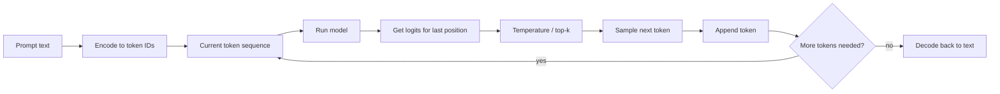
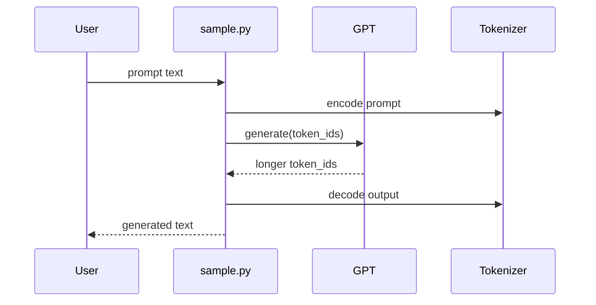
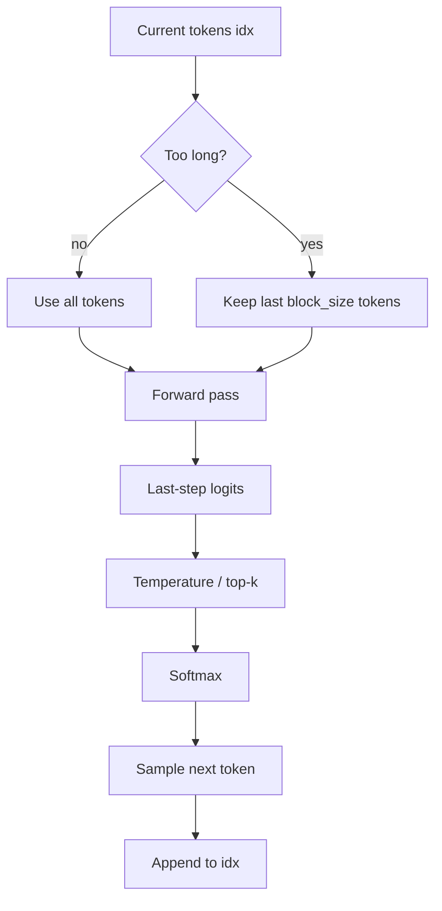

# Chapter 7: Autoregressive Text Generation

In the previous chapter, [Initialization and Checkpoint Flow](06_initialization_and_checkpoint_flow_.md), we learned how a model gets into memory:

- from scratch
- from a saved checkpoint
- or from pretrained GPT-2 weights

Now we ask the fun question:

> **Once the model is loaded, how does it actually write text?**

This chapter explains that.

---

## Why this exists

Training gives you a model that can score next tokens.

That is useful, but it still feels abstract.

What most beginners *really* want is this:

- type a prompt
- press enter
- watch the model continue it

That is what **autoregressive text generation** does.

A very beginner-friendly analogy:

> Imagine an author writing one word at a time.
>
> 1. They read the current sentence  
> 2. they choose the next word  
> 3. they add it  
> 4. they read the longer sentence again  
> 5. they choose the next word again

That is exactly the idea behind `generate()` in `nanoGPT`.

This is the abstraction that turns a trained model from “a pile of learned weights” into something interactive and fun.

---

## Our concrete beginner use case

Let’s use a simple goal:

> **Continue a Shakespeare-style prompt like `ROMEO:` using a trained checkpoint.**

For example:

```bash
python sample.py --out_dir=out-shakespeare-char --start="ROMEO:" --num_samples=2
```

High-level result:

- `sample.py` loads your saved model
- it turns `"ROMEO:"` into token IDs
- it asks the model for one next token at a time
- it keeps appending tokens
- it turns the final token IDs back into readable text

By the end of this chapter, that whole process should feel clear.

---

## The big picture

Here is the full generation story:



That loop is the heart of autoregressive generation.

---

## What does “autoregressive” mean?

The word sounds scary, but the idea is simple.

A beginner-friendly definition:

> **Autoregressive generation means the model creates the next token using the tokens it already has, including the ones it generated itself.**

So if the current text is:

```text
ROMEO:
```

the model might generate:

```text
ROMEO: I
```

Then it uses that new text to generate the next token:

```text
ROMEO: I am
```

Then again:

```text
ROMEO: I am too
```

And so on.

It is always building on its own latest output.

---

## The simplest mental model

Think of `generate()` as a loop that does this:

1. look at the current text
2. predict the next token
3. choose one token
4. append it
5. repeat

In tiny pseudo-code:

```python
while want_more_text:
    next_token = model.predict_next(current_tokens)
    current_tokens = current_tokens + [next_token]
```

This is not the exact `nanoGPT` code, but it is the right beginner mental model.

---

## A tiny toy example

Imagine the current token sequence means:

```text
I love
```

The model looks at that and says:

- `" pizza"` seems likely
- `" music"` also seems possible
- `" running"` is possible too

Suppose it picks `" music"`.

Now the text becomes:

```text
I love music
```

Then it looks again and predicts what comes next after **that**.

So the model does **not** write the whole paragraph in one shot.  
It writes **one token at a time**.

---

## Key concepts, one by one

## 1. The model generates **tokens**, not raw text

Inside the model, everything is integers.

So before generation starts:

- text prompt → token IDs

And after generation ends:

- token IDs → text

This connects back to [Token Dataset and Batching](03_token_dataset_and_batching_.md), where we learned that GPTs work with token IDs, not plain strings.

For example, `sample.py` does this:

```python
start_ids = encode(start)
x = torch.tensor(start_ids, dtype=torch.long, device=device)[None, ...]
```

Beginner meaning:

- `encode(start)` converts text into token IDs
- `torch.tensor(...)` makes a PyTorch tensor
- `[None, ...]` adds a batch dimension

So even one prompt becomes a batch of size 1.

---

## 2. Generation starts from a prompt

The model needs some starting text.

That starting text is often called the **prompt**.

Examples:

- `"ROMEO:"`
- `"Once upon a time"`
- `"\n"`
- `"<|endoftext|>"`

In `sample.py`, the default is:

```python
start = "\n"
```

So if you do not provide a prompt, generation begins from a newline.

You can also pass a prompt from a file:

```bash
python sample.py --start=FILE:prompt.txt
```

That is helpful for longer prompts.

---

## 3. The model predicts the **next token**

This is the core GPT behavior.

Back in [GPT Language Model](05_gpt_language_model_.md), we learned that GPT is a next-token predictor.

During generation, the question is always:

> “Given the current tokens, what token should come next?”

So if the current tokens represent:

```text
ROMEO:
```

the model might think the next token could be:

- a space
- a newline
- a name
- punctuation

It gives scores for all possible next tokens.

Those scores are called **logits**.

---

## 4. Only the **last position** matters for the next step

This is an important beginner idea.

If the current sequence is:

```text
R O M E O :
```

then the next token should come **after the last token**, not after the earlier ones.

So `generate()` takes the logits from the final position only.

That is why this line exists in `model.py`:

```python
logits = logits[:, -1, :] / temperature
```

Beginner meaning:

- keep only the prediction for the newest position
- that is the one used to choose the next token

You can think of it like reading a sentence and asking:

> “What comes next after *this whole sentence*?”

not:

> “What came after the third word?”

---

## 5. The new token is appended, then the model tries again

After choosing a token, `generate()` adds it to the running sequence.

```python
idx = torch.cat((idx, idx_next), dim=1)
```

This means:

- `idx` = all tokens generated so far
- `idx_next` = the newly chosen token
- concatenate them along the time dimension

So the prompt grows step by step.

Example:

```text
[ROMEO:]        -> current sequence
[ROMEO:, " "]   -> after one new token
[ROMEO:, " ", "I"] -> after another token
```

That is the “reread the updated sentence” part of the process.

---

## 6. The model may need to crop the context

The model cannot look back forever.

From [Model Blueprint (GPTConfig)](04_model_blueprint__gptconfig__.md), we know the model has a maximum context length called `block_size`.

So if the running text gets too long, `generate()` keeps only the most recent part:

```python
idx_cond = idx if idx.size(1) <= self.config.block_size else idx[:, -self.config.block_size:]
```

Beginner meaning:

- if the sequence is short enough, use all of it
- if it is too long, keep only the latest `block_size` tokens

### Analogy

Imagine the model has a desk that fits only 256 papers.

If the text grows to 300 tokens, the model cannot spread out all 300 at once.

So it keeps only the most recent 256 on the desk.

That is called **cropping the context**.

---

## 7. Temperature changes how random the model feels

After getting logits, `generate()` divides them by `temperature`:

```python
logits = logits[:, -1, :] / temperature
```

This is a simple but important control.

### Beginner-friendly intuition

- **lower temperature** → safer, more predictable
- **higher temperature** → more random, more surprising

A nice analogy:

> Temperature is like the model’s “boldness knob.”

If the model is too cold:

- it becomes conservative
- it may repeat common patterns more

If the model is hotter:

- it takes more risks
- outputs can be more creative or more chaotic

### Common examples

| Temperature | Typical feel |
|---|---|
| `0.5` | cautious |
| `0.8` | balanced |
| `1.0` | more natural randomness |
| `1.2` | wilder |

In `sample.py`, the default is:

```python
temperature = 0.8
```

---

## 8. Top-k keeps only the most likely choices

Sometimes you do not want the model to sample from *every* token in the vocabulary.

You may want it to consider only the top few candidates.

That is what **top-k filtering** does.

In `generate()`:

```python
v, _ = torch.topk(logits, min(top_k, logits.size(-1)))
logits[logits < v[:, [-1]]] = -float('Inf')
```

Beginner meaning:

- find the `k` best logits
- throw away everything below that cutoff

If `top_k = 50`, the model samples only from its 50 favorite next-token options.

### Analogy

Imagine a multiple-choice test with 50,000 possible answers.

Top-k says:

> “Before choosing, ignore all the ridiculous options and keep only the top few plausible ones.”

That often makes generation more focused.

In `sample.py`, the default is:

```python
top_k = 200
```

---

## 9. Sampling is different from always taking the best token

After temperature and top-k, the logits become probabilities:

```python
probs = F.softmax(logits, dim=-1)
idx_next = torch.multinomial(probs, num_samples=1)
```

This means:

- convert scores into probabilities
- randomly sample one token using those probabilities

This is very important.

The model does **not** always choose the single highest-probability token.

Instead, it usually **samples**.

### Why sample?

Because always choosing the top token can make text stiff and repetitive.

Sampling lets the model be varied.

### Analogy

Suppose the model thinks the next token is:

- 70% likely: `"the"`
- 20% likely: `"a"`
- 10% likely: `"this"`

If you always take the maximum, you always get `"the"`.

If you sample, you usually get `"the"`, but sometimes `"a"` or `"this"`.

That makes outputs more interesting.

---

## 10. This repeats for `max_new_tokens` steps

`generate()` runs the loop again and again.

If:

```python
max_new_tokens = 100
```

then the model adds up to 100 more tokens after the prompt.

The original prompt stays at the front.

So the returned sequence is:

- prompt tokens
- plus newly generated tokens

---

## Solving our use case

Let’s return to our goal:

> Continue `ROMEO:` using a trained Shakespeare checkpoint.

The simplest command is:

```bash
python sample.py --out_dir=out-shakespeare-char --start="ROMEO:"
```

What happens at a high level:

1. `sample.py` loads `out-shakespeare-char/ckpt.pt`
2. it rebuilds the model from the saved checkpoint
3. it encodes `"ROMEO:"` into token IDs
4. it calls `model.generate(...)`
5. it decodes the result back into characters
6. it prints the generated sample

You will usually see text that *looks* somewhat Shakespeare-like, though the exact output changes from run to run.

---

## A slightly more controlled version

If you want more focused output, you might lower temperature:

```bash
python sample.py --out_dir=out-shakespeare-char --start="ROMEO:" --temperature=0.5
```

High-level result:

- the text will usually be less wild
- it may also become more repetitive

If you want more variety, raise it:

```bash
python sample.py --out_dir=out-shakespeare-char --start="ROMEO:" --temperature=1.0
```

High-level result:

- more surprising output
- sometimes more nonsense too

---

## Using top-k

You can also restrict the candidate pool:

```bash
python sample.py --out_dir=out-shakespeare-char --start="ROMEO:" --top_k=50
```

High-level result:

- the model only samples from its top 50 choices each step
- output often feels more coherent than sampling from the full vocabulary

---

## Generating multiple samples from the same prompt

`sample.py` can draw several completions:

```bash
python sample.py --out_dir=out-shakespeare-char --start="ROMEO:" --num_samples=3
```

High-level result:

- same prompt
- three different continuations

This is nice because sampling includes randomness, so one prompt can branch into many different outputs.

---

## What you might see on screen

A run may print something like:

```text
ROMEO:
What shall I say, my lord?
---------------
ROMEO:
I am undone by love and grief.
---------------
```

The exact text will vary, but the pattern is:

- one generated completion
- a separator line
- another completion
- and so on

That separator comes from `sample.py`.

---

## A helpful analogy: writing with a short memory

Imagine a writer who can only keep the last few sentences in view.

They:

- read the visible text
- write one more word
- push the oldest word off the desk if it gets too long
- repeat

That is very close to what `generate()` does with `block_size`.

---

## Under the hood: what happens step by step?

Here is the non-code version of `generate()`:

1. start with the prompt tokens
2. if the current sequence is longer than `block_size`, keep only the last part
3. run a forward pass of the model
4. take the logits for the last position
5. divide by temperature
6. optionally keep only the top-k logits
7. apply softmax to get probabilities
8. sample one next token
9. append it to the sequence
10. repeat until enough new tokens have been added

That is the whole abstraction.

---

## Sequence diagram



This is the beginner-friendly picture:

- `sample.py` is the wrapper
- `GPT.generate()` is the core loop
- tokenizer logic converts between human text and model tokens

---

## Internal code walk-through

Now let’s look at the real implementation in small pieces.

---

## 1. `sample.py` turns the prompt into tokens

From `sample.py`:

```python
start_ids = encode(start)
x = torch.tensor(start_ids, dtype=torch.long, device=device)[None, ...]
```

This means:

- convert the prompt string into token IDs
- make a tensor on the right device
- add a batch dimension

So if your prompt is:

```text
ROMEO:
```

then `x` becomes a tensor shaped like:

- `(1, prompt_length)`

That `1` means “one sample in the batch”.

---

## 2. `sample.py` calls `generate()`

Also from `sample.py`:

```python
y = model.generate(x, max_new_tokens,
                   temperature=temperature,
                   top_k=top_k)
```

This means:

- start from prompt tensor `x`
- ask the model to continue it
- control randomness with `temperature`
- optionally restrict choices with `top_k`

The returned `y` contains:

- the original prompt
- plus all the new tokens

---

## 3. `sample.py` decodes the result back into text

After generation:

```python
print(decode(y[0].tolist()))
print('---------------')
```

This means:

- take the first sample in the batch
- convert token IDs back to text
- print it

So `sample.py` is what makes generation feel human-friendly.

Without it, you would mostly see lists of integers.

---

## 4. `generate()` is marked with `@torch.no_grad()`

In `model.py`, the method begins like this:

```python
@torch.no_grad()
def generate(self, idx, max_new_tokens, temperature=1.0, top_k=None):
```

Beginner meaning:

- generation does not need training gradients
- so PyTorch can skip gradient tracking

That makes generation lighter and faster.

This is the same general idea we saw during evaluation in [Training Engine](02_training_engine_.md).

---

## 5. `generate()` loops one token at a time

Inside `model.py`:

```python
for _ in range(max_new_tokens):
    idx_cond = idx if idx.size(1) <= self.config.block_size else idx[:, -self.config.block_size:]
```

This means:

- repeat once per new token
- if the sequence is too long, crop it to the model’s maximum context

This directly connects to [Model Blueprint (GPTConfig)](04_model_blueprint__gptconfig__.md), where `block_size` defined the model’s context length.

---

## 6. It runs a forward pass on the current context

Next:

```python
logits, _ = self(idx_cond)
logits = logits[:, -1, :] / temperature
```

What is happening?

- `self(idx_cond)` calls the GPT forward pass
- because no `targets` are given, this is inference mode
- then it keeps the logits for the last position
- then it scales them by temperature

This connects back to [GPT Language Model](05_gpt_language_model_.md), where we saw that the model returns logits in inference mode.

### Very important detail

During generation, the model is always asking:

> “What comes next after the current sequence?”

So only the final position is used to choose the next token.

---

## 7. It can apply top-k filtering

Then:

```python
if top_k is not None:
    v, _ = torch.topk(logits, min(top_k, logits.size(-1)))
    logits[logits < v[:, [-1]]] = -float('Inf')
```

This means:

- find the top-k cutoff
- set all smaller logits to negative infinity

Why negative infinity?

Because after softmax, those positions effectively get probability 0.

So top-k is a way of saying:

> “Only allow the most plausible candidates.”

---

## 8. It converts logits to probabilities and samples

Then:

```python
probs = F.softmax(logits, dim=-1)
idx_next = torch.multinomial(probs, num_samples=1)
```

This means:

- turn logits into probabilities
- draw one random token according to those probabilities

So if one token is much more likely, it will usually be chosen.

But lower-probability tokens still have a chance.

That is what gives generation variety.

---

## 9. It appends the new token and keeps going

Finally:

```python
idx = torch.cat((idx, idx_next), dim=1)
```

This means:

- glue the sampled token to the end of the sequence

Then the loop repeats.

So the newly generated token immediately becomes part of the context for the next step.

That is why this is called **autoregressive**.

---

## 10. At the end, `generate()` returns the full sequence

When the loop finishes, `generate()` returns:

- original prompt tokens
- plus all generated tokens

So if the input length was 6 and `max_new_tokens=100`, the output length can be 106.

`sample.py` then decodes the whole thing into text.

---

## A tiny step-by-step token example

Let’s imagine a toy character-level model.

Prompt tokens:

```text
[17, 4, 12]
```

These might mean something like:

```text
R O M
```

### Step 1
Current tokens:

```text
[17, 4, 12]
```

Model samples next token:

```text
[4]
```

New sequence:

```text
[17, 4, 12, 4]
```

### Step 2
Current tokens:

```text
[17, 4, 12, 4]
```

Model samples next token:

```text
[14]
```

New sequence:

```text
[17, 4, 12, 4, 14]
```

And so on.

It is always:

- predict one token
- append it
- repeat

---

## Why `sample.py` matters so much

`generate()` itself works on tensors of token IDs.

That is powerful, but not very friendly for everyday use.

`sample.py` wraps generation with:

- checkpoint loading
- model setup
- prompt encoding
- output decoding
- repeated sample printing

So a beginner-friendly way to say it is:

> `generate()` is the engine.  
> `sample.py` is the dashboard.

Without `sample.py`, you would need to do more manual setup every time.

---

## How `sample.py` chooses the tokenizer

There is a small but important detail in `sample.py`.

If a checkpoint includes dataset info and a `meta.pkl` exists, `sample.py` loads that metadata to define `encode()` and `decode()`.

That is especially useful for character-level datasets like `shakespeare_char`.

Otherwise, it falls back to GPT-2 tokenization using `tiktoken`.

So `sample.py` tries to answer:

> “How should this text be converted to and from token IDs?”

That is why the same generation code can work for both:

- your own trained Shakespeare model
- pretrained GPT-2

---

## A small flowchart for `generate()`



This is the full core loop in one picture.

---

## Common beginner questions

## “Why does the model generate one token at a time?”

Because GPT is trained as a next-token predictor.

It knows how to answer:

> “What comes next?”

So to write a longer passage, we keep asking that question over and over.

---

## “Why not generate the whole sentence at once?”

Because this model’s training objective is next-token prediction, not full-sentence prediction in one step.

The repeated loop is how next-token prediction becomes full text generation.

---

## “Why does generation sometimes change between runs?”

Because sampling is random.

Even with the same prompt, different tokens may be sampled.

That is often a feature, not a bug.

---

## “What does lower temperature do?”

It makes the model more conservative.

The highest-scoring tokens become even more dominant.

---

## “What does top-k do?”

It throws away low-ranked token choices before sampling.

That often makes output more focused.

---

## “What happens if the prompt is longer than `block_size`?”

The model keeps only the most recent `block_size` tokens for the forward pass.

Older context is dropped.

---

## “Does `generate()` return only the new tokens?”

No.

It returns the full sequence:

- original prompt
- plus generated continuation

---

## “Why does `sample.py` exist if `generate()` already exists?”

Because `generate()` works on token tensors.

`sample.py` adds the practical human-facing pieces:

- loading the model
- encoding prompts
- decoding outputs
- handling checkpoints and GPT-2 loading

---

## Tiny cheat sheet

| Thing | Meaning |
|---|---|
| prompt | starting text |
| encode | text → token IDs |
| logits | raw next-token scores |
| temperature | randomness control |
| top-k | keep only top candidate tokens |
| sample | randomly choose according to probabilities |
| append | add new token to sequence |
| decode | token IDs → text |

And:

| Parameter | Effect |
|---|---|
| `max_new_tokens` | how much continuation to generate |
| `temperature` | lower = safer, higher = wilder |
| `top_k` | smaller = more focused choices |
| `num_samples` | number of different completions |

---

## A minimal practical recipe

If you want the shortest beginner workflow, it is this:

### 1. Train or load a model
For example, from a saved checkpoint in `out-shakespeare-char`.

### 2. Run sampling
```bash
python sample.py --out_dir=out-shakespeare-char --start="ROMEO:"
```

### 3. Adjust randomness if needed
```bash
python sample.py --out_dir=out-shakespeare-char --start="ROMEO:" --temperature=0.6 --top_k=50
```

That is the whole interactive loop.

---

## What this chapter really taught you

If you remember only one sentence, let it be this:

> **Autoregressive text generation means repeatedly predicting one next token, appending it, and using the longer sequence to predict again.**

You learned that:

- `generate()` is the loop that turns a prompt into a continuation
- the model works one token at a time
- generation uses the logits from the last position
- temperature changes randomness
- top-k narrows the candidate set
- context may be cropped to the model’s `block_size`
- `sample.py` wraps all of this with prompt encoding, checkpoint loading, and output decoding

That is the moment where a trained model starts to feel alive.

In the next chapter, we will zoom out from generation quality to runtime behavior in [Performance and Benchmarking](08_performance_and_benchmarking_.md).

---

Generated by [AI Codebase Knowledge Builder](https://github.com/The-Pocket/Tutorial-Codebase-Knowledge)