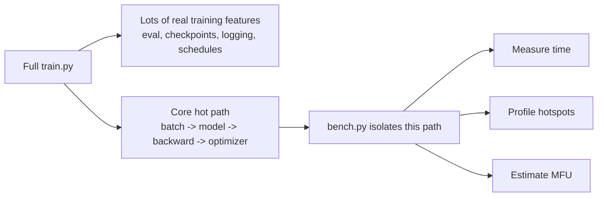
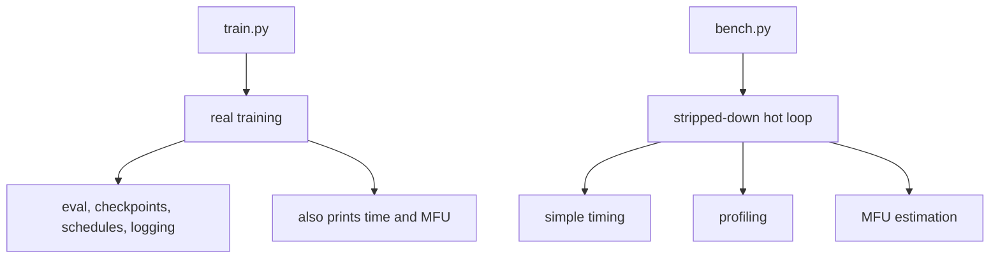
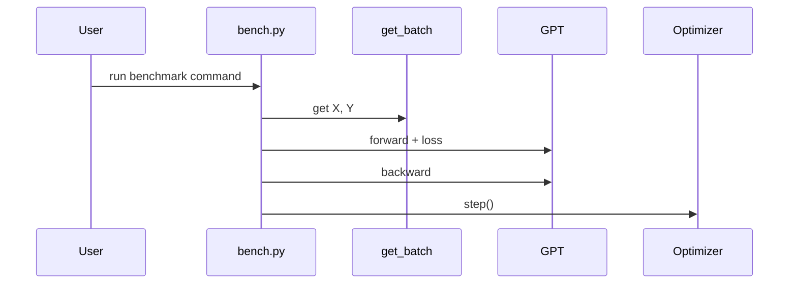

# Chapter 8: Performance and Benchmarking

In [Autoregressive Text Generation](07_autoregressive_text_generation_.md), we saw how a trained model can produce text one token at a time.

Now we switch from **“does it work?”** to a new beginner question:

> **“How fast does it work?”**

That is what this chapter is about.

`nanoGPT` does not only care about correctness.  
It also cares a lot about **speed**.

A good analogy is a treadmill test at a sports lab:

- the model is the runner
- the GPU is the treadmill
- benchmarking measures:
  - how fast the runner moves
  - how hard the hardware is working
  - where time is being wasted

That is why the repo includes `bench.py`, and why the main training path in `train.py` uses several speed tricks by default.

---

## Why this exists

When you train a model, many things can make it slow:

- data loading
- copying batches to the GPU
- the model forward pass
- the backward pass
- the optimizer step
- extra training features like evaluation and checkpoint saving

If you only use `train.py`, all of those things are mixed together.

That is great for real training, but not ideal for answering speed questions like:

- “Did `torch.compile` help?”
- “Is my bottleneck the model or the data pipeline?”
- “How long is one iteration?”
- “Am I using my GPU efficiently?”

So `nanoGPT` gives you a simpler tool:

**`bench.py`**

It keeps the hot path of training and removes much of the extra stuff.

---

## Our concrete beginner use case

Let’s use one simple goal for this whole chapter:

> **You have a GPU and want to measure training speed, compare `compile=False` vs `compile=True`, and figure out whether the slowdown comes from data loading or the model itself.**

We will solve this with `bench.py`.

By the end of this chapter, you will understand:

- what `bench.py` does
- what “time per iteration” means
- what MFU means
- what profiling mode does
- why `train.py` uses things like:
  - `torch.compile`
  - mixed precision autocast
  - fused AdamW
  - TF32
  - asynchronous batch transfer

---

## The big picture

Here is the main idea:



So `bench.py` is basically:

> **“just the important fast loop, with a stopwatch attached.”**

---

## The simplest mental model

Think of the repo like a race car team.

- `train.py` is the full race:
  - driving
  - pit stops
  - scoreboards
  - saving progress
- `bench.py` is the garage test:
  - rev the engine
  - time a lap
  - inspect where power is going

That is why `bench.py` feels much smaller and more focused.

---

## A first quick benchmark

If you want the easiest first run, use **synthetic data** so you do not need the OpenWebText dataset:

```bash
python bench.py --real_data=False --compile=False
```

High-level result:

- `bench.py` builds a GPT model
- it runs a short warmup
- it runs a measured loop
- it prints loss values and a final speed summary

You may see output roughly like this:

```text
0/20 loss: 10.82
1/20 loss: 10.80
...
time per iteration: 135.4000ms, MFU: 52.31%
```

The exact numbers will be different on your machine.

For beginners, the most important part is the last line:

- **time per iteration** = how long one training step took
- **MFU** = a rough estimate of how efficiently the GPU was used

---

## Very important beginner note

`bench.py` is mainly a **GPU benchmarking tool**.

Why?

Because:

- it uses CUDA-oriented timing
- it reports GPU-oriented MFU
- many of the speed tricks matter most on CUDA

So the core ideas still help everywhere, but `bench.py` is most useful when you have an NVIDIA GPU.

---

## Key concepts, one by one

## 1. Benchmarking measures speed, not model quality

In normal training, you care about things like:

- train loss
- validation loss
- sample quality

In benchmarking, the main question is different:

> **How fast is the loop running?**

So if `bench.py` prints loss, that is mostly a sanity check.  
It tells you the loop is doing real work, but the benchmark is not mainly about model quality.

### Beginner rule

When reading `bench.py` output:

- **loss** = “the loop is alive”
- **time per iteration** = “the speed number”
- **MFU** = “the efficiency number”

---

## 2. `bench.py` keeps only the hot path of training

Back in [Training Engine](02_training_engine_.md), we learned that the core training loop is:

- get batch
- forward pass
- compute loss
- backward pass
- optimizer step

That same core appears in `bench.py`, but stripped down.

A tiny version looks like this:

```python
X, Y = get_batch('train')
for k in range(num_steps):
    with ctx:
        logits, loss = model(X, Y)
    X, Y = get_batch('train')
    optimizer.zero_grad(set_to_none=True)
    loss.backward()
    optimizer.step()
```

What this means:

- fetch a batch
- run the model
- get gradients
- update weights
- repeat

That is the exact part we want to time.

---

## 3. Warmup comes before measurement

This is a very common benchmarking idea.

The first few iterations are often not representative, because:

- kernels may still be warming up
- caches are cold
- `torch.compile` may still be preparing optimized code
- the runtime is not yet “steady”

So `bench.py` does a **burn-in** stage first, then a real measured stage.

In simple benchmarking mode, it uses:

```python
for stage, num_steps in enumerate([10, 20]):
```

This means:

- first run 10 warmup steps
- then run 20 benchmark steps

### Beginner analogy

It is like timing a runner only after they are already moving, not while they are still tying their shoes.

---

## 4. Real data and synthetic data answer different questions

This is one of the nicest beginner-friendly ideas in `bench.py`.

There are two modes:

### `real_data=True`
Use actual token data from `train.bin`.

This measures something closer to real training, because it includes:

- reading slices from the dataset
- converting them to tensors
- copying them to the GPU

### `real_data=False`
Use fixed random tensors instead.

This mostly removes data-loading concerns, so you measure more of the pure compute path.

### Why this is useful

If:

- synthetic data is much faster than real data

then some of your slowdown is probably in the input pipeline.

If:

- synthetic and real data are close

then the model compute is probably the main bottleneck.

### Beginner analogy

It is like testing a kitchen in two ways:

- **real_data=True**: include chopping vegetables and carrying plates
- **real_data=False**: pretend the ingredients are already sitting on the stove

That helps you ask:

> “Am I slow because of cooking, or because of preparation?”

---

## 5. Simple timing and profiling are different tools

`bench.py` supports two styles of speed investigation.

### A. Simple benchmarking
This gives you one easy answer:

- how long each iteration took

This is the easiest starting point.

### B. Profiling
This gives you a deeper answer:

- where time was spent
- which operations were expensive
- what the timeline looked like

Simple benchmarking is like checking a total lap time.

Profiling is like watching a slow-motion replay of the whole lap.

---

## 6. MFU is a rough “hardware efficiency” estimate

MFU stands for:

**Model FLOPs Utilization**

That sounds intimidating, but the beginner version is simple:

> **MFU estimates how much of the GPU’s theoretical compute power the model is actually using.**

In `nanoGPT`, the estimate is compared against an A100 bfloat16 peak throughput.

So if MFU is:

- low → the GPU is not being used very effectively
- higher → the compute pipeline is making better use of the hardware

### Important beginner warning

MFU is:

- useful
- approximate
- mostly meaningful for GPU runs

It is **not** a universal truth number.

It is better to think of it as:

> a rough efficiency thermometer

---

## 7. `train.py` also contains built-in speed tools

`bench.py` is the testing lab, but `train.py` is where real speed engineering shows up during actual training.

The main speed helpers are:

- `torch.compile`
- mixed precision autocast
- fused AdamW when available
- TF32 on CUDA
- asynchronous batch transfer with pinned memory

These make the repo feel “lean” because performance is treated as a first-class design goal.

We will go through them one by one soon.

---

## Solving our use case step by step

Let’s now solve the chapter’s main beginner use case.

> You want to measure speed, compare compile on/off, and see whether the data pipeline matters.

---

## Step 1: Measure a baseline without compilation

Start with synthetic data so setup is easy:

```bash
python bench.py --real_data=False --compile=False
```

High-level result:

- the benchmark avoids dataset loading
- you get a baseline iteration time
- you get a baseline MFU

This gives you a clean “before” number.

---

## Step 2: Try `torch.compile`

Now run the same benchmark with compilation turned on:

```bash
python bench.py --real_data=False --compile=True
```

High-level result:

- `bench.py` first compiles the model
- then it benchmarks the optimized version
- you compare the new time per iteration to the old one

If the time goes down, `compile` helped.

### Beginner interpretation

- **smaller ms/iter** = faster
- **larger ms/iter** = slower
- same benchmark, same machine, same settings = fair comparison

---

## Step 3: Check whether real data changes the speed

Now switch to real dataset loading:

```bash
python bench.py --real_data=True
```

High-level result:

- benchmarking now includes memmap slicing and GPU transfer
- the time may increase compared to synthetic data

If real data is much slower than synthetic data, the input path matters.

If they are similar, the model math is probably the bigger cost.

### Beginner shortcut

Compare:

- `--real_data=False`
- `--real_data=True`

That is the quickest way to ask:

> “Is my bottleneck outside the model?”

---

## Step 4: Profile if you want a deeper answer

If simple timing is not enough, run the profiler:

```bash
python bench.py --profile=True
```

High-level result:

- `bench.py` records a PyTorch profiler trace
- it writes data into `./bench_log`

Then you can inspect it with TensorBoard:

```bash
tensorboard --logdir=./bench_log
```

This gives you a timeline view of what the CPU and GPU were doing.

For a beginner, this is best used when you already know:

- “something is slow”
- but not yet **what part** is slow

---

## A quick decision guide

Here is a tiny interpretation table:

| What you observe | Likely meaning |
|---|---|
| `compile=True` is faster | PyTorch compilation helps on your setup |
| `real_data=True` is much slower than synthetic | data loading / transfer matters |
| MFU is very low on a strong GPU | there may be optimization headroom |
| profiler trace shows one giant hotspot | that part is likely the bottleneck |

---

## What you might see in normal `train.py`

Even outside `bench.py`, the training loop already reports some performance info.

From [Training Engine](02_training_engine_.md), you may remember lines like:

```text
iter 10: loss 3.9500, time 52.31ms, mfu 47.10%
```

Now those numbers should make more sense:

- **time** = iteration duration
- **mfu** = rough hardware efficiency

So benchmarking is not completely separate from training.  
`bench.py` is just the cleaner measuring tool.

---

## A helpful picture of the two paths



---

## The speed tools inside `train.py`

Now let’s unpack the most important performance helpers.

---

## 1. `torch.compile`

This is one of the most visible speed features.

In both `train.py` and `bench.py`, you may see:

```python
if compile:
    model = torch.compile(model)
```

Beginner meaning:

- let PyTorch rewrite and optimize the model execution
- often reduces iteration time
- may take an upfront compile cost

### Analogy

It is like taking a handwritten route and asking a GPS to optimize it before driving.

The route setup may take a moment, but the trip can become faster.

---

## 2. Mixed precision autocast

In `train.py`, the model forward pass usually runs inside an autocast context.

```python
ptdtype = {'float32': torch.float32,
           'bfloat16': torch.bfloat16,
           'float16': torch.float16}[dtype]
ctx = nullcontext() if device_type == 'cpu' else \
    torch.amp.autocast(device_type=device_type, dtype=ptdtype)
```

Beginner meaning:

- on supported GPUs, many operations can use lower precision
- this often makes training faster and lighter on memory

### Analogy

It is like using lighter tools for parts of the job where you do not need the heaviest equipment.

### Important beginner note

This is one reason `nanoGPT` can feel fast on modern GPUs.

---

## 3. GradScaler for `float16`

When dtype is `float16`, `train.py` also uses:

```python
scaler = torch.cuda.amp.GradScaler(enabled=(dtype == 'float16'))
```

Beginner meaning:

- `float16` can be fast, but more numerically fragile
- GradScaler helps keep training stable

This is partly a **performance** tool and partly a **safety** tool.

---

## 4. Fused AdamW

The optimizer setup in `model.py` tries to use a faster fused version of AdamW when possible.

```python
fused_available = 'fused' in inspect.signature(torch.optim.AdamW).parameters
use_fused = fused_available and device_type == 'cuda'
extra_args = dict(fused=True) if use_fused else dict()
optimizer = torch.optim.AdamW(optim_groups, lr=learning_rate, **extra_args)
```

Beginner meaning:

- if PyTorch and your device support it
- use a more optimized optimizer implementation

### Analogy

Instead of several small assembly steps, fused AdamW bundles them into a tighter operation.

That often means less overhead.

---

## 5. TF32 on CUDA

`train.py` and `bench.py` both enable TF32 math on CUDA:

```python
torch.backends.cuda.matmul.allow_tf32 = True
torch.backends.cudnn.allow_tf32 = True
```

Beginner meaning:

- allow a faster math mode on supported NVIDIA hardware
- useful especially for matrix-heavy deep learning work

### Analogy

It is like allowing a “fast lane” for certain GPU math operations.

This is one of those practical speed settings that you may never notice, but it helps.

---

## 6. Asynchronous batch transfer

In the data loader path of `train.py`, CUDA batches are moved like this:

```python
x = x.pin_memory().to(device, non_blocking=True)
y = y.pin_memory().to(device, non_blocking=True)
```

Beginner meaning:

- `pin_memory()` prepares CPU memory for faster transfer
- `non_blocking=True` lets the copy happen more efficiently

### Analogy

It is like moving boxes to the GPU using a better loading dock.

This matters because the GPU should spend more time computing and less time waiting for data.

---

## 7. One more speed trick inside the model: fast attention when available

Inside `model.py`, attention checks whether PyTorch supports the faster built-in scaled dot product attention path.

A tiny simplified version is:

```python
self.flash = hasattr(torch.nn.functional, 'scaled_dot_product_attention')
if self.flash:
    y = torch.nn.functional.scaled_dot_product_attention(...)
else:
    # slower manual attention path
```

Beginner meaning:

- if the fast attention path exists, use it
- otherwise fall back to a slower manual implementation

We will understand the attention math much better later in [Causal Self-Attention](10_causal_self_attention_.md).  
For now, it is enough to know:

> the model itself also contains performance-aware decisions

---

## Why the repo feels so “lean”

At this point, a pattern should be visible.

`nanoGPT` keeps the code short, but it still includes:

- compilation
- mixed precision
- TF32
- fused optimizers
- fast attention
- async transfer
- benchmark and profiler support

That is why the repo feels minimal **without** being careless.

A good beginner summary is:

> **The project is small, but it is not naive about speed.**

---

## Under the hood: what happens when `bench.py` runs?

Before diving into code, let’s do the non-code walkthrough.

Suppose you run:

```bash
python bench.py --real_data=False --compile=True
```

At a high level, this is what happens:

1. `bench.py` reads its config values
2. it sets random seeds and CUDA math settings
3. it chooses a dtype and builds the autocast context
4. it decides whether to use real data or synthetic data
5. it builds a GPT model
6. it creates the optimizer
7. it optionally compiles the model
8. it runs a warmup stage
9. it runs a measured stage
10. it times the loop
11. it estimates MFU
12. it prints the results

That is the full benchmark story.

---

## Sequence diagram



This is intentionally simple.

The point is:

- fetch a batch
- run one training step
- repeat
- measure speed

---

## Internal code walk-through

Now let’s look at the real implementation in small, beginner-friendly pieces.

---

## 1. `bench.py` starts with a few performance knobs

From `bench.py`:

```python
batch_size = 12
block_size = 1024
real_data = True
device = 'cuda'
dtype = 'bfloat16' if torch.cuda.is_available() and torch.cuda.is_bf16_supported() else 'float16'
compile = True
profile = False
```

This means:

- benchmark on CUDA by default
- use real dataset loading by default
- try a lower precision dtype
- turn compilation on by default
- use simple timing unless profiling is requested

And just like in [Configuration Overrides](01_configuration_overrides_.md), these can be changed with command-line flags.

---

## 2. It enables fast CUDA math and prepares autocast

From `bench.py`:

```python
torch.backends.cuda.matmul.allow_tf32 = True
torch.backends.cudnn.allow_tf32 = True
device_type = 'cuda' if 'cuda' in device else 'cpu'
ptdtype = {'float32': torch.float32,
           'bfloat16': torch.bfloat16,
           'float16': torch.float16}[dtype]
```

This means:

- allow TF32 on CUDA
- decide whether we are on CPU or CUDA
- map the dtype string to a real PyTorch dtype

Then it creates the context:

```python
ctx = nullcontext() if device_type == 'cpu' else \
    torch.amp.autocast(device_type=device_type, dtype=ptdtype)
```

So later the forward pass can simply use:

```python
with ctx:
    logits, loss = model(X, Y)
```

That keeps the benchmark code clean.

---

## 3. Real data mode uses a memmap token file

From `bench.py`, simplified:

```python
train_data = np.memmap(os.path.join(data_dir, 'train.bin'),
                       dtype=np.uint16, mode='r')
def get_batch(split):
    ix = torch.randint(len(train_data) - block_size, (batch_size,))
    x = torch.stack([...])
    y = torch.stack([...])
```

This is the same basic batching idea from [Token Dataset and Batching](03_token_dataset_and_batching_.md):

- pick random start positions
- slice `x`
- slice shifted `y`
- stack into a batch

Then the batch is moved to the GPU:

```python
x = x.pin_memory().to(device, non_blocking=True)
y = y.pin_memory().to(device, non_blocking=True)
```

So real-data benchmarking includes:

- batch creation
- CPU-to-GPU transfer
- model compute

---

## 4. Synthetic mode skips real loading

Also from `bench.py`:

```python
x = torch.randint(50304, (batch_size, block_size), device=device)
y = torch.randint(50304, (batch_size, block_size), device=device)
get_batch = lambda split: (x, y)
```

This means:

- create fake token tensors once
- reuse them every step

That is why `real_data=False` is so useful:

- it removes a lot of input overhead
- it focuses more on model and optimizer speed

---

## 5. `bench.py` builds a GPT and an optimizer

From `bench.py`:

```python
gptconf = GPTConfig(
    block_size=block_size,
    n_layer=12, n_head=12, n_embd=768,
    dropout=0, bias=bias,
)
model = GPT(gptconf).to(device)
```

This means:

- build a GPT-2-small-like model shape
- set dropout to 0 for determinism
- move it to the chosen device

Then:

```python
optimizer = model.configure_optimizers(
    weight_decay=1e-2,
    learning_rate=1e-4,
    betas=(0.9, 0.95),
    device_type=device_type,
)
```

So the benchmark is doing a real forward/backward/update loop, not a fake placeholder loop.

---

## 6. It can compile the model

From `bench.py`:

```python
if compile:
    print("Compiling model...")
    model = torch.compile(model)
```

This means:

- use PyTorch compilation if requested
- print a message so you know it is happening

The first time may take extra setup time.  
That is one reason warmup exists.

---

## 7. Simple benchmarking uses synchronization around timing

This part is very important for GPU timing.

From `bench.py`, simplified:

```python
torch.cuda.synchronize()
t0 = time.time()
# run benchmark steps
torch.cuda.synchronize()
t1 = time.time()
```

Why synchronize?

Because GPU work is asynchronous.  
If you just read the clock without synchronizing, you may measure the launch time, not the true finished time.

### Beginner analogy

It is like starting a dishwasher and timing only the button press instead of waiting until the dishes are actually done.

---

## 8. The simple benchmark has a warmup stage and a measured stage

From `bench.py`, simplified:

```python
for stage, num_steps in enumerate([10, 20]):
    t0 = time.time()
    for k in range(num_steps):
        # one training step
    dt = time.time() - t0
```

This means:

- stage 0 = warmup
- stage 1 = real benchmark

Then only the second stage prints the final summary.

That gives a cleaner speed number.

---

## 9. Profiling mode records a trace

If `profile=True`, `bench.py` uses the PyTorch profiler.

A very small version looks like this:

```python
with torch.profiler.profile(... ) as prof:
    for k in range(num_steps):
        # one training step
        prof.step()
```

This means:

- record performance events
- advance the profiler each step
- save a trace for later inspection

This is deeper than a simple stopwatch.

---

## 10. MFU is estimated in `model.py`

The helper lives inside the `GPT` class.

A very simplified version is:

```python
flops_per_token = 6*N + 12*L*H*Q*T
flops_per_fwdbwd = flops_per_token * T
flops_achieved = flops_per_fwdbwd * fwdbwd_per_iter / dt
mfu = flops_achieved / 312e12
```

You do **not** need to memorize this formula.

Beginner meaning:

- estimate how much work the model should be doing
- divide by elapsed time
- compare to A100 peak throughput

So MFU is not magic.  
It is a rough “achieved compute vs ideal compute” estimate.

---

## 11. `train.py` uses the same speed ideas in real training

The main training loop uses many of the same helpers.

For example, in `train.py` the forward pass happens under autocast:

```python
with ctx:
    logits, loss = model(X, Y)
```

The next batch is prefetched early:

```python
X, Y = get_batch('train')
scaler.scale(loss).backward()
```

And timing is logged:

```python
print(f"iter {iter_num}: loss {lossf:.4f}, time {dt*1000:.2f}ms, mfu {running_mfu*100:.2f}%")
```

So `bench.py` is not a separate universe.

It is mostly the same training heart, just isolated for measurement.

---

## A beginner-friendly interpretation of the benchmark output

Suppose you run:

```bash
python bench.py --real_data=False --compile=True
```

and see:

```text
time per iteration: 140.0000ms, MFU: 48.00%
```

What should you conclude?

### `time per iteration`
Each training step took about 140 milliseconds.

That is your easiest headline number.

### `MFU`
The GPU is achieving about 48% of the A100 peak-compute reference used by the estimate.

That does **not** mean “48% bad” or “48% good” by itself.  
It is just a rough efficiency signal.

### Loss lines
They are not the point of the benchmark.  
They mostly show that training-like work is actually happening.

---

## A helpful analogy: stopwatch vs mechanic

When you use:

- **simple benchmarking**, you are using a stopwatch
- **profiling**, you are calling in a mechanic

The stopwatch tells you:

- “the lap took 135ms”

The mechanic tells you:

- “most of the time is going into this one engine part”

Both are useful, but they answer different questions.

---

## Common beginner questions

## “Why not just benchmark with `train.py`?”

You can look at `train.py` timing, and it is useful.

But `train.py` also includes many real-training activities:

- evaluation
- checkpoint saving
- learning-rate scheduling
- logging
- sometimes distributed coordination

`bench.py` removes much of that noise.

---

## “Why does `bench.py` print loss if it is a speed tool?”

Because it still runs a real training-style step.

The loss is a sanity check that the model, backward pass, and optimizer are active.

But the important outputs are speed-related.

---

## “What does smaller `ms/iter` mean?”

It means faster training steps.

That is usually the simplest performance number to compare.

---

## “What is better: synthetic data or real data?”

Neither is universally “better”.  
They answer different questions.

- **synthetic** = cleaner compute benchmark
- **real** = more realistic end-to-end benchmark

---

## “Should I always use `compile=True`?”

Often it helps, but not always equally on every setup.

That is exactly why benchmarking exists: measure it on your machine instead of guessing.

---

## “What if MFU is low?”

It may mean:

- your GPU is underfed by data
- the model is too small for the hardware
- there is overhead outside pure math
- there is optimization room

MFU is a clue, not a verdict.

---

## “Why is `bench.py` mostly for GPU work?”

Because the most interesting speed features here are GPU-focused:

- TF32
- autocast lower precision
- fused AdamW
- CUDA synchronization
- MFU estimation

---

## “Does `bench.py` train a useful model?”

Not really.  
Its job is measurement, not meaningful convergence.

Think of it as a lab test, not a full experiment.

---

## Tiny cheat sheet

| Thing | Meaning |
|---|---|
| `bench.py` | stripped-down benchmarking script |
| `time per iteration` | speed of one training step |
| `profile=True` | record a deeper performance trace |
| `real_data=True` | include real dataset loading |
| `real_data=False` | isolate compute more |
| `MFU` | rough GPU utilization estimate |
| `torch.compile` | optional model execution speedup |
| `autocast` | mixed precision speed helper |
| `fused AdamW` | faster optimizer when available |
| `pin_memory + non_blocking` | faster batch transfer to GPU |

---

## A tiny practical recipe

If you want the shortest beginner workflow, it is this:

### 1. Benchmark pure compute
```bash
python bench.py --real_data=False --compile=False
```

### 2. Test compilation
```bash
python bench.py --real_data=False --compile=True
```

### 3. Test real input overhead
```bash
python bench.py --real_data=True
```

### 4. Profile if needed
```bash
python bench.py --profile=True
```

That is enough to answer a lot of beginner performance questions.

---

## What this chapter really taught you

If you remember only one sentence, let it be this:

> **`bench.py` is a stripped-down training treadmill that lets you measure iteration speed, inspect bottlenecks, and estimate how efficiently the hardware is being used.**

You learned that:

- performance matters alongside correctness
- `bench.py` isolates the hot path of training
- warmup and measurement are kept separate
- synthetic vs real data helps reveal where time is going
- profiling gives a deeper hotspot view
- MFU is a rough hardware-efficiency estimate
- `train.py` uses speed tools like `torch.compile`, mixed precision, fused AdamW, TF32, and asynchronous batch transfer

That performance mindset is one reason `nanoGPT` feels so compact yet practical.

Next, we will zoom back into the model internals and study one repeated building block inside GPT in [Transformer Block](09_transformer_block_.md).

---

Generated by [AI Codebase Knowledge Builder](https://github.com/The-Pocket/Tutorial-Codebase-Knowledge)