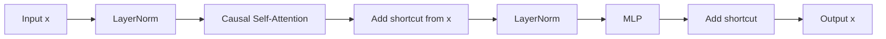
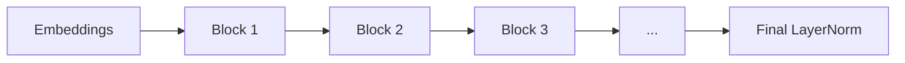
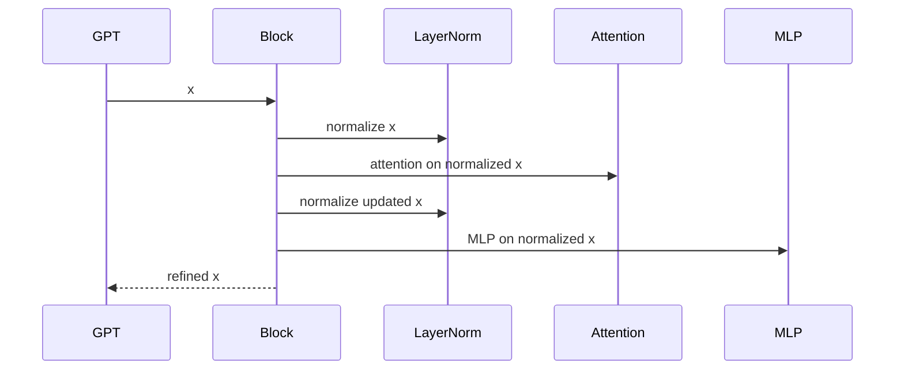

# Chapter 9: Transformer Block

In [Performance and Benchmarking](08_performance_and_benchmarking_.md), we zoomed out and asked, “How fast is the model?”

Now we zoom back in and ask a more important beginner question:

> **What is the model’s main repeating building unit?**

That unit is the **Transformer block**.

If you understand **one block**, you understand the local logic of **all blocks** in GPT.

---

## Why this exists

A GPT model is deep.

It does not refine token representations in one giant mysterious step.  
Instead, it does the same kind of processing **again and again**.

That repeating unit is the **Transformer block**.

A very beginner-friendly analogy:

> Think of a Transformer block like one workstation on an assembly line.
>
> - token representations arrive
> - the workstation improves them
> - then passes them to the next workstation

So instead of building one giant complicated layer, `nanoGPT` stacks many smaller, similar blocks.

That makes the design:

- easier to reason about
- easier to scale
- easier to repeat many times

---

## Our concrete beginner use case

Let’s solve this line from `model.py`:

```python
for block in self.transformer.h:
    x = block(x)
```

If you are new, this can feel very mysterious.

Questions you might have:

- What is inside `block(x)`?
- What changes?
- What stays the same?
- Why are there many blocks?
- Why is this one abstraction so important?

By the end of this chapter, you will understand exactly what one block does, and why stacking many of them gives you the full GPT.

---

## The big picture

A Transformer block in `nanoGPT` contains four big ideas:

1. **LayerNorm**
2. **Causal self-attention**
3. **MLP**
4. **Residual connections**

Here is the flow inside one block:



That is the full block at a high level.

---

## The simplest mental model

Here is the easiest way to think about it:

- **attention** lets tokens look at earlier tokens
- **MLP** lets each token do extra internal thinking
- **layer norm** keeps values well-behaved
- **residual connections** provide shortcut roads

So one block says:

> “First, let tokens share information.  
> Then, let each token refine itself.  
> Keep a shortcut path around both steps.”

That is the repeating heartbeat of GPT.

---

## Meet the `Block` class

In `model.py`, the core forward logic is surprisingly short:

```python
def forward(self, x):
    x = x + self.attn(self.ln_1(x))
    x = x + self.mlp(self.ln_2(x))
    return x
```

This tiny code block is one of the most important pieces in the whole repository.

Beginner translation:

- normalize `x`, run attention, add the result back to `x`
- normalize again, run the MLP, add the result back to `x`
- return the refined representation

That is one Transformer block.

---

## A helpful analogy: shortcut roads

The `+ x` part is the residual connection.

Imagine the main road goes through:

- attention
- or the MLP

But there is also a **shortcut road** around that processing.

So instead of replacing the old information completely, the block says:

> “Keep the old information, and add some new refinement.”

This helps with:

- information flow
- gradient flow during training
- stability in deep models

A beginner-friendly summary:

> residual connections help the model remember what it already had while learning improvements

---

## One block in plain English

Suppose a token sequence enters a block.

For example, maybe the model is processing something like:

```text
ROMEO: I love thee
```

Each token already has a vector representation.

Inside one block:

1. **LayerNorm** tidies the current vectors
2. **Attention** lets each token look left at earlier tokens
3. the attention result is **added back** to the original input
4. another **LayerNorm** tidies the updated vectors
5. the **MLP** transforms each token representation further
6. that MLP result is **added back** too

After that, the tokens come out with the **same shape**, but richer meaning.

---

## Very important beginner idea: same shape in, same shape out

A Transformer block **does not** change:

- batch size
- sequence length
- embedding width

If `x` has shape:

```text
(batch_size, sequence_length, n_embd)
```

then the output has the same shape:

```text
(batch_size, sequence_length, n_embd)
```

That is why blocks stack so nicely.

One block can hand its output directly to the next block.

### Beginner analogy

Think of each block as washing and polishing the same set of objects.

- same number of objects
- same arrangement
- just cleaner and more informative

---

## A tiny example

You can even try a block by itself:

```python
from model import GPTConfig, Block
import torch

cfg = GPTConfig(block_size=4, n_embd=8, n_head=2)
block = Block(cfg)
x = torch.randn(2, 4, 8)
y = block(x)
```

High-level result:

- `x.shape` is `(2, 4, 8)`
- `y.shape` is also `(2, 4, 8)`
- the values in `y` are different because the block refined them

This is a nice beginner experiment because it shows the key pattern:

> **same shape, better representation**

---

## Key concepts, one by one

## 1. A block is the model’s main repeating unit

From [GPT Language Model](05_gpt_language_model_.md), we know the full GPT contains a stack of blocks.

In `model.py`, they are created like this:

```python
h = nn.ModuleList([Block(config) for _ in range(config.n_layer)])
```

This means:

- build one `Block`
- then another
- then another
- until there are `n_layer` of them

So if `n_layer = 6`, the model has 6 blocks.  
If `n_layer = 12`, it has 12 blocks.

### Beginner analogy

It is like building a staircase with repeated steps.

If you understand one step, you understand the design of the staircase.

---

## 2. LayerNorm is the “tidy up” step

Each block has two layer norms.

From `model.py`:

```python
self.ln_1 = LayerNorm(config.n_embd, bias=config.bias)
self.ln_2 = LayerNorm(config.n_embd, bias=config.bias)
```

Beginner meaning:

- one normalization before attention
- one normalization before the MLP

You can think of LayerNorm as:

> “clean up the scale of the features before more processing happens”

### Analogy

Imagine students entering a classroom after recess.

Before the lesson starts, everyone is told to sit down and settle.  
That “settling down” is a nice analogy for normalization.

### Small note

Because the normalization happens **before** attention and **before** the MLP, this style is often called a **pre-norm** block.

You do not need to memorize that name, but it is good to know.

---

## 3. Causal self-attention lets tokens look left

The first big computation inside the block is:

```python
self.attn = CausalSelfAttention(config)
```

This is the part that lets tokens use context from earlier tokens.

### Why “causal”?

Because GPT is autoregressive.

A token can look at:

- itself
- earlier tokens

but **not future tokens**.

So when predicting the next token, the model does not cheat by peeking to the right.

### Beginner analogy

Imagine reading a sentence left to right with your finger covering the future words.

You can use what came before, but not what comes next.

We will unpack this carefully in [Causal Self-Attention](10_causal_self_attention_.md).

---

## 4. The MLP is the “private thinking” step

After attention, the block runs an MLP:

```python
self.mlp = MLP(config)
```

This part is different from attention.

- attention mixes information **across positions**
- the MLP mostly processes each token representation **individually**

A simple way to think about it:

> attention is for communication  
> MLP is for private thinking

### Beginner analogy

Imagine a classroom.

- first, students discuss with each other → attention
- then, each student sits quietly and improves their own notes → MLP

That is a very good mental model of the two halves of the block.

---

## 5. Residual connections are shortcut paths

The two most important lines again are:

```python
x = x + self.attn(self.ln_1(x))
x = x + self.mlp(self.ln_2(x))
```

The `x + ...` part means:

- do some processing
- then add the result to the original input

This is called a **residual connection**.

### Why this helps

Residual paths make deep models much easier to train.

They help:

- preserve information
- avoid overwriting everything at each step
- let gradients flow backward more easily

### Analogy

Instead of forcing every car through a crowded city center, residuals provide a bypass highway.

That keeps traffic moving.

---

## 6. One block refines, many blocks deepen

One block can only do a limited amount of refinement.

But GPT stacks many blocks:

```python
for block in self.transformer.h:
    x = block(x)
```

This means:

- block 1 adds some contextual understanding
- block 2 builds on that
- block 3 builds further
- and so on

### Beginner analogy

It is like editing a paragraph several times.

- first pass: basic cleanup
- second pass: improve clarity
- third pass: improve style
- fourth pass: improve nuance

Each pass helps, and the later passes build on the earlier ones.

---

## 7. This is the most important local abstraction in GPT

If you are trying to understand model internals, this is the most important local unit.

Why?

Because the full GPT is mostly:

- embeddings at the start
- many Transformer blocks
- a final layer norm
- an output head

So most of the “deep thinking” happens inside the repeated blocks.

A beginner-friendly sentence to remember:

> **The whole GPT is mostly just many Transformer blocks stacked on top of each other.**

---

## Solving our use case

Let’s go back to the original mystery:

```python
for block in self.transformer.h:
    x = block(x)
```

Now we can explain it.

Suppose `x` is the hidden representation after token and position embeddings from [GPT Language Model](05_gpt_language_model_.md).

Then each iteration means:

1. normalize `x`
2. let tokens attend to earlier tokens
3. add that result back to `x`
4. normalize again
5. run an MLP
6. add that result back to `x`

Then the next block repeats the same kind of work.

So if your model has 6 layers, this logic happens 6 times.

That is how a simple repeated abstraction becomes a deep model.

---

## A tiny flow of stacked blocks



This is the whole GPT backbone in a very compact picture.

---

## How the block fits into the full model

From [GPT Language Model](05_gpt_language_model_.md), the full GPT forward pass is roughly:

1. token embeddings
2. position embeddings
3. dropout
4. many blocks
5. final layer norm
6. output head

So the Transformer block lives in the **middle** of the model.

It is where most of the repeated representation-building happens.

---

## Under the hood: step-by-step without code

When a block receives `x`, here is what happens:

1. make a normalized version of `x`
2. run causal self-attention on that normalized input
3. add the attention result to the original `x`
4. normalize the updated `x`
5. run the MLP on that normalized version
6. add the MLP result back
7. return the final refined `x`

Notice the pattern:

- normalize
- transform
- add shortcut

Then do it again.

That is the block design.

---

## Sequence diagram



This is the simplest “one block call” story.

---

## Internal code walk-through

Now let’s look at the real implementation in `model.py`, one small piece at a time.

---

## 1. The block constructor creates four subparts

From `model.py`:

```python
self.ln_1 = LayerNorm(config.n_embd, bias=config.bias)
self.attn = CausalSelfAttention(config)
self.ln_2 = LayerNorm(config.n_embd, bias=config.bias)
self.mlp = MLP(config)
```

This means the block contains:

- first layer norm
- attention module
- second layer norm
- MLP module

That is the entire internal toolbox of one block.

---

## 2. The forward pass does attention with a residual

From `model.py`:

```python
x = x + self.attn(self.ln_1(x))
```

Beginner translation:

- first normalize `x`
- then run attention
- then add the attention result back to the old `x`

So this is not:

- “replace `x` completely”

It is:

- “keep `x`, and add some attention-based improvement”

That is the first half of the block.

---

## 3. Then it does MLP with another residual

Next:

```python
x = x + self.mlp(self.ln_2(x))
```

This is the same pattern again:

- normalize
- transform
- add back

But now the transform is the MLP instead of attention.

That is the second half of the block.

---

## 4. The MLP widens, activates, and projects back

Inside `MLP`, `model.py` does this:

```python
x = self.c_fc(x)
x = self.gelu(x)
x = self.c_proj(x)
x = self.dropout(x)
```

Beginner meaning:

- expand the features
- apply a nonlinearity (`GELU`)
- project back down
- optionally apply dropout

This is like giving each token vector a small internal neural network.

---

## 5. The MLP briefly gets wider inside

In the constructor, the MLP is defined like this:

```python
self.c_fc = nn.Linear(config.n_embd, 4 * config.n_embd, bias=config.bias)
self.c_proj = nn.Linear(4 * config.n_embd, config.n_embd, bias=config.bias)
```

This means:

- go from width `n_embd`
- up to `4 * n_embd`
- then back down to `n_embd`

### Beginner analogy

It is like opening a suitcase, spreading everything out to reorganize it, then packing it back in.

The representation temporarily gets wider so the model has more room to transform it.

---

## 6. The block can stack cleanly because shapes match

The block input and output both have shape:

```text
(B, T, C)
```

where:

- `B` = batch size
- `T` = sequence length
- `C` = embedding width

This matters because GPT can then do:

```python
for block in self.transformer.h:
    x = block(x)
```

Every block receives the same kind of tensor shape, so stacking is simple and clean.

---

## 7. GPT creates many blocks from one blueprint

Back in the GPT constructor, `model.py` creates the whole stack like this:

```python
h = nn.ModuleList([Block(config) for _ in range(config.n_layer)])
```

This means:

- use the settings from [Model Blueprint (GPTConfig)](04_model_blueprint__gptconfig__.md)
- build `n_layer` many blocks
- store them in order

Important beginner note:

- all blocks have the same **structure**
- but each block has its own **learned weights**

So they are similar machines, not identical copies of the same parameter tensors.

---

## 8. Attention details live one level deeper

The block itself does not implement attention math directly.

Instead, it delegates that work to:

```python
self.attn = CausalSelfAttention(config)
```

So the block is like a manager that combines:

- normalization
- attention
- MLP
- residuals

The next chapter, [Causal Self-Attention](10_causal_self_attention_.md), will zoom into that attention module itself.

---

## A simple shape example

Suppose the input to a block is:

- batch size = 2
- sequence length = 4
- embedding width = 8

So:

```text
x.shape = (2, 4, 8)
```

After:

- first LayerNorm
- attention
- residual add
- second LayerNorm
- MLP
- residual add

the output is still:

```text
(2, 4, 8)
```

But the vectors now contain more contextual information.

That is the key:

> **the block changes the meaning, not the outer shape**

---

## A helpful analogy: conversation plus reflection

A Transformer block is nicely summarized by this two-part analogy:

### Part 1: Conversation
Tokens talk to earlier tokens through attention.

### Part 2: Reflection
Each token privately refines itself through the MLP.

And around both parts, residuals keep shortcut roads open.

So one block is like:

> discuss, reflect, keep the old notes, and improve the new notes

---

## Common beginner questions

## “Is one block the whole GPT?”

No.

One block is just one repeated layer inside the full model.

The full GPT also contains:

- token embeddings
- position embeddings
- many blocks
- a final layer norm
- an output head

See [GPT Language Model](05_gpt_language_model_.md) for the full picture.

---

## “Why are there two LayerNorms?”

Because the block has two main sub-steps:

1. attention
2. MLP

Each one gets its own normalization first.

---

## “Why does the block add `x` back in?”

That is the residual connection.

It gives the model a shortcut path, which helps deep training stay stable and lets information keep flowing.

---

## “Does the block change sequence length?”

No.

If the input has `T` token positions, the output still has `T` token positions.

---

## “Does the MLP let tokens talk to each other?”

Not in the main across-token way.

The attention part is the main communication mechanism across positions.

The MLP mostly refines each position’s representation after attention has already mixed context in.

---

## “Are all blocks exactly the same?”

They have the same structure, but different learned weights.

So they are like identical machine designs built with different internal parameter values.

---

## “Why is understanding one block so important?”

Because the model is mostly many copies of this same idea stacked together.

If you understand one block, you understand the local logic of the whole stack.

---

## Tiny cheat sheet

| Part | Job |
|---|---|
| `ln_1` | normalize before attention |
| `attn` | let tokens use earlier-token context |
| first residual | keep shortcut around attention |
| `ln_2` | normalize before MLP |
| `mlp` | per-token nonlinear refinement |
| second residual | keep shortcut around MLP |

And the core forward pass is:

```python
x = x + self.attn(self.ln_1(x))
x = x + self.mlp(self.ln_2(x))
```

A very short summary:

> normalize → attention → add  
> normalize → MLP → add

---

## What this chapter really taught you

If you remember only one sentence, let it be this:

> **A Transformer block is GPT’s main repeating unit: it normalizes the token representations, mixes context with causal self-attention, refines each token with an MLP, and uses residual shortcuts to keep information flowing.**

You learned that:

- one block is the main local abstraction inside GPT
- its input and output have the same shape
- it contains LayerNorm, causal self-attention, an MLP, and residual connections
- the residual paths are shortcut roads that help deep training work well
- the full GPT is just many of these blocks stacked together

In the next chapter, we will open up the most mysterious part inside the block and study [Causal Self-Attention](10_causal_self_attention_.md).

---

Generated by [AI Codebase Knowledge Builder](https://github.com/The-Pocket/Tutorial-Codebase-Knowledge)