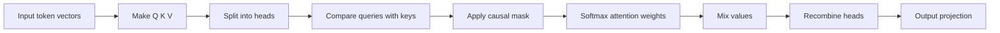
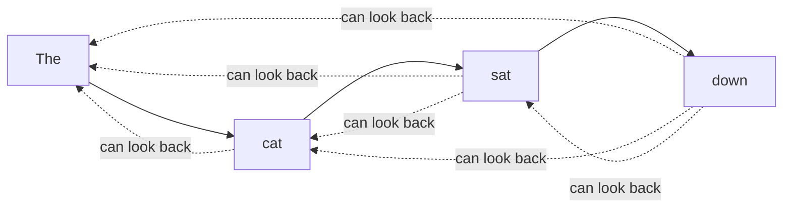
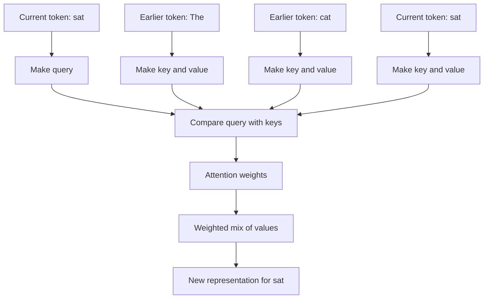
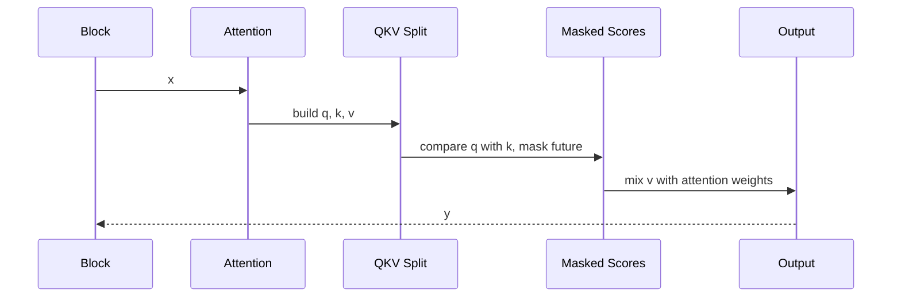

# Chapter 10: Causal Self-Attention

In [Transformer Block](09_transformer_block_.md), we learned that each block has two big sub-steps:

- attention
- MLP

Now we open up the most important and most mysterious part:

**Causal Self-Attention**

This is one of the core ideas that makes GPT feel “aware” of context.

---

## Why this exists

A GPT reads a sequence of tokens and predicts the next one.

But to do that well, it needs to answer questions like:

- which earlier words matter most right now?
- should this word look back at the previous noun?
- should it pay more attention to a nearby word or a distant one?

That is exactly what causal self-attention helps with.

A very beginner-friendly analogy:

> Imagine reading a sentence with a highlighter.
>
> For the current word, the model highlights the earlier words that seem most useful.

That is the “attention” part.

And “causal” means:

> **only look left, never right**

So the model can use the past, but it cannot peek into the future.

---

## Our concrete beginner use case

Let’s use this tiny sentence:

```text
The cat sat
```

Suppose the model is processing the word:

```text
sat
```

A beginner-friendly question is:

> When the model thinks about `sat`, how does it decide whether to look back at `The`, `cat`, or both?

Causal self-attention is the answer.

By the end of this chapter, you will understand:

- what “self-attention” means
- what “causal” means
- what queries, keys, and values are doing
- why attention is split into heads
- how `nanoGPT` implements fast and slow attention paths
- how the attention output fits back into the Transformer block

---

## The big picture

Here is the full high-level story:



That is the whole attention pipeline.

---

## The simplest mental model

A very simple way to think about attention is:

- every token asks: **“What earlier tokens should I care about?”**
- it gives different earlier tokens different importance
- then it builds a new representation from the most useful ones

So if the current token is:

```text
sat
```

it might think:

- `cat` is very important
- `The` is somewhat important
- future words are not allowed at all

That is causal self-attention.

---

## What does “self-attention” mean?

“Self-attention” means the sequence attends to **itself**.

Not to another sentence.  
Not to an external memory.  
To itself.

So if the input tokens are:

```text
[The, cat, sat]
```

then each position can look at tokens in that same sequence.

For example:

- `The` can look at `The`
- `cat` can look at `The` and `cat`
- `sat` can look at `The`, `cat`, and `sat`

Because this is **causal** self-attention, nobody can look to the right.

---

## What does “causal” mean?

This is one of the most important beginner ideas in GPT.

“Causal” means:

> **a token can only use itself and earlier tokens**

So for a sequence of 4 positions:

| Current position | Allowed to look at |
|---|---|
| 0 | 0 |
| 1 | 0, 1 |
| 2 | 0, 1, 2 |
| 3 | 0, 1, 2, 3 |

But never like this:

- position 1 looking at position 3
- position 2 looking at position 4

Why?

Because GPT is trained for next-token prediction.  
If it could look right, it would be cheating.

### Helpful analogy

Imagine doing a fill-in-the-blank test with your hand covering the answer key on the right.

You are allowed to use:

- what came before
- what you have right now

But not:

- what comes next

That is causality.

---

## A tiny left-only picture



Read this as:

- later tokens may look left
- earlier tokens may not look right

---

## Key concepts, one by one

## 1. Attention starts from token vectors, not raw words

Back in [GPT Language Model](05_gpt_language_model_.md), we learned that GPT first turns token IDs into vectors.

So attention does **not** directly operate on strings like `"cat"`.

It operates on hidden representations like:

```text
x.shape = (batch, time, embedding_width)
```

In `model.py`, attention receives:

```python
def forward(self, x):
    B, T, C = x.size()
```

This means:

- `B` = batch size
- `T` = sequence length
- `C` = embedding width (`n_embd`)

So attention works on a 3D tensor of token features.

---

## 2. Q, K, and V are three different views of the same input

This is the part that usually sounds scary at first.

From `model.py`:

```python
q, k, v = self.c_attn(x).split(self.n_embd, dim=2)
```

Beginner meaning:

- take the input `x`
- run one linear layer
- split the result into three parts:
  - query
  - key
  - value

A very beginner-friendly analogy:

- **query** = “what am I looking for?”
- **key** = “what do I contain?”
- **value** = “what information should I contribute?”

### Tiny analogy with a library

Imagine each token is a library card.

- the **query** asks what kind of book this token wants
- the **key** describes what each earlier token offers
- the **value** is the actual content to borrow

Then the token compares its query to everyone else’s key.

If there is a good match, it borrows more of that token’s value.

---

## 3. Query-key matching produces attention scores

Once we have queries and keys, the model compares them.

In the slow path, this is the core line:

```python
att = (q @ k.transpose(-2, -1)) * (1.0 / math.sqrt(k.size(-1)))
```

Beginner meaning:

- compare each query to each key
- get a score saying how relevant one token is to another
- scale the result to keep it numerically stable

So the model is asking something like:

> “How much should this token pay attention to that earlier token?”

The result is a table of scores.

### Shape intuition

After splitting into heads, the score tensor has shape:

```text
(B, n_head, T, T)
```

That last `(T, T)` means:

- each position compared to each other position

---

## 4. The causal mask blocks the future

This is the “causal” part in action.

In the slow path, `model.py` uses:

```python
att = att.masked_fill(self.bias[:,:,:T,:T] == 0, float('-inf'))
```

Beginner meaning:

- positions that should not be visible are blocked
- blocked scores become `-inf`
- after softmax, those positions get probability 0

So if token 2 tries to look at token 5, the mask says:

> “Nope. Future tokens are forbidden.”

### Helpful picture

Allowed attention pattern looks like a lower triangle:

```text
1 0 0 0
1 1 0 0
1 1 1 0
1 1 1 1
```

Where:

- `1` = allowed
- `0` = blocked

That is why the code uses `torch.tril(...)` when it builds the manual mask.

---

## 5. Softmax turns raw scores into weights

After masking, the model does:

```python
att = F.softmax(att, dim=-1)
```

Beginner meaning:

- convert raw attention scores into a probability-like distribution
- weights become non-negative
- weights across each row sum to 1

So attention becomes a set of “importance weights”.

Example idea for one token:

```text
[The: 0.2, cat: 0.7, sat: 0.1]
```

This means:

- `cat` matters most
- `The` matters some
- `sat` matters a little

These are the highlight strengths.

---

## 6. Values are mixed using those weights

After the weights are ready, attention combines the values:

```python
y = att @ v
```

Beginner meaning:

- use the attention weights to mix information from earlier tokens
- important tokens contribute more
- unimportant tokens contribute less

### Analogy

Imagine 3 earlier words are each speaking into a microphone.

The attention weights act like volume knobs:

- loud for useful words
- quiet for less useful words
- zero for forbidden future words

The mixed result becomes the new representation for the current token.

---

## 7. Attention uses multiple heads

This is why the code is called multi-head attention.

The model does not use just one attention pattern.  
It uses several in parallel.

From [Model Blueprint (GPTConfig)](04_model_blueprint__gptconfig__.md), we know:

- `n_head` = number of attention heads
- `n_embd` must divide evenly across heads

In `model.py`, the code reshapes like this:

```python
k = k.view(B, T, self.n_head, C // self.n_head).transpose(1, 2)
q = q.view(B, T, self.n_head, C // self.n_head).transpose(1, 2)
v = v.view(B, T, self.n_head, C // self.n_head).transpose(1, 2)
```

Beginner meaning:

- split the embedding into several smaller subspaces
- each head gets its own query, key, and value view
- each head can focus on different patterns

### Analogy

Think of attention heads as several different highlighters:

- one head may focus on nearby grammar clues
- another may focus on longer-range meaning
- another may focus on punctuation or structure

They all read the same sentence, but with different habits.

---

## 8. Head outputs are recombined

After each head finishes, the model puts them back together:

```python
y = y.transpose(1, 2).contiguous().view(B, T, C)
```

Beginner meaning:

- move the head dimension back
- flatten the heads into one embedding again
- return to the original width `C`

So heads are not the final answer.  
They are parallel mini-attention paths whose results are recombined.

---

## 9. There is a final output projection

After recombining heads, attention uses one more linear layer:

```python
y = self.resid_dropout(self.c_proj(y))
```

Beginner meaning:

- mix the combined head outputs one more time
- optionally apply dropout
- return a tensor with the same shape as the input

This is the final output of the attention module that gets added through the residual connection in the block.

That connects back to [Transformer Block](09_transformer_block_.md), where we saw:

```python
x = x + self.attn(self.ln_1(x))
```

So attention returns a refined version of `x`, and the block adds it back to the shortcut path.

---

## 10. `nanoGPT` has two attention implementations

This is an important practical detail.

### Fast path
If PyTorch provides built-in scaled dot product attention:

```python
self.flash = hasattr(torch.nn.functional, 'scaled_dot_product_attention')
```

then `nanoGPT` uses the fast path.

### Slow path
If not, it falls back to a manual masked implementation.

This means the same attention idea is implemented in two ways:

- a fast built-in version
- a slower explicit version

The math idea is the same.  
The main difference is performance.

---

## Solving our use case

Let’s return to our beginner question:

> When the model processes `sat` in `The cat sat`, how does it decide what matters?

Here is the high-level answer:

1. the token representation for `sat` produces a **query**
2. earlier tokens like `The` and `cat` produce **keys**
3. the query is compared to those keys
4. this creates relevance scores
5. causality blocks any future positions
6. softmax turns the scores into attention weights
7. those weights mix the **values** from allowed earlier tokens
8. the result becomes a new, more context-aware representation of `sat`

If `cat` is highly relevant, it gets a higher weight.  
So the model learns that `sat` should probably pay strong attention to `cat`.

That is the core use of attention.

---

## A tiny toy attention example

Imagine the current word is `sat`, and the model produces these weights:

| Earlier token | Attention weight |
|---|---|
| `The` | 0.2 |
| `cat` | 0.7 |
| `sat` | 0.1 |

High-level meaning:

- `cat` is the main thing the model wants to use
- `The` contributes a little
- the token also keeps a little of itself

The actual model uses vectors, not human-readable weights like this, but this is the right beginner intuition.

---

## A helpful summary picture



---

## Under the hood: step-by-step without code

Let’s describe one attention call in plain English.

Suppose a block sends a tensor `x` into attention.

Here is what happens:

1. attention reads `x`
2. it creates query, key, and value vectors
3. it splits them into heads
4. each head compares queries against keys
5. future positions are blocked by causality
6. softmax turns scores into weights
7. those weights mix the values
8. head outputs are recombined
9. a final projection is applied
10. the result is returned to the block

That is the full story.

---

## Sequence diagram



This is the local life of one attention call inside a block.

---

## Internal code walk-through

Now let’s look at `model.py` in small, beginner-friendly pieces.

---

## 1. The module stores its basic settings

From `model.py`:

```python
class CausalSelfAttention(nn.Module):
    def __init__(self, config):
        super().__init__()
        assert config.n_embd % config.n_head == 0
```

This means:

- the attention module is a PyTorch layer
- embedding width must split evenly across heads

If:

- `n_embd = 384`
- `n_head = 6`

then each head gets:

```text
384 / 6 = 64
```

dimensions.

---

## 2. One linear layer creates Q, K, and V together

From `model.py`:

```python
self.c_attn = nn.Linear(config.n_embd, 3 * config.n_embd, bias=config.bias)
self.c_proj = nn.Linear(config.n_embd, config.n_embd, bias=config.bias)
```

Beginner meaning:

- `c_attn` creates all three of:
  - queries
  - keys
  - values
- `c_proj` is the final output projection

Why `3 * config.n_embd`?

Because one input vector is being turned into:

- one query chunk
- one key chunk
- one value chunk

all packed side by side.

---

## 3. Dropout is used in attention too

Also from `model.py`:

```python
self.attn_dropout = nn.Dropout(config.dropout)
self.resid_dropout = nn.Dropout(config.dropout)
```

This means:

- dropout can be applied to attention weights in the manual path
- dropout can also be applied after the output projection

Just like in earlier chapters, dropout is a training-time regularization trick.

---

## 4. `nanoGPT` checks whether fast attention exists

From `model.py`:

```python
self.flash = hasattr(torch.nn.functional, 'scaled_dot_product_attention')
if not self.flash:
    self.register_buffer("bias", torch.tril(torch.ones(...)))
```

Beginner meaning:

- if PyTorch has the fast built-in attention, use it
- otherwise create a manual causal mask buffer

That mask is a lower-triangular matrix used to forbid future positions.

This connects nicely to [Performance and Benchmarking](08_performance_and_benchmarking_.md), where we saw that `nanoGPT` tries to use faster implementations when available.

---

## 5. The forward pass starts by unpacking shape

From `model.py`:

```python
B, T, C = x.size()
```

This means:

- `B` = batch size
- `T` = time steps / sequence length
- `C` = embedding size

This is the incoming hidden-state tensor from the block.

---

## 6. Q, K, and V are created, then split apart

From `model.py`:

```python
q, k, v = self.c_attn(x).split(self.n_embd, dim=2)
```

Beginner meaning:

- apply one linear projection to `x`
- split the last dimension into 3 equal chunks
- treat them as query, key, and value tensors

So this is a compact way to build Q, K, and V in one shot.

---

## 7. Then each one is reshaped into heads

From `model.py`:

```python
k = k.view(B, T, self.n_head, C // self.n_head).transpose(1, 2)
q = q.view(B, T, self.n_head, C // self.n_head).transpose(1, 2)
v = v.view(B, T, self.n_head, C // self.n_head).transpose(1, 2)
```

Beginner meaning:

- split the embedding width across heads
- move the head dimension forward

After this, the shape is:

```text
(B, n_head, T, head_size)
```

This is the standard multi-head format used for attention math.

---

## 8. Fast path: built-in PyTorch attention

If flash attention is available, `nanoGPT` uses:

```python
y = torch.nn.functional.scaled_dot_product_attention(
    q, k, v, attn_mask=None,
    dropout_p=self.dropout if self.training else 0,
    is_causal=True
)
```

Beginner meaning:

- ask PyTorch to do the attention work efficiently
- tell it this is causal attention
- apply dropout only during training

This path is faster and cleaner.

A nice beginner point:

> the code is shorter here because PyTorch is doing the heavy lifting internally

---

## 9. Slow path: manual attention math

If the fast built-in path is unavailable, `nanoGPT` does attention manually.

First the scores:

```python
att = (q @ k.transpose(-2, -1)) * (1.0 / math.sqrt(k.size(-1)))
att = att.masked_fill(self.bias[:,:,:T,:T] == 0, float('-inf'))
```

Then normalize and mix:

```python
att = F.softmax(att, dim=-1)
att = self.attn_dropout(att)
y = att @ v
```

Beginner meaning:

- compare queries with keys
- block illegal future positions
- convert scores to weights
- optionally apply dropout
- use the weights to mix values

This slow path is very useful for learning because it shows the attention steps explicitly.

---

## 10. The head outputs are stitched back together

After either path, `model.py` does:

```python
y = y.transpose(1, 2).contiguous().view(B, T, C)
```

Beginner meaning:

- undo the head-first layout
- place head outputs side by side
- recover the original embedding width

So the output shape matches the input shape again.

---

## 11. Final projection and dropout finish the module

The last step is:

```python
y = self.resid_dropout(self.c_proj(y))
return y
```

This means:

- pass the recombined result through an output linear layer
- apply dropout
- return it to the block

Then the block adds it back through the residual connection:

```python
x = x + self.attn(self.ln_1(x))
```

That closes the loop between attention and the full Transformer block.

---

## A shape map that beginners often find helpful

```mermaid
flowchart TD
    A[x: (B,T,C)] --> B[q,k,v split]
    B --> C[q,k,v: (B,T,C)]
    C --> D[reshape into heads]
    D --> E[(B,nh,T,hs)]
    E --> F[attention scores: (B,nh,T,T)]
    F --> G[mix values]
    G --> H[(B,nh,T,hs)]
    H --> I[recombine heads]
    I --> J[y: (B,T,C)]
```

Where:

- `nh` = number of heads
- `hs` = head size

---

## A very small manual example

Imagine 3 tokens:

```text
[The, cat, sat]
```

For the token `sat`:

- its query compares against the keys of:
  - `The`
  - `cat`
  - `sat`
- there is no future token to inspect
- suppose softmax gives weights:
  - `The`: 0.1
  - `cat`: 0.8
  - `sat`: 0.1
- then the new vector for `sat` becomes a weighted mix of those three value vectors

That is attention in one sentence.

---

## How this fits into the block again

Back in [Transformer Block](09_transformer_block_.md), we saw:

```python
x = x + self.attn(self.ln_1(x))
```

Now we can finally read that line more clearly:

1. normalize the incoming token representations
2. run causal self-attention
3. get context-aware updates
4. add those updates back to the shortcut path

So attention is the part of the block that gives each token access to useful earlier context.

The MLP that follows is more like per-token refinement.

---

## A helpful analogy: class discussion

Imagine each token is a student in a classroom.

### Query
What kind of help is this student looking for?

### Key
What kind of information does each student have?

### Value
What actual content can each student share?

Then causal self-attention works like this:

- a student can listen only to students who spoke earlier
- not to future students
- some earlier students matter more than others
- the student builds a new understanding from that weighted discussion

That is a surprisingly good mental model.

---

## Common beginner questions

## “Why is it called self-attention?”

Because the sequence attends to itself.

The tokens are using other tokens from the same sequence as context.

---

## “Why does GPT need causality?”

Because GPT is trained for next-token prediction.

If it could see future tokens during training or generation, it would cheat.

---

## “Why do we need Q, K, and V? Why not just one vector?”

Because attention needs different roles:

- query = what this token wants
- key = what each token offers
- value = what content gets passed along

Using separate projections makes the model more flexible.

---

## “Why are there multiple heads?”

Because different heads can focus on different kinds of relationships in parallel.

That gives the model richer context processing.

---

## “Does attention change the tensor shape?”

Not at the outside level.

Input shape and output shape are both:

```text
(B, T, C)
```

That is why attention fits neatly inside the block.

---

## “What is the difference between the fast and slow path?”

- **fast path**: uses PyTorch’s built-in scaled dot product attention
- **slow path**: computes scores, masking, softmax, and value mixing manually

The idea is the same.  
The main difference is speed and implementation style.

---

## “Why is the manual mask lower-triangular?”

Because each position may look only at itself and earlier positions.

That exactly matches a lower triangle.

---

## “What does `is_causal=True` mean in the fast path?”

It tells PyTorch to apply the left-only rule automatically.

So the built-in function handles the causal masking internally.

---

## Tiny cheat sheet

| Term | Beginner meaning |
|---|---|
| self-attention | tokens look at other tokens in the same sequence |
| causal | only allowed to look left |
| query | what this token is looking for |
| key | what this token offers |
| value | the information this token contributes |
| head | one parallel attention view |
| mask | blocks illegal future positions |
| softmax | turns scores into weights |
| output projection | mixes head outputs back together |

And the main beginner flow is:

1. make Q, K, V
2. split into heads
3. compare Q with K
4. mask the future
5. softmax
6. mix V
7. recombine heads

---

## One final compact code summary

Here is the heart of the attention story in miniature:

```python
q, k, v = self.c_attn(x).split(self.n_embd, dim=2)
# reshape into heads...
# compare q with k...
# apply causal masking...
# softmax...
# mix v...
y = self.c_proj(y)
```

Beginner meaning:

- build the three attention roles
- compute left-only relevance
- gather useful context
- project back to the model width

That is causal self-attention in a nutshell.

---

## Conclusion

In this chapter, you learned that **causal self-attention** is the mechanism that lets each token look back at earlier tokens and decide what matters most.

You saw that:

- **self-attention** means the sequence attends to itself
- **causal** means tokens can only look left, never right
- queries, keys, and values let tokens ask, match, and gather information
- multiple heads let the model inspect context in several parallel ways
- `nanoGPT` uses either a fast built-in PyTorch attention path or a slower manual masked path
- the attention output is returned to the [Transformer Block](09_transformer_block_.md), where it is added through a residual connection

If you remember only one sentence, let it be this:

> **Causal self-attention is the left-looking highlighter that gives GPT its context-awareness.**

And with that, you now understand one of the most important operations in the entire `nanoGPT` project.

---

Generated by [AI Codebase Knowledge Builder](https://github.com/The-Pocket/Tutorial-Codebase-Knowledge)