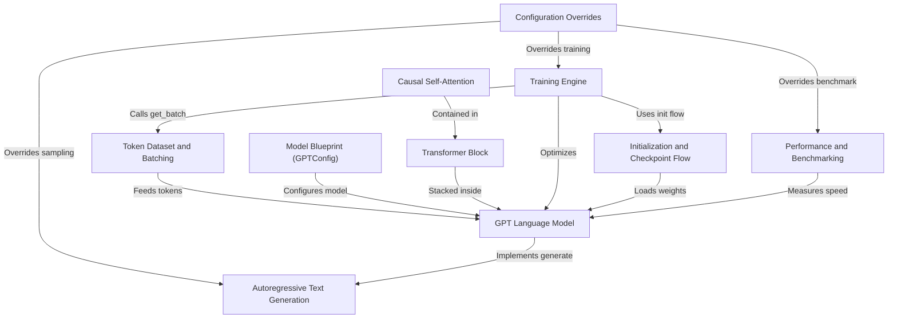

# Tutorial: nanoGPT

**nanoGPT** is a small, readable project for *training, evaluating, and sampling* GPT-style language models.
It takes tokenized text, builds a configurable Transformer model, and runs a simple training loop to learn **next-token prediction**.
The code also supports *loading checkpoints or pretrained GPT-2 weights*, generating text autoregressively, and measuring **speed and hardware efficiency**.

**Source Repository:** [None](None)

## Chapters

1. [Configuration Overrides
](01_configuration_overrides_.md)
2. [Training Engine
](02_training_engine_.md)
3. [Token Dataset and Batching
](03_token_dataset_and_batching_.md)
4. [Model Blueprint (GPTConfig)
](04_model_blueprint__gptconfig__.md)
5. [GPT Language Model
](05_gpt_language_model_.md)
6. [Initialization and Checkpoint Flow
](06_initialization_and_checkpoint_flow_.md)
7. [Autoregressive Text Generation
](07_autoregressive_text_generation_.md)
8. [Performance and Benchmarking
](08_performance_and_benchmarking_.md)
9. [Transformer Block
](09_transformer_block_.md)
10. [Causal Self-Attention
](10_causal_self_attention_.md)

---

Generated by [AI Codebase Knowledge Builder](https://github.com/The-Pocket/Tutorial-Codebase-Knowledge)